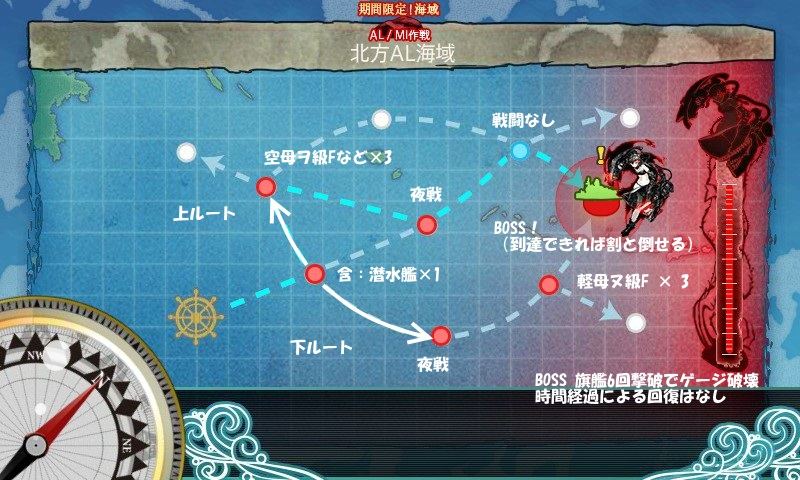
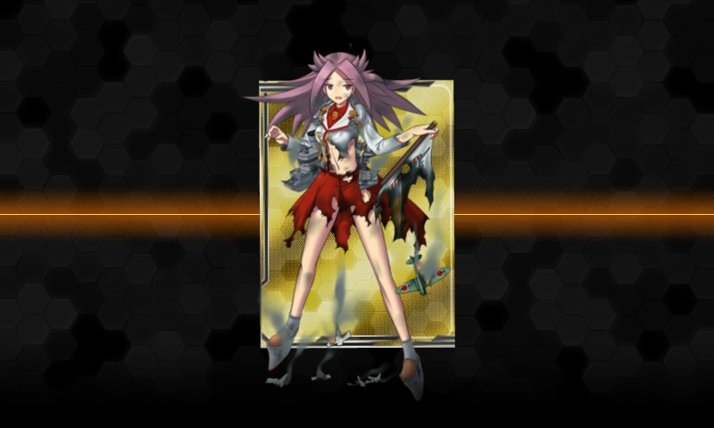
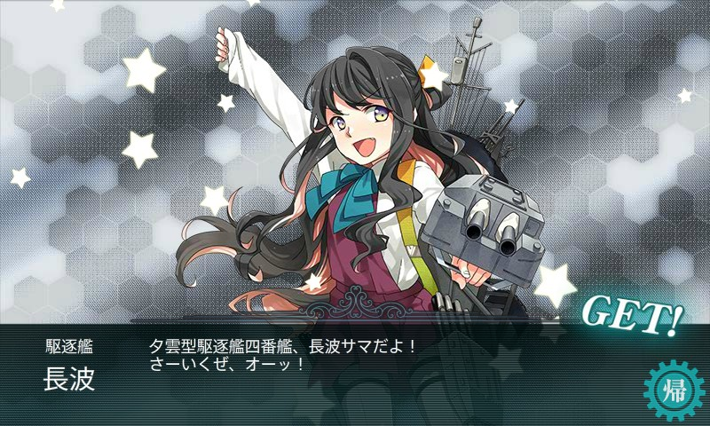

<h3>海域オーバービュー</h3>

大雑把に、上ルートか下ルートにわけられそう。

最初、ちょっと史実準拠風味に「軽空×2、軽巡×2（雷巡×1含む）、駆逐×2」にしてみたけれど、どうも BOSS までたどり着けぬ（すべて下ルート）。この編成だと第1戦目で砲撃が潜水艦に吸われるのもあまりよくない感じ。

そこで「軽空×2、重巡×2、駆逐×2」にしてみたところ、全員中破になりつつも、上ルートで BOSS に到達。BOSS は割と簡単に撃破できた。

次にためしに「重巡×4、軽空×2」という構成にしてみた。これは下ルート固定らしい。軽空母にダメコンを載せたところ、BOSS 到達率がかなり上がったので、これで行くことにした。

<h3>結果</h3>

<table>
<tr>
<td>	</td>
<td>前衛哨戒艦隊	</td>
<td>北方水上打撃部隊B群	</td>
<td>対潜掃討部隊	</td>
<td>北方方面主力艦隊	</td>
</tr>
<tr>
<td>1	</td>
<td>A	</td>
<td>B	</td>
<td>C	</td>
<td>	</td>
</tr>
<tr>
<td>2	</td>
<td>B	</td>
<td>B	</td>
<td>S	</td>
<td>	</td>
</tr>
<tr>
<td>3	</td>
<td>B	</td>
<td>B	</td>
<td>	</td>
<td>	</td>
</tr>
<tr>
<td>4	</td>
<td>B	</td>
<td>B（北方任務部隊）	</td>
<td>B（北方水雷戦隊）	</td>
<td>A	</td>
</tr>
<tr>
<td>5	</td>
<td>B	</td>
<td>A	</td>
<td>B	</td>
<td>	</td>
</tr>
<tr>
<td>6	</td>
<td>A	</td>
<td>A	</td>
<td>B	</td>
<td>S	</td>
</tr>
<tr>
<td>7	</td>
<td>A	</td>
<td>B	</td>
<td>	</td>
<td>	</td>
</tr>
<tr>
<td>8	</td>
<td>B	</td>
<td>A	</td>
<td>A	</td>
<td>	</td>
</tr>
<tr>
<td>9	</td>
<td>A	</td>
<td>B	</td>
<td>A	</td>
<td>	</td>
</tr>
<tr>
<td>10	</td>
<td>B	</td>
<td>A	</td>
<td>A	</td>
<td>S	</td>
</tr>
<tr>
<td>11	</td>
<td>A	</td>
<td>A	</td>
<td>S	</td>
<td>S	</td>
</tr>
<tr>
<td>12	</td>
<td>A	</td>
<td>	</td>
<td>	</td>
<td>	</td>
</tr>
<tr>
<td>13	</td>
<td>C	</td>
<td>	</td>
<td>	</td>
<td>	</td>
</tr>
<tr>
<td>14	</td>
<td>A	</td>
<td>B	</td>
<td>B	</td>
<td>A（BOSS打ち漏らし）	</td>
</tr>
<tr>
<td>15	</td>
<td>A	</td>
<td>A	</td>
<td>B	</td>
<td>A（BOSS打ち漏らし）	</td>
</tr>
<tr>
<td>16	</td>
<td>B	</td>
<td>A	</td>
<td>B	</td>
<td>S	</td>
</tr>
<tr>
<td>17	</td>
<td>A	</td>
<td>B	</td>
<td>	</td>
<td>	</td>
</tr>
<tr>
<td>18	</td>
<td>A	</td>
<td>A	</td>
<td>	</td>
<td>	</td>
</tr>
<tr>
<td>19	</td>
<td>A	</td>
<td>	</td>
<td>	</td>
<td>	</td>
</tr>
<tr>
<td>20	</td>
<td>A	</td>
<td>A	</td>
<td>S	</td>
<td>	</td>
</tr>
<tr>
<td>21	</td>
<td>A	</td>
<td>B	</td>
<td>	</td>
<td>	</td>
</tr>
<tr>
<td>22	</td>
<td>A	</td>
<td>A	</td>
<td>S	</td>
<td>A	</td>
</tr>
</table>
<blockquote class="twitter-tweet" data-lang="ja">
1戦目：潜水艦の雷撃が当たらないように祈る 2戦目：戦艦の夜戦砲撃が当たらないように祈る 2戦目：制空権とってあとは祈る
&mdash; だるやなぎ に天使が舞い降りた！ (@daruyanagi) <a href="https://twitter.com/daruyanagi/status/497899091204923392?ref_src=twsrc%5Etfw">2014年8月9日</a></blockquote>

三戦目で制空権をとってみるかと思っていろいろ試してみたけど、軽空母2隻で制空権まで狙うと打撃力の低下が著しかったので、航空優勢で十分だと思った。

まぁ、それはともかく、途中での事故が多いわ、多いわ。だんだん撤退するのがかなりめんどくさくなったので、ダメコン頼りに大破のまま進んだら、そのままダメコンを消費せずに BOSS が倒せてしまった（9戦目、10戦目）。それに味をしめて、二匹目の泥鰌を狙って大破進軍を繰り返したところ……

<blockquote class="twitter-tweet" data-lang="ja">
また隼鷹死んだ
&mdash; だるやなぎ に天使が舞い降りた！ (@daruyanagi) <a href="https://twitter.com/daruyanagi/status/497927433635377152?ref_src=twsrc%5Etfw">2014年8月9日</a></blockquote>

ダメコンを4つも失う事態に（隼鷹×3、龍驤×1）。

最初は「隼鷹は二度死ぬ」ってブログのタイトルにつけるか、なんて思ってたけど、さすがにこれはあかん。

幸い BOSS へのルートは固定できるし、時間経過によるゲージ回復もない。家事をしながら15分に1回、ダメコンがあってもBOSS 戦以外は大破撤退というのんびりした方針で最後の方は臨んだ。

<blockquote class="twitter-tweet" data-lang="ja">
E1: ①22回出撃 → ②18回 → ③13回 → ④8回（撃破6回）　最初の5回ぐらい編成を試行錯誤していたとはいえ、ちょっと無駄が多かった
&mdash; だるやなぎ に天使が舞い降りた！ (@daruyanagi) <a href="https://twitter.com/daruyanagi/status/497952284085477376?ref_src=twsrc%5Etfw">2014年8月9日</a></blockquote>

WebMatrix で遊んだり、お皿洗いしながらやっていたので、初戦で夜戦に突入してしまったりなどなど、いろいろ誤操作もやらかし、効率よくクリアできたとはとても言い難い。たぶん、情報さえあれば半分程度に出撃回数は減らせると思う。

<h3>ドロップ艦娘</h3>

<table>
<tr>
<td>	</td>
<td>S	</td>
<td>A	</td>
<td>B	</td>
</tr>
<tr>
<td>前衛哨戒艦隊	</td>
<td>	</td>
<td>如月、加古、青葉、天龍	</td>
<td>	</td>
</tr>
<tr>
<td>北方水上打撃部隊B群	</td>
<td>	</td>
<td>睦月、川内、名取	</td>
<td>皐月、望月	</td>
</tr>
<tr>
<td>対潜掃討部隊	</td>
<td>足柄、<b>谷風</b>	</td>
<td>木曾	</td>
<td>	</td>
</tr>
<tr>
<td>北方方面主力艦隊	</td>
<td><b>阿賀野</b>、山城、<b>長波</b>、龍驤	</td>
<td>筑摩、長良、龍驤、鳳翔	</td>
<td>	</td>
</tr>
</table>

<blockquote class="twitter-tweet" data-lang="ja">
長波きたああああああああああああああああああああ！
&mdash; だるやなぎ に天使が舞い降りた！ (@daruyanagi) <a href="https://twitter.com/daruyanagi/status/497927759352446976?ref_src=twsrc%5Etfw">2014年8月9日</a></blockquote>

もってなかった（掘るのめんどくさかった）のでうれしい！

<h3>任務報酬</h3>

<blockquote class="twitter-tweet" data-lang="ja">
やったやでー <a href="http://t.co/LTPmkleNmR">pic.twitter.com/LTPmkleNmR</a>
&mdash; だるやなぎ に天使が舞い降りた！ (@daruyanagi) <a href="https://twitter.com/daruyanagi/status/497951128466620417?ref_src=twsrc%5Etfw">2014年8月9日</a></blockquote>

めっさかわいい！　これで「村雨」「夕立」「五月雨」で第2駆逐隊が組める！

<ul>
<li><a href="https://blog.daruyanagi.jp/entry/2014/03/20/195019">&#x300E;&#x99C6;&#x9010;&#x8266;&#x300C;&#x4E94;&#x6708;&#x96E8;&#x300D;&#x51FA;&#x6483;&#x3059;&#x2015;&#x30BD;&#x30ED;&#x30E2;&#x30F3;&#x6D77;&#x306E;&#x706B;&#x67F1;&#x300F; - &#x3060;&#x308B;&#x308D;&#x3050;</a></li>
</ul>
第2駆逐隊はこの本の前半に出てくる。

