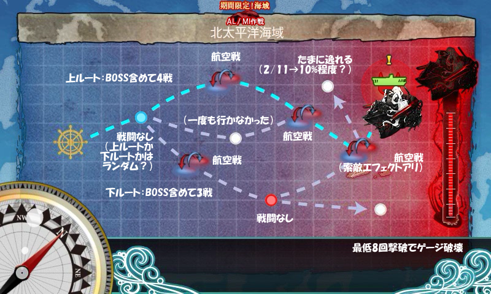
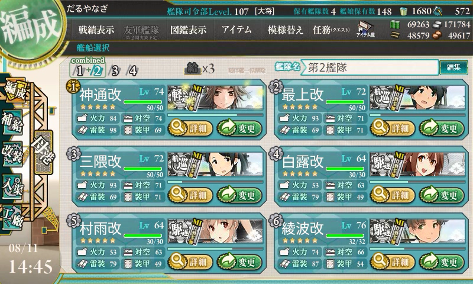
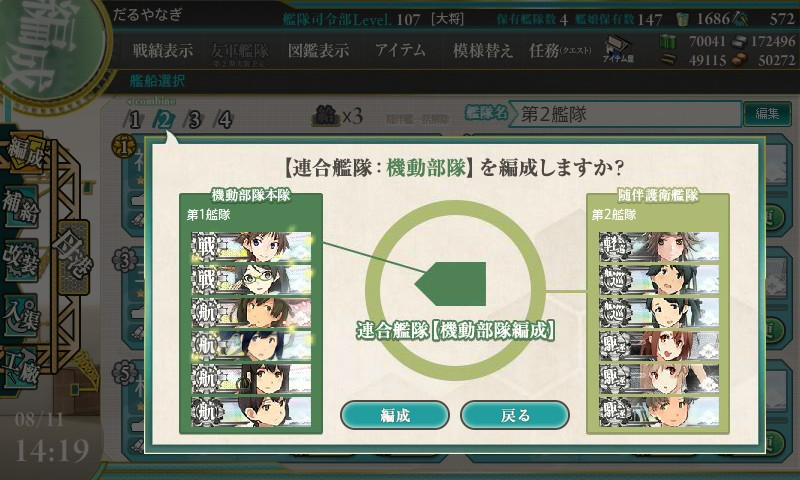
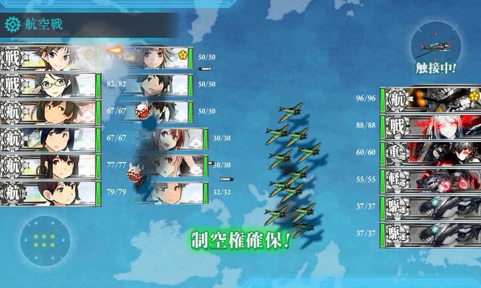
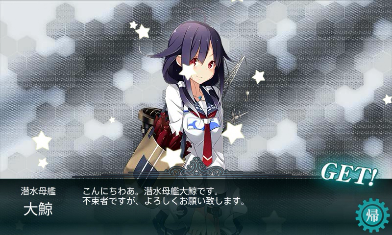
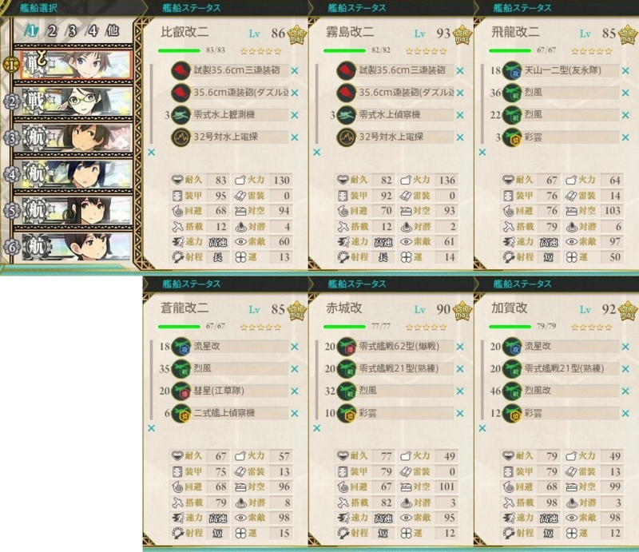
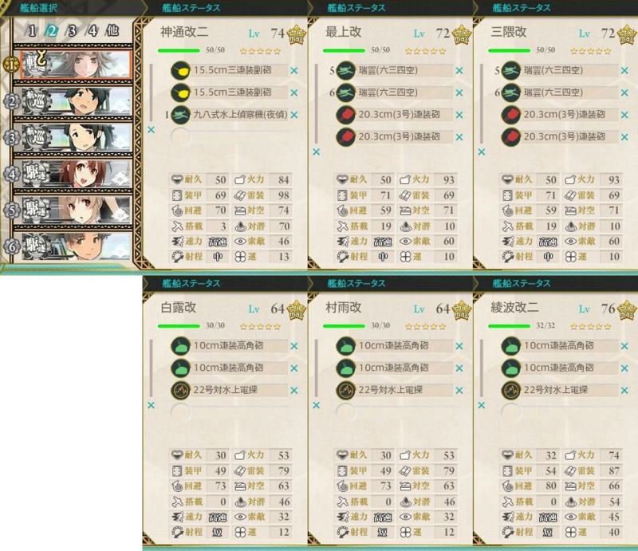
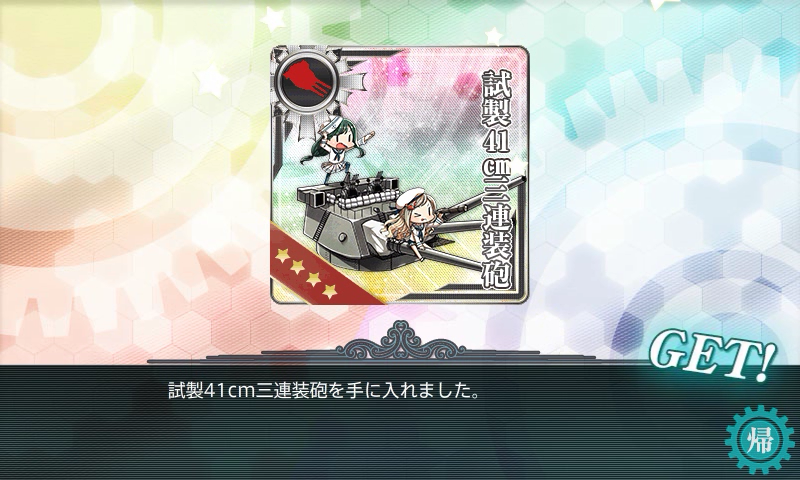
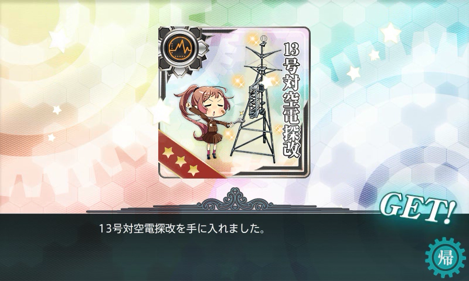
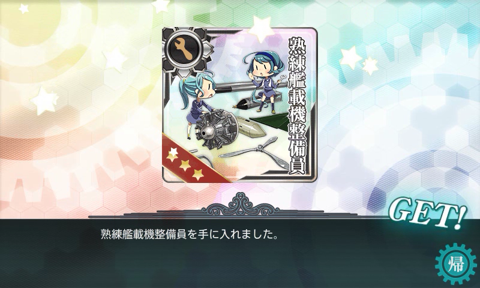

初めて「連合艦隊」が組めるマップ。「連合艦隊」のルールを学習するためのマップかな？（報酬に艦娘がないのもそのせいかも）　いやに難易度が低かった。AL 作戦を突破したらぜひこの海域もクリアしておこう。イベントクリアした後は、ここが釣り堀になりそう。

矢印が相互に行きかっているマスは、「航空戦」（後述）が行われる。

<h3>連合艦隊</h3>

<blockquote class="twitter-tweet" lang="ja">
07▼【連合艦隊】の編成と解隊&#10;「連合艦隊(機動部隊編成)」を編成可能な第1艦隊と第2艦隊を配備し、編成画面上部の第2艦隊のアイコンを第1艦隊にドラッグ&amp;ドロップすることで、連合艦隊が可能となります。艦娘の配備を変更や解除し、編成条件未達になると連合艦隊は解隊されます。&#10;<a href="https://twitter.com/hashtag/%E8%89%A6%E3%81%93%E3%82%8C?src=hash">#艦これ</a>
&mdash; 「艦これ」開発/運営 (@KanColle_STAFF) <a href="https://twitter.com/KanColle_STAFF/statuses/497723883496038401">2014, 8月 8</a></blockquote>

第一艦隊（機動部隊）＋第二艦隊（水雷戦隊）で編成。

<ul>
<li>第一艦隊：航空母艦が2隻以上必要です(最大4隻まで)。直衛艦として、戦艦や航空戦艦などの大型艦も最大2隻まで編成に組み込むことが可能</li>
<li>第二艦隊：軽巡1隻及び多数の駆逐艦で構成される水雷戦隊。火力支援や索敵の眼として、重巡洋艦や航空巡洋艦を最大2隻まで組み込むことも可能</li>
</ul>
第二艦隊（水雷戦隊）は、軽巡1＋駆逐2が基本のよう（？）。これに重巡×2＋高速戦艦×1でも連合艦隊を組むことができた。

［2］を［1］へドラッグ＆ドロップすれば連合艦隊が編成される。

このままで艦娘の入れ替えは可能だが、連合艦隊の条件が見たらされなくなると、連合艦隊は自動で解体される。

<h3>航空戦</h3>

<iframe width="854" height="510" src="//www.youtube.com/embed/wgQvbLBp0Ws" frameborder="0" allowfullscreen></iframe>

動画を観たほうが早いと思った。

機動部隊が殴り合うだけで戦闘は終了。水雷戦隊は攻撃を受けるだけ。対空火器のエフェクトが出ているので、対空戦闘はしている模様。もし余裕があれば対空兵装を充実させるとよいのかもしれない。

<h3>経過</h3>

11戦中、6回撃破、3回打ち漏らし、2回 BOSS を逸れる。

途中、一度だけ BOSS 前で大破を出したのだけど、ミスって進軍（台風でベランダの隔壁が破れたらしく、管理会社から修理の連絡が来ていて、それに対応しながらマウスをポチポチっと……あうあう）。「村雨」が失われてしまった (ノД`)・゜・。

所要時間：3時間

消費資材（イベント、クエストによる増減を含む）：

<ul>
<li>燃料：8000</li>
<li>弾薬：5000</li>
<li>鋼材：6000</li>
<li>ボーキサイト：6000</li>
</ul>
バケツの消費は70個。順調……なのかな？

<h3>ドロップ</h3>

とりあえずめぼしいのは「長波」「大鯨」ぐらい。一人目は「龍鳳」に改造してしまったので、ちょっとうれしい。

<h3>装備</h3>

機動艦隊。制空値400程度を目安に（これでボスでも航空優勢がとれるみたい）、索敵も重視した編成に。

村雨轟沈後は、五月雨（Lv.57、装備は変わらず）にスイッチ。途中で綾波改二を旗艦にして砲をすべて外し、探照灯・照明弾を足す。探照灯はエフェクトがでず、効果があるかわからなかったので電探に変更（あとで夜戦兵器のエフェクトがでないのはバグと判明。<a href="https://twitter.com/KanColle_STAFF/status/498765290067345409">&#x3053;&#x308C;&#x306F;&#x4FEE;&#x6B63;&#x3055;&#x308C;&#x305F;</a>）。しかし、電探を追加しても BOSS 前を1回逸れたので、索敵をいくら積み増しても完全なルート固定はできないのかもしれない。

<h3>報酬</h3>

レア装備がメイン。

「長門」にでもくっつけとくか。

駆逐艦向けの電探。索敵重視だと水上電探になるので、今回のイベントで役に立つかどうか。

これは何に使うんだ？　艦載機搭載数の少ないスロットを埋めるのによさそうだけど。あと、なにげに射程が伸びてる。

次は本格的に「連合艦隊」を駆使したマップになるのかな……？

