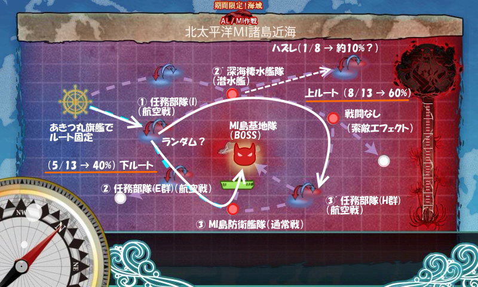
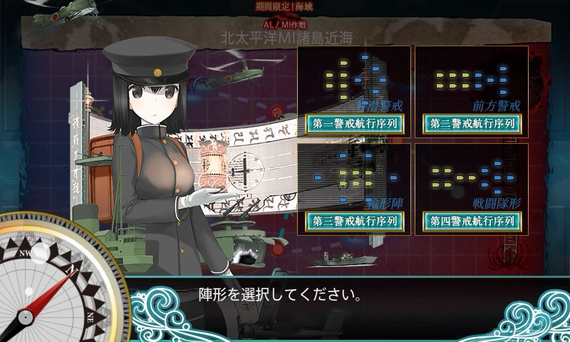
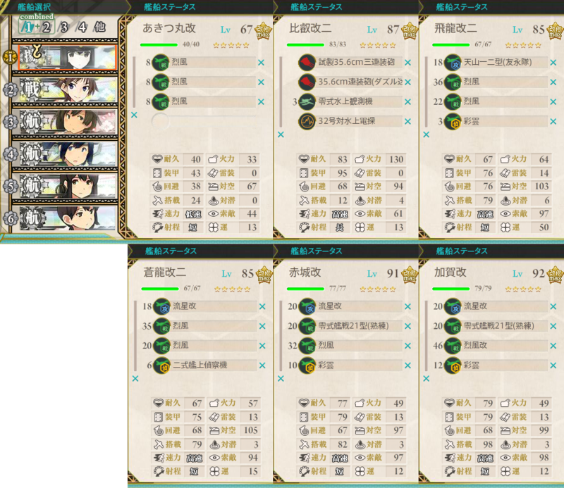
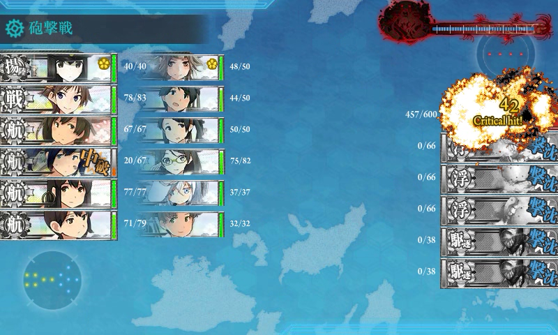
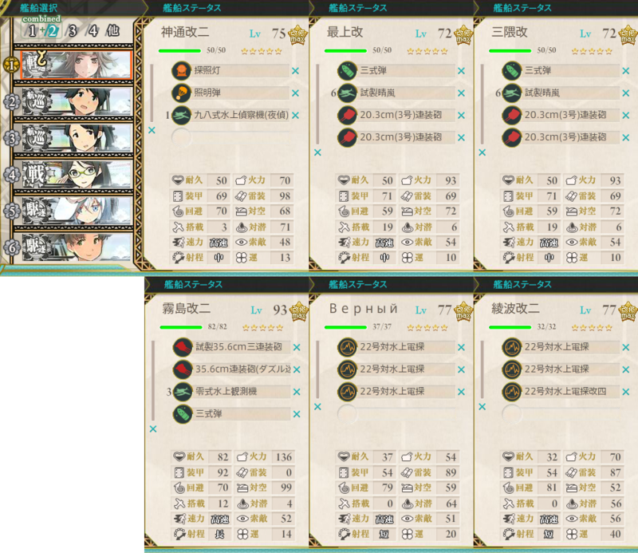
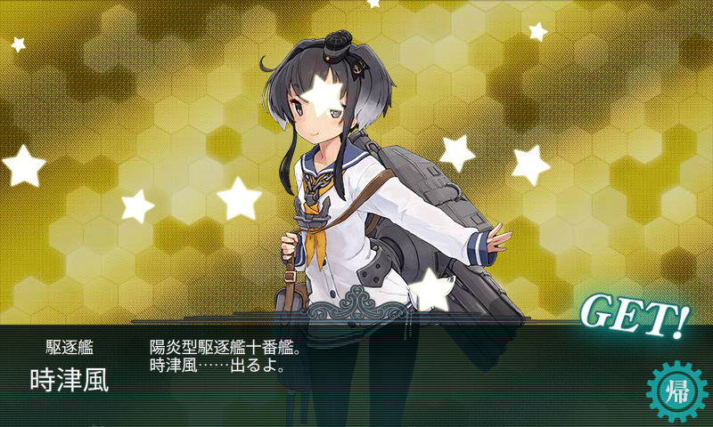

10回撃破でクリア。13回出撃のうち、上ルートが8回（1回逸れて、1回大破撤退）、下ルートが5回（1回撤退）。BOSS に到達しさえすれば、かなり楽に撃破まで持ち込めた。わざわざキラ付け・支援艦隊などの対策をとる必要はないと思う。

<iframe width="854" height="510" src="//www.youtube.com/embed/SGyDiOe9drg" frameborder="0" allowfullscreen></iframe>

あきつ丸を旗艦することにより最初のルートを固定できる。これにより下ルートをとる可能性を高めることができるが、正直上ルートでも下ルートでも中途撤退率はそれほど変わらないと思われる（自分の場合、25％：20％）。

ちなみに、あきつ丸旗艦の場合、上ルート:下ルート は 3:2 の割合。多少、潜水艦ルートをとることの方が多い印象を受けた。試行回数が少なすぎるので断言はできないけれど。

 

<h3>陣形</h3>

E-3 よりも敵のバリエーションが増えるので、陣形をちょっとだけ考えないといけない。

<ul>
<li>航空戦：第三警戒航行序列</li>
<li>対潜水艦：第一警戒航空序列</li>
<li>通常戦、BOSS 戦：第四警戒航行序列</li>
</ul>
でよい。E-3 ではよくわかってなくて BOSS 戦で“第三警戒航行序列（前方警戒）”を選んでいたけれど、これは通常の複縦陣に当たるようだ。“第四警戒航行序列（戦闘隊形）”を選んだ方が早く片付くので、こちらを選ぶべし（通常の単縦陣に相当？）。

<h3>装備</h3>

第一艦隊。

BOSS には「艦攻」しか効かないらしい（雷撃もダメ）。Twitter で「基地攻撃＝爆弾＝艦爆じゃないの？」って言ってる人がいたけど、艦攻も爆弾は落とせるし、むしろ艦攻のほうが大きな爆弾が積めるから、史実でも基地攻撃はたぶん艦攻でやったろうと思う（艦爆は小さなターゲットを精密に狙うのに使う。基地爆撃にも使うかもしれないが、艦船を狙うのが本領だろう）。

E-3 よりも艦戦を増やして制空をとれるようにしてるけど、厳密に計算はしていない。この編成でもボスで航空優勢は取れるようだ。

あとは索敵重視で。あきつ丸に「烈風」を積みまくれるのがちょっと面白いなと思った。昼の砲撃もやけに強い。

第二艦隊。

ダメージソースは「三式弾」を装備した重巡コンビと「霧島」。それ以外には砲撃力を期待していないので（それでも余裕で BOSS を倒せる）、駆逐艦は電波係に、「神通」は夜戦補助係にした（AL 作戦で「川内」を使わずにこっちで使いたかった！　キャラへの愛着的に）。それでも「神通」は割といいダメージをたたき出していたけれど。

<h3>ドロップ</h3>

<table>
<tr>
<td>-</td>
<td>S</td>
<td>A</td>
</tr>
<tr>
<td>MI島防衛艦隊</td>
<td>金剛、<b>三隈</b>、<b>初風</b>、<b>赤城</b>、蒼龍、比叡、浜風、舞風、妙高、夕雲</td>
<td>-</td>
</tr>
<tr>
<td>MI島基地隊</td>
<td>五月雨、鳥海</td>
<td>-</td>
</tr>
<tr>
<td>任務部隊(I)</td>
<td>-</td>
<td>不知火</td>
</tr>
</table>
「三隈」は養殖しよう。

<h3>報酬</h3>

駆逐艦「時津風」。それとダメコン（女神）。

消費資材（遠征・任務によるぞ元を含む）

<ul>
<li>燃料：8000</li>
<li>弾薬：5000</li>
<li>鋼鉄：6000</li>
<li>ボーキサイト：5000</li>
</ul>
高速修復財70個。まだ備蓄は大丈夫。所要時間は6時間弱。洗濯しながらのんびりやってた。

