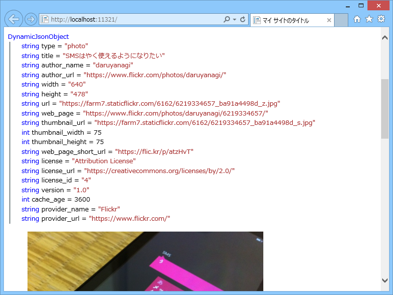
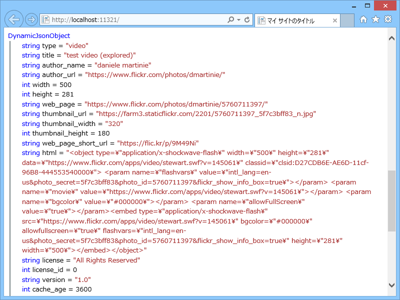
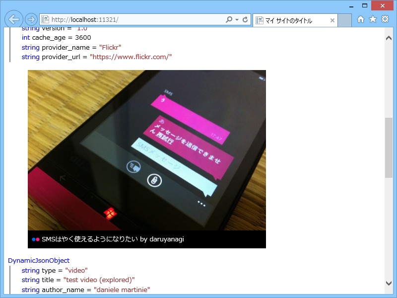

<a href="https://blog.daruyanagi.jp/entry/2014/08/08/185357">WebMatrix 3&#xFF1A;oEmbed &#x30D8;&#x30EB;&#x30D1;&#x30FC;&#x3092;&#x4F5C;&#x3063;&#x3066;&#x307F;&#x305F; - &#x3060;&#x308B;&#x308D;&#x3050;</a> の続き。今回は Flickr の埋め込みをやってみようかと思う。

<h3>~/App_Code/OEmbed.cshtml</h3>
<pre class="code lang-cs" data-lang="cs" data-unlink>@helper Flickr(string url) {
const string API_ENDPOINT = &quot;http://www.flickr.com/services/oembed/&quot;;

using (var downloader = new WebClient())
{
try
{
// URL を組み立てて JSON の oEmbed データを取得
var request = string.Format(&quot;{0}?url={1}&amp;format={2}&quot;, API_ENDPOINT, url, &quot;json&quot;);
var oembed_data = downloader.DownloadString(request);
var oembed_json = Json.Decode(oembed_data);

@ObjectInfo.Print(oembed_json) // デバッグのため

var embed_type = oembed_json.type as string;

switch (embed_type) // photo と video の二種類がある
{
case &quot;photo&quot;:
&lt;figure&gt;
&lt;img src='@oembed_json.url' alt='@oembed_json.title'&gt;
&lt;figcaption&gt;
&lt;img src='http://favicon.qfor.info/f/@oembed_json.provider_url' /&gt;
&lt;a href='@oembed_json.web_page'&gt;@oembed_json.title&lt;/a&gt;
by &lt;a href='@oembed_json.author_url'&gt;@oembed_json.author_name&lt;/a&gt;
&lt;/figcaption&gt;
&lt;/figure&gt;
break;
case &quot;video&quot;:
&lt;figure&gt;
@Html.Raw(oembed_json.html)
&lt;/figure&gt;
break;
default:
break;

}
}
catch (Exception exception)
{
&lt;p class='error'&gt;@url: @exception.Message&lt;/p&gt;
}
}
}
</pre>

<h3>~/Default.cshtml</h3>
<pre class="code lang-html" data-lang="html" data-unlink>&lt;!DOCTYPE html&gt;

&lt;html lang=&quot;ja&quot;&gt;
&lt;head&gt;
        &lt;meta http-equiv=&quot;Content-Type&quot; content=&quot;text/html; charset=utf-8&quot;/&gt;
        &lt;meta charset=&quot;utf-8&quot; /&gt;
        &lt;title&gt;マイ サイトのタイトル&lt;/title&gt;
        &lt;link href=&quot;~/favicon.ico&quot; rel=&quot;shortcut icon&quot; type=&quot;image/x-icon&quot; /&gt;
    &lt;/head&gt;
&lt;body&gt;
@OEmbed.Flickr(&quot;https://www.flickr.com/photos/daruyanagi/6219334657/&quot;)
@OEmbed.Flickr(&quot;https://www.flickr.com/photos/dmartinie/5760711397/&quot;)
&lt;/body&gt;
&lt;/html&gt;
</pre>

<h3>結果</h3>

たとえば Photo の場合。Twitter のときみたいに html を返してくれないので、自分で組み立てる。

 

<pre class="code lang-html" data-lang="html" data-unlink>&lt;figure&gt;
&lt;img src='https://farm7.staticflickr.com/6162/6219334657_ba91a4498d_z.jpg' alt='SMSはやく使えるようになりたい'&gt;
&lt;figcaption&gt;
&lt;img src='http://favicon.qfor.info/f/https://www.flickr.com/' /&gt;
&lt;a href='https://www.flickr.com/photos/daruyanagi/6219334657/'&gt;SMSはやく使えるようになりたい&lt;/a&gt;
by &lt;a href='https://www.flickr.com/photos/daruyanagi/'&gt;daruyanagi&lt;/a&gt;
&lt;/figcaption&gt;
&lt;/figure&gt;
</pre>
Video の場合。これは html があるのでそれを使う。

 

<pre class="code lang-html" data-lang="html" data-unlink>&lt;figure&gt;
&lt;object type=&quot;application/x-shockwave-flash&quot; width=&quot;500&quot; height=&quot;281&quot; data=&quot;https://www.flickr.com/apps/video/stewart.swf?v=145061&quot; classid=&quot;clsid:D27CDB6E-AE6D-11cf-96B8-444553540000&quot;&gt; &lt;param name=&quot;flashvars&quot; value=&quot;intl_lang=en-us&amp;photo_secret=5f7c3bff83&amp;photo_id=5760711397&amp;flickr_show_info_box=true&quot;&gt;&lt;/param&gt; &lt;param name=&quot;movie&quot; value=&quot;https://www.flickr.com/apps/video/stewart.swf?v=145061&quot;&gt;&lt;/param&gt; &lt;param name=&quot;bgcolor&quot; value=&quot;#000000&quot;&gt;&lt;/param&gt; &lt;param name=&quot;allowFullScreen&quot; value=&quot;true&quot;&gt;&lt;/param&gt;&lt;embed type=&quot;application/x-shockwave-flash&quot; src=&quot;https://www.flickr.com/apps/video/stewart.swf?v=145061&quot; bgcolor=&quot;#000000&quot; allowfullscreen=&quot;true&quot; flashvars=&quot;intl_lang=en-us&amp;photo_secret=5f7c3bff83&amp;photo_id=5760711397&amp;flickr_show_info_box=true&quot; height=&quot;281&quot; width=&quot;500&quot;&gt;&lt;/embed&gt;&lt;/object&gt;
&lt;/figure&gt;
</pre>

写真の方は CSS でいい感じにデコってみた。なかなかいいかも。

