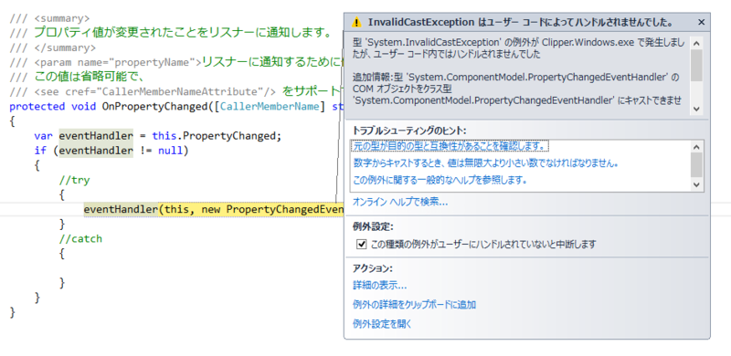
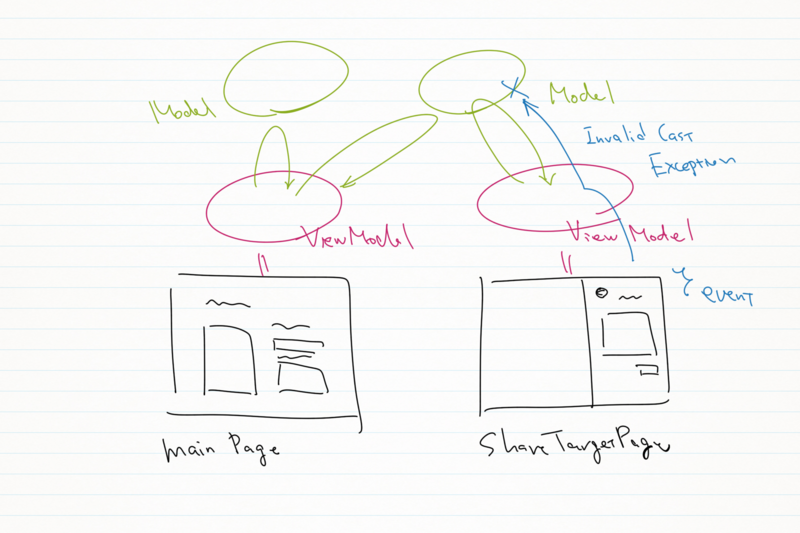

 

<blockquote>

COM コンポーネントを表す型のインターフェイスを COM コンポーネントを表さない型にキャストすることはできません。

</blockquote>

なんかこんな感じの、まぁ、自分でもよくわからん感じの設計になっていたのだけど、ShareTargetPage の ViewModel でエラーが発生する。

問題のコードはこの部分。

<pre class="code lang-cs" data-lang="cs" data-unlink>protected void OnPropertyChanged([CallerMemberName] string propertyName = null)
{
var eventHandler = this.PropertyChanged;
if (eventHandler != null)
{
eventHandler(this, new PropertyChangedEventArgs(propertyName));
}
}
</pre>
ここで InvalidCastException が出る……。<a href="http://okazuki.hatenablog.com/entries/2012/10/13">&#x304B;&#x305A;&#x304D;&#x306E;Blog@hatena</a> ともちょっと違うのだけど、どうせ似たような原因だと思う。

<blockquote>

結果として別スレッドでコレクションを操作したため、エラーになるというWPFやSilverlightなどでおなじみのエラーパターンと同じでした。それにしても、何故InvalidCastExceptionなのだ！！

</blockquote>

いろいろ試してみたが、結局、自分の場合は Visual Studio でデバッグ実行しているときだけ発生することが判明（？）。共有のテストをするときはデバッグ実行したアプリを終了してから行うという手段で回避できた。

いつか根本的に解決できるようになりたいです（小並

