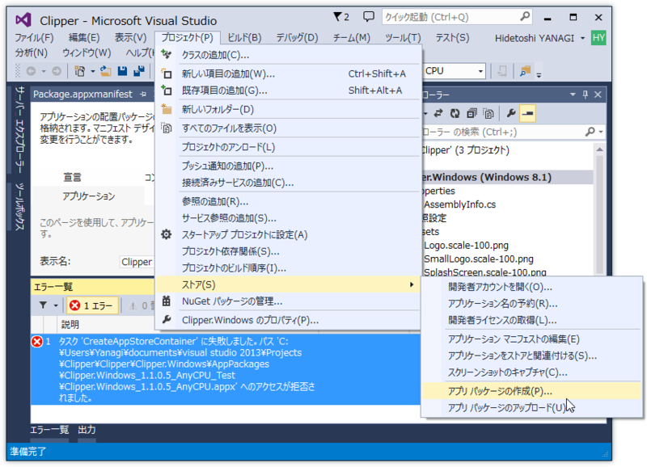
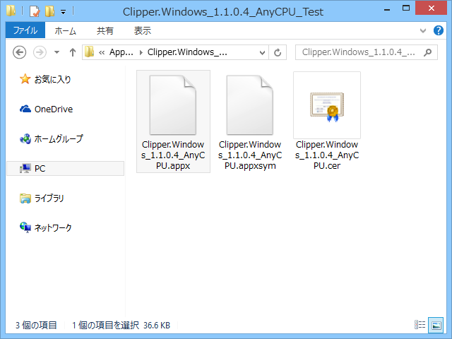
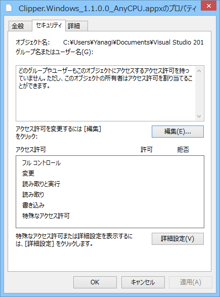
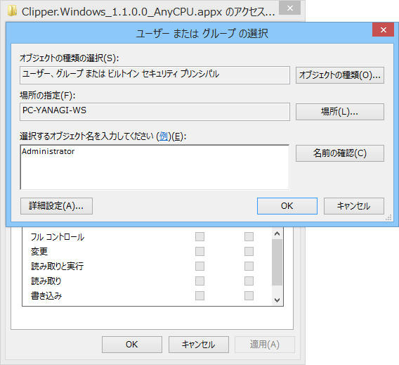
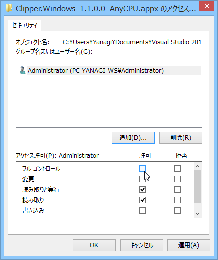
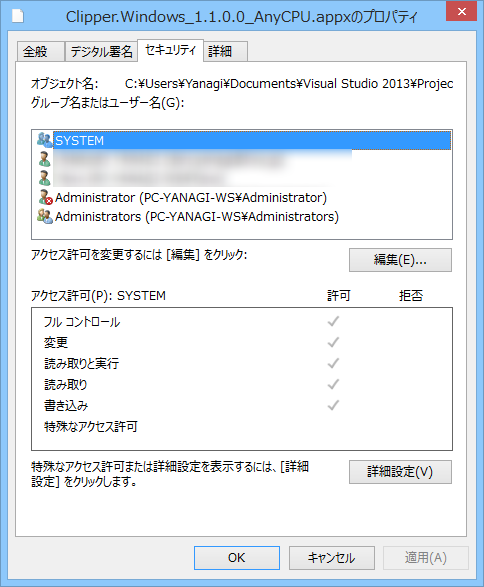
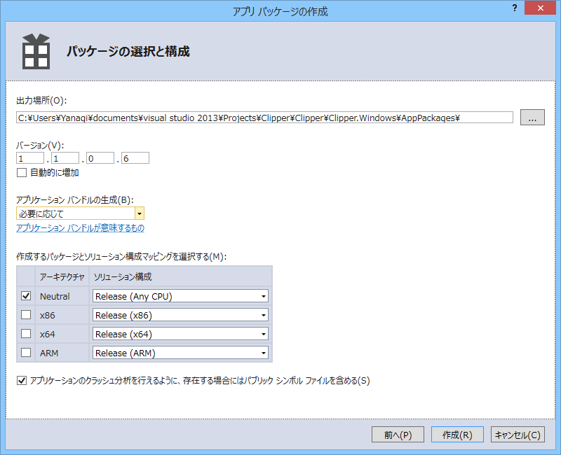

せっかくアプリを作ったのに、アップロードパッケージ（.appupload）が作成できませんがなでんがな！　ヒドい、ヒドすぎる！！

<ul>
<li><a href="http://social.msdn.microsoft.com/Forums/ja-JP/8bee78fd-6b32-4c44-a884-c89f9c900f24/create-app-package-bundle-creation-failed-access-is-denied?forum=winappswithcsharp">Create App Package Bundle Creation Failed. Access is denied.</a></li>
<li><a href="https://connect.microsoft.com/VisualStudio/feedback/details/810786/visual-studio-express-2013-for-windows-create-app-packages-fails-0x8007005-access-is-denied">Visual Studio Express 2013 for Windows Create app packages fails 0x8007005 Access is denied | Microsoft Connect</a></li>
</ul>
ここら辺りをみてみたが、どうやら .appx ファイルにアクセス権限を手動で与えてやればいいようだ。

バイナリのフォルダを開き、.appx ファイルのアクセス権限を確かめる。

ぁー……なんでか知らんけど、空っぽやった。

Administrators にフルコントロールを与える。適当だけどこれでいいのかしら？

とりあえず、これでうまくいった。

バージョンを［自動的に増加］するオプションが有効な状態で一度バイナリを吐き、アップロードパッケージの作成に失敗したら一時的に無効にして再度挑戦するといい感じに成功する。ちょっとめんどくさいけど……。

