
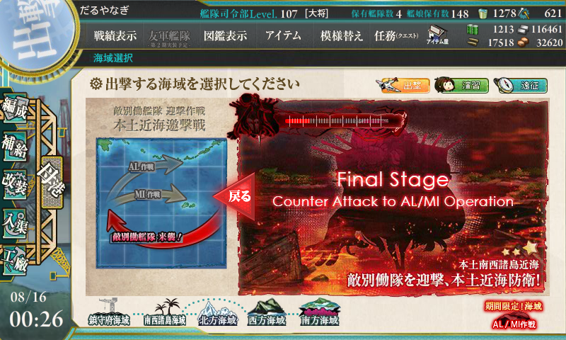

もっと資材を備蓄してから挑戦しようと思っていたのだけど、Twitter で挑戦報告・クリア報告を耳にしているうちに我慢できなくなり、金曜日だったかな？　突撃してみた。その結果――

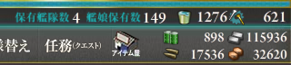

正直ちょっと立ち直れなかったのだけど、ようやく資源も燃料・弾薬ともに3万まで回復したので、当時のことを思い出しながらメモメモ。

<h3>海域オーバービュー</h3>

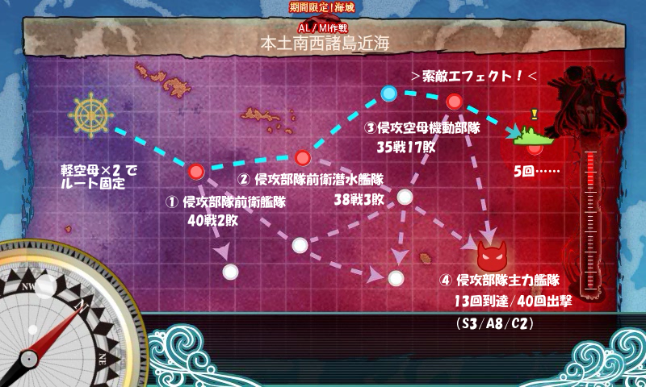

先達のおかげで 軽空母×2 でルート固定されるということはわかっていたので、北上さんを旗艦に千歳・千代田、残りはその時の気分でころころ変えながら一番感触がよさそうなのを探ってみる方針。

なお、基本的にキラ付けはなし。

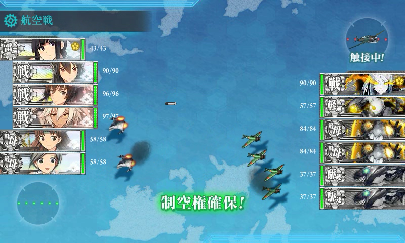

1戦目。戦艦はもちろん、軽空母が割と痛い。軽空母の開幕爆撃と北上さんの開幕雷撃で潰せないと、細かい傷を負ってしまってボスまでたどり着けなくなる。支援艦隊が来てくれるとだいぶ楽に突破できるので、出しておくのも手。

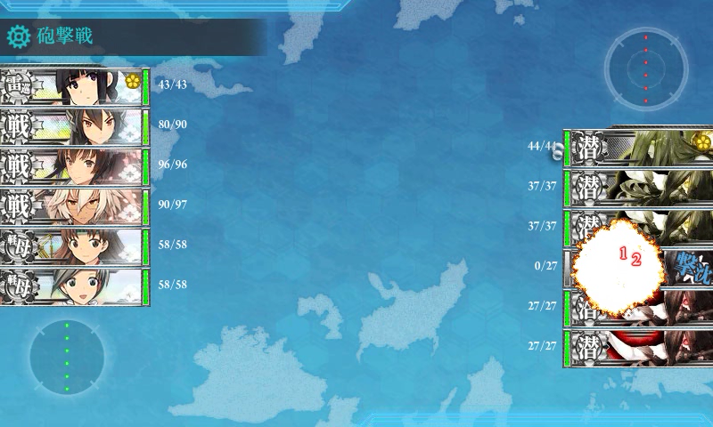

2戦目。敵潜水艦の雷撃が当たらないように、単横陣を敷いて祈りを捧げる。20% 程度の確率で何らかの傷は負ってしまうようだ。

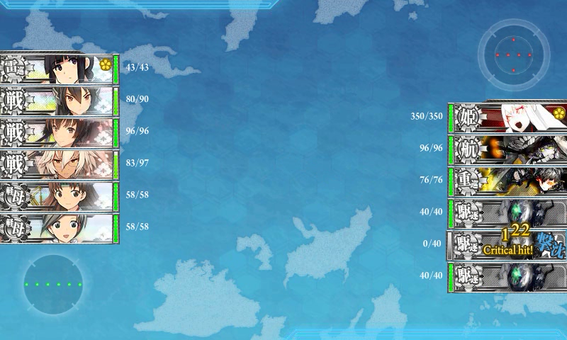

3戦目。撤退率50%の難関。だいたい、旗艦の「姫」ってなんなんだよ！　あと、空母が新型艦載機を積んでいる場合があって、これまた痛い。開幕で殺せたらとても楽になるのだけど……。

ちなみに、戦艦を混ぜなければ敵の攻撃を一巡に抑えることができる。ただし、戦艦抜きだとボス戦が割としんどいので、一長一短って感じ。削りなら重巡の編成のほうがコストパフォーマンスがよかったと思うが、自分は短気なので途中で大和型をぶち込んで破産した。

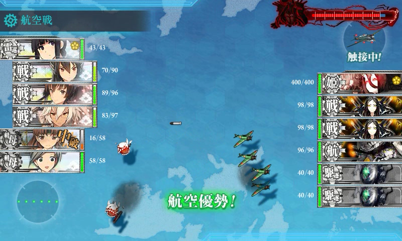

ボス戦。夜戦まで行かないと削り切れない感じ。北上さんはカットイン装備にしたけれど、削るだけならば連撃装備のほうが安定するかもしれない。

重巡編成だと、昼戦を全艦中破で生き延びるのが至難の業。生き延びさえすれば、戦艦構成に劣らない打撃力をもつが、雑魚を撃ち漏らしている場合が多いので、ひたすら攻撃が姫に直撃することを祈ることになる。

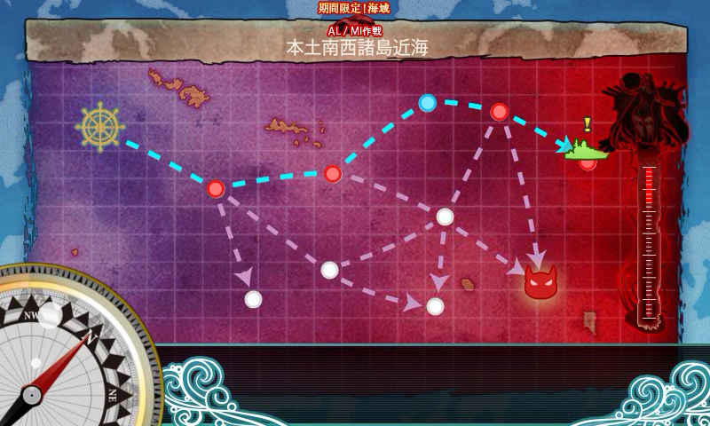

番外編。ボスを外すと痛い……索敵値が十分でも外すときは外すようだ。自分は 5/18（30％）で外したが、これは前半に余裕をかまして索敵を削ってみたりしたときの数値も込みなので、実際は 10％ ほどじゃないかと思う。

<h3>経過</h3>

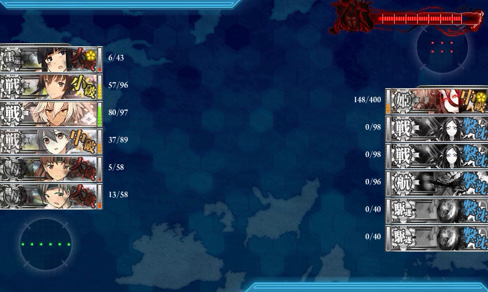

初めて到達したけど、雑魚が残っていたのと、北上さんが大破していたせいで打ち漏らした。

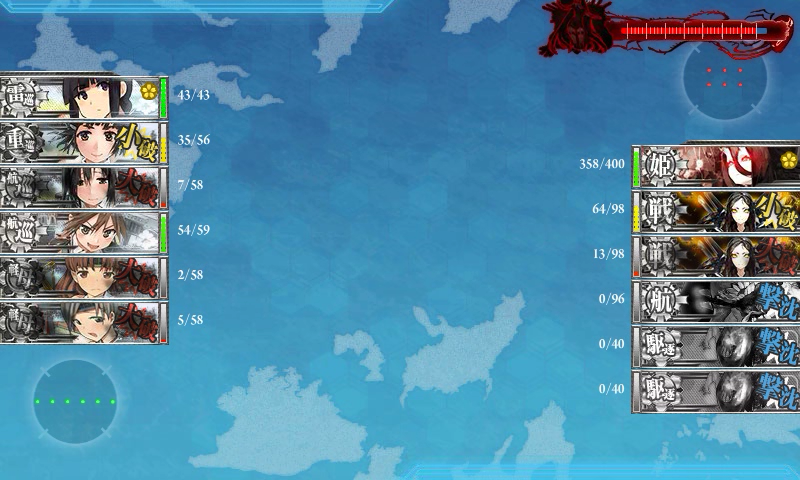

重巡艦隊にスイッチして到達。昼戦で大破が出たのであきらめた。軽空母にはダメコンが積んであるので、ここは踏み込んでもよかったところかも。

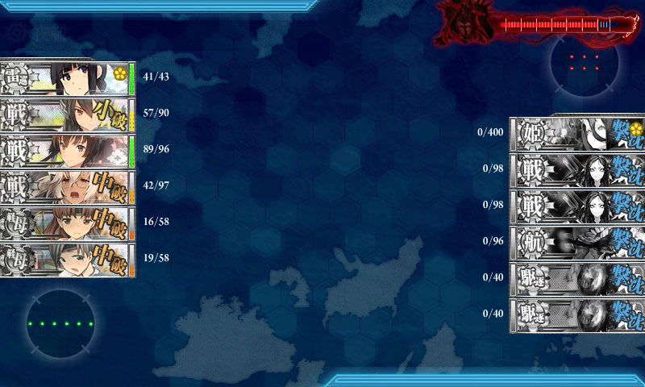

初撃破。運次第だなと実感。

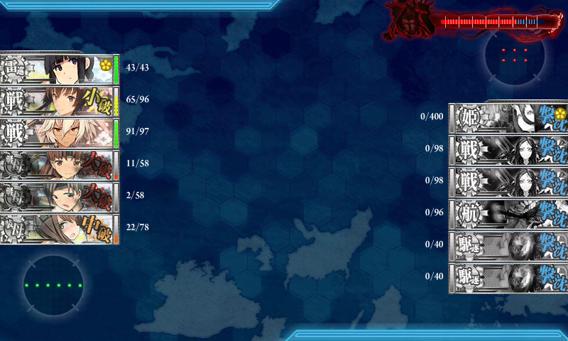

続いて二回目の撃破。空母マップで航空優勢をとれば相手の艦載機の爆撃を緩和できないかと考え、長門に替え大鳳を投入。その直後は割と到達率がよかったのだけど、とくに空母マップでの撤退率が下がったかといえばそうとも言えず、トータルでみればイマイチだったかもしれない。

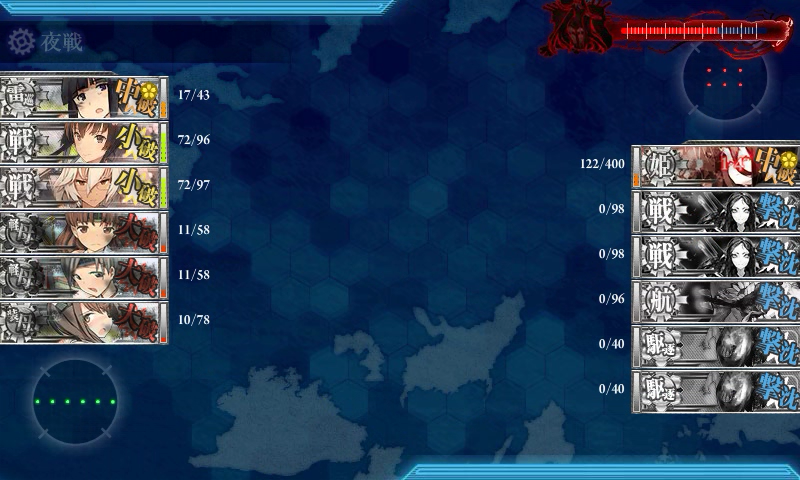

北上さんのカットイン不発＆大和型のカスダメで打ち漏らしたパターン。

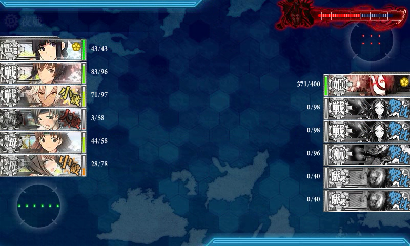

雑魚がたくさん残って撃ち漏らしたパターン。

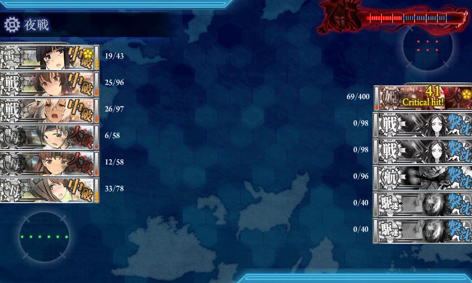

夜戦開戦時は絶対イケると思ったのに大和型が中破、撃ち漏らしたパターン。

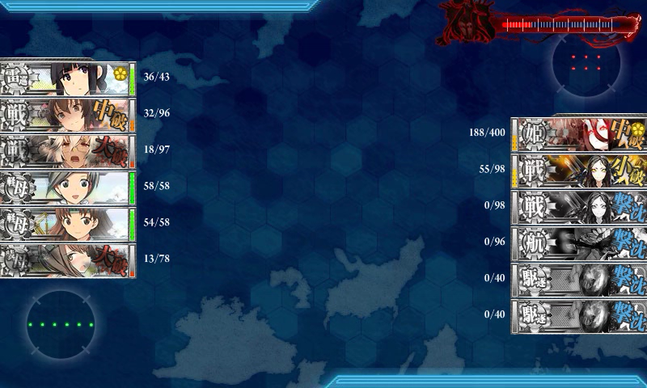

またもや雑魚がたくさん残って撃ち漏らしたパターン。

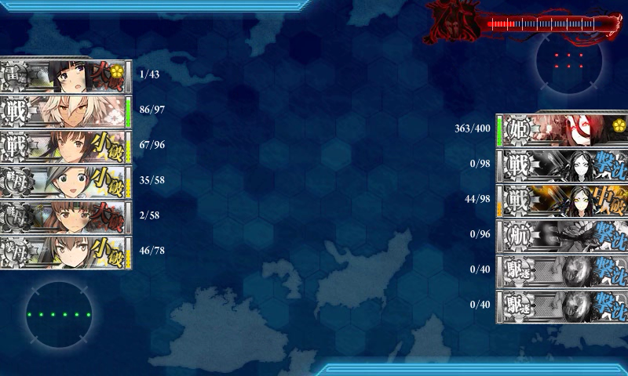

雑魚残存＆北上さんの大破で打ち漏らしたパターン。

記録に残っていないものもあるので、まぁ、こんな感じ。ボスに到達したのに、1発も当てられなかったこともある。

実質的なボスへの到達率は約40％。そこでさらにボスを潰せる確率は……20％ほどか。うーむ。

<h3>装備</h3>

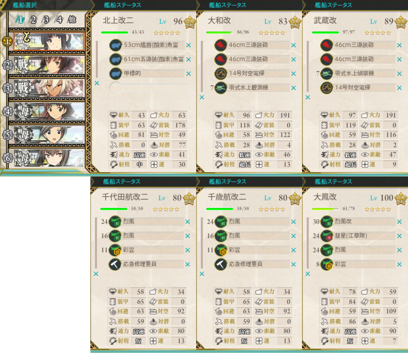

途中でころころ変えたので一例だけど……。

<h3>再戦、どうしよう？</h3>

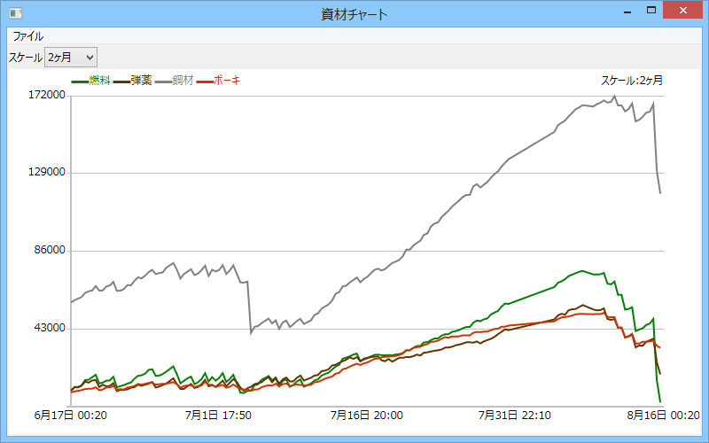

とりあえず燃料・弾薬ともに三万たまったので、同様の作戦をもう一度敢行することは可能。しかし、削り切った後もこれでイケるかといわれると……自信ない。

大鳳＋北上・重巡で中央を突破する方法も試してみようかなぁ？

