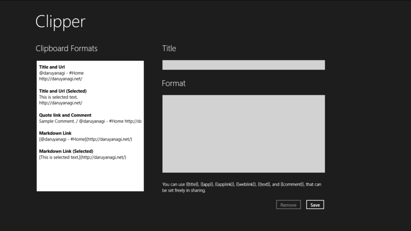
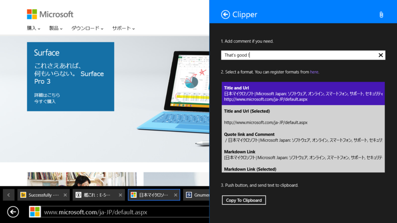
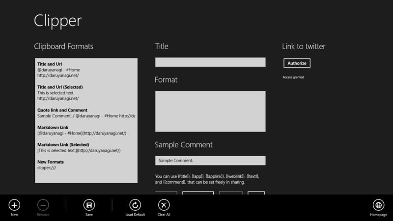

簡単に言うと、［共有］チャームから

<ul>
<li><a href="https://chrome.google.com/webstore/detail/create-link/gcmghdmnkfdbncmnmlkkglmnnhagajbm">Create Link - Chrome Web Store</a></li>
<li><a href="https://addons.mozilla.org/ja/firefox/addon/make-link/">Make Link :: Add-ons for Firefox</a></li>
</ul>
をするアプリです。

整形フォーマットを登録しておいて、それを［共有］チャームで選択すると、タイトルや URL がその通りに整形されてクリップボードにコピーされます。現在申請中の最新版だと、Twitter にポストすることもできます。この機能は <a href="http://apps.microsoft.com/windows/ja-jp/app/sharetwit/52d662fb-937d-41ef-bcca-8e32c2bc7446">Windows &#x30B9;&#x30C8;&#x30A2; &#x306E; Windows &#x7528; ShareTwit &#x30A2;&#x30D7;&#x30EA;</a> にちょっと似てますね。

（個の埋め込みタグは <a href="http://wsoembed.com/">Windows Store oEmbed</a> を利用しています）

ローミング機能を付けてからいろいろ動作が怪しいのですが、そのうち安定するかも……。

あかんかったらアプリバーからデフォルトの設定をロードしてみてください。

<h3>Release 1: 1.1.0.6 (2014/08/16)</h3>

<ul>
<li>初回リリース</li>
<li>[New] ［共有］チャームからフォーマットを選択し、アプリのタイトルやリンクを整形してクリップボードにコピーします</li>
<li>[New] フォーマットを編集できます</li>
<li>[New] フォーマット設定は複数デバイス間でローミングされます（テストがあんまりできてなくて動作が不安定……）</li>
</ul>
<del>そのうち公開されるバージョンでは、さらに機能の追加があります。</del>公開されました。（追記：2014/08/20）

<h3>Release 2: 1.1.0.7 (14/08/19)</h3>

<ul>
<li>{{comment}} で {{title}} や {{url}} が使えるようになりました。アプリのメイン画面でわざわざ登録するまでもない使い捨てのフォーマットを書くための隠し機能です。</li>
<li>整形済みテキストをツイートできるようになりました。</li>
<li>[Fix] {{comment}} を編集してもプレビューに反映されない場合がある不具合を直した気がする</li>
<li>フォーマットを一覧で並び替えられるようにしました。</li>
</ul>

