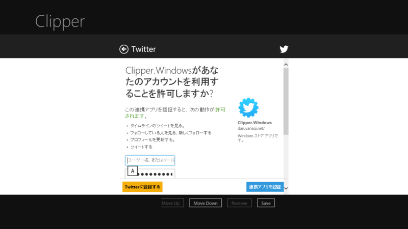

Windows ストア アプリへ手軽にツイート機能を追加したいときに便利なライブラリが、<a href="http://twitterrt.codeplex.com/">TwitterRt - Tweet from Windows Metro Apps - Home</a>。こういう感じの WebAuthenticationBroker を使った認証処理を一行で実現してくれるのがいい。

<pre class="code lang-cs" data-lang="cs" data-unlink>private TwitterRt t = new TwitterRt(
&quot;consumerKey&quot;,
&quot;consumerSecret&quot;,
&quot;callbackUrl&quot;
);

private async void Button1_Click(object sender, Windows.UI.Xaml.RoutedEventArgs args)
{
// 認証
await t.GainAccessToTwitter();
}

private async void Button2_Click(object sender, Windows.UI.Xaml.RoutedEventArgs args)
{
// ツイート
await t.UpdateStatus(&quot;Hello From TwitterRt&quot;);
}
</pre>
ソースコードを斜め読みしかしてないのだけど、認証処理で取得したトークンなんかは自動で ApplicationData.RoamingSettings に保存してくれるっぽい。一度どこかの端末で認証しておけば、ほかの端末でもそれが自動で同期されるはず。超便利だな。

でも、残念ながらメンテナンスされていないようで、NuGet で取得したバイナリが動かない。しょうがないのでソースコードを落としてきてちょろちょろっと直した。

<pre class="code lang-cs" data-lang="cs" data-unlink>// 46行目ぐらい

// const string _updateStatusUrl = &quot;https://api.twitter.com/1/statuses/update.json&quot;;
const string _updateStatusUrl = &quot;https://api.twitter.com/1.1/statuses/update.json&quot;;
</pre>
まずは Twitter の API を 1.0 → 1.1 へとアップデート。

<pre class="code lang-cs" data-lang="cs" data-unlink>// 295行目ぐらい

Request.Method = &quot;POST&quot;;
Request.ContentType = &quot;application/x-www-form-urlencoded&quot;; // 追加
Request.Headers[&quot;Authorization&quot;] = headers;
</pre>
ContentType も設定しなきゃいけないらしい。

これだけで一応動くのだけど……

<pre class="code lang-cs" data-lang="cs" data-unlink>// 179行目ぐらい

// request.Add(&quot;status&quot;, Uri.EscapeDataString(status));
request.Add(&quot;status&quot;, Uri.EscapeDataString(status.Replace(&quot;\r\n&quot;, &quot;\n&quot;)));
</pre>
改行を含んだテキストをツイートできるように、もう一カ所修正しておいた。

<ul>
<li><a href="http://coelacanth.jp.net/windows%E3%82%B9%E3%83%88%E3%82%A2%E3%82%A2%E3%83%97%E3%83%AA%E5%85%A5%E9%96%80-vol73twitterrt%E3%81%A7%E3%81%8A%E6%89%8B%E8%BB%BD%E3%81%AB%E3%81%A4%E3%81%B6%E3%82%84%E3%81%8F/">Windows&#x30B9;&#x30C8;&#x30A2;&#x30A2;&#x30D7;&#x30EA;&#x5165;&#x9580; vol73:TwitterRt&#x3067;&#x304A;&#x624B;&#x8EFD;&#x306B;&#x3064;&#x3076;&#x3084;&#x304F; | &#x7720;&#x308B;&#x30B7;&#x30FC;&#x30E9;&#x30AB;&#x30F3;&#x30B9;&#x3068;&#x6C34;&#x5E95;&#x306E;&#x30D7;&#x30ED;&#x30B0;&#x30E9;&#x30DE;&#x30FC;</a></li>
</ul>