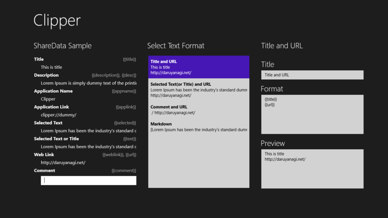
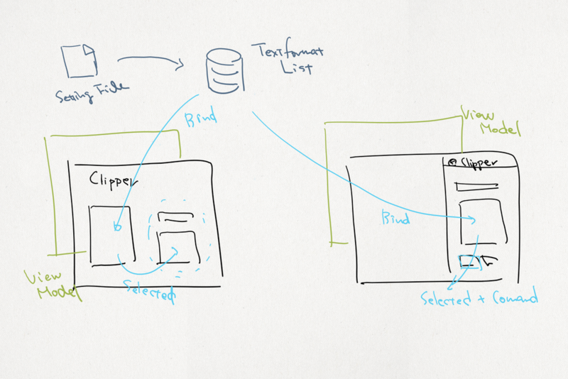
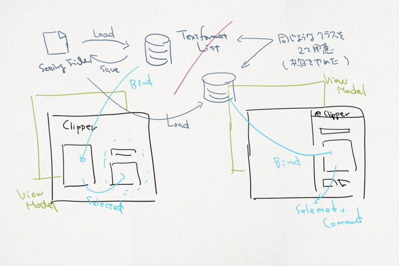
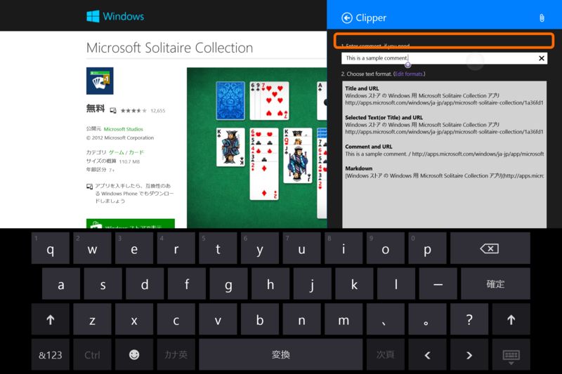

ソースコードなくしたので一から作り直しました orz でも、おかげで

<ul>
<li>共有ターゲットページの表示に時間がかかる</li>
<li>共有ターゲットページの表示に失敗する</li>
</ul>
といった不具合がだいぶ減っていると思います。

<blockquote>

2014/08/26 9:47 追記：<b>ごめんなさい</b>、データの互換性がなくなってるのでもう一度フォーマットの編集と保存をお願いします。保存コマンド（や、Twitter の認証コマンド）はアプリバーにあります。

</blockquote>

これまではテキストフォーマットの設定ファイルを読みだしてその内容（ObservableCollection）をメインページと共有ターゲットページのビューモデルから参照するようにしていたのですが、いろいろ不具合が出てしまいます（<a href="https://blog.daruyanagi.jp/entry/2014/08/16/211610">WinRT: COM &#x30B3;&#x30F3;&#x30DD;&#x30FC;&#x30CD;&#x30F3;&#x30C8;&#x3092;&#x8868;&#x3059;&#x578B;&#x306E;&#x30A4;&#x30F3;&#x30BF;&#x30FC;&#x30D5;&#x30A7;&#x30A4;&#x30B9;&#x3092; COM &#x30B3;&#x30F3;&#x30DD;&#x30FC;&#x30CD;&#x30F3;&#x30C8;&#x3092;&#x8868;&#x3055;&#x306A;&#x3044;&#x578B;&#x306B;&#x30AD;&#x30E3;&#x30B9;&#x30C8;&#x3059;&#x308B;&#x3053;&#x3068;&#x306F;&#x3067;&#x304D;&#x307E;&#x305B;&#x3093;&#x3002; - &#x3060;&#x308B;&#x308D;&#x3050;</a>、この内容も全然回避になってなくて、共有ターゲットページの表示に失敗する原因になってました）。

というわけで、ちょっと無駄になるのだけどそれぞれのビューモデルにそれぞれ同じようなクラスを書き、リストを保持するようにしました（クラスを共用するようにすることもダメみたい）。保守性が下がっちゃったけど、so far, so good って感じですかね。

あと、そのほかにも

<ul>
<li>ユーザーインターフェイスがちょろっとリッチになりました。</li>
</ul>
少しはわかりやすくなったかなーって思います。

（ブラウザーなどの［共有］チャームからタイトルや URL、選択テキストなどをあらかじめ記述したテンプレートに従って整形し、クリップボードへコピーしたり、ツイートしたりするアプリです）

<h3>注意点</h3>

<blockquote class="twitter-tweet" data-lang="ja">
<a href="https://twitter.com/daruyanagi?ref_src=twsrc%5Etfw">@daruyanagi</a> Clipper便利でですね！ コメント入力テキストボックスが非アクティブになったらソフトキーボード消えるようにしてもらえるとありがたいです
&mdash; くつき くれむ（公式）.eXe (@k2kkrm) <a href="https://twitter.com/k2kkrm/status/503920531729424385?ref_src=twsrc%5Etfw">2014年8月25日</a></blockquote>

キーボードのない端末でコメントテキストボックスにフォーカスを当て、次にリストボックスを選択すると、オンスクリーンキーボードがとじないようです。

少し調べてみましたが、残念ながらいい解決が思いつきませんでした。オンスクリーンキーボードの表示・非表示は OS（？）の仕事のようなのですが……最初にリストボックスを選択するとオンスクリーンキーボードは現れないので、編集可能なコントロールからフォーカスがほかに移ったにもかかわらずオンスクリーンキーボードが閉じないのは OS 側の問題かなって気もしないでもないです。

橙色で囲った辺りをタップするとオンスクリーンキーボードは消えますので、不便で申し訳ないのですが、当面はそれで回避していただけるとありがたいです。

<h3>おまけ</h3>

ダウンロードが 7 もある！ ひとつは多分自分だから、もの好きが6人もいるってことだな！　ありがたい！

