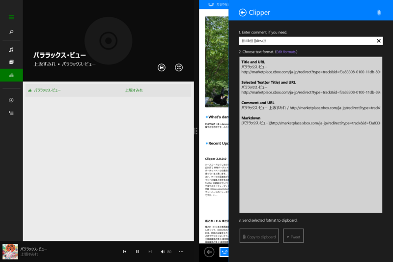

Windows 8 の「ミュージック」アプリの場合、

<ul>
<li>{{title}} に曲名</li>
<li>{{description}} にアーティスト名</li>
</ul>
が入るので、

<pre class="code" data-lang="" data-unlink>&#34;{{title}}&#34; by {{desc}} #nowplaying</pre>
みたいな書式を作ってやると、今聞いている曲がツイートできる。書式をあらかじめ登録してない場合でも、{{comment}} にこの書式を入力すればちゃんと展開される（ハズ）。

<blockquote class="twitter-tweet" lang="ja">
&quot;パララックス･ビュー&quot; by 上坂すみれ / <a href="http://t.co/kCvHKlsQt2">http://t.co/kCvHKlsQt2</a>
&mdash; だるやなぎ（歩兵） (@daruyanagi) <a href="https://twitter.com/daruyanagi/statuses/504604291290513408">2014, 8月 27</a></blockquote>

ただし「ミュージック」アプリを起動した状態で共有しなきゃならない（<a href="http://apps.microsoft.com/windows/ja-jp/app/c9cd525b-1abd-44fb-9f50-3c61ede0f650">Windows &#x30B9;&#x30C8;&#x30A2; &#x306E; Windows &#x7528; &#x3077;&#x308D;&#x306A;&#x307E;&#x306A;&#x3046;&#x3077;&#x308C; &#x30A2;&#x30D7;&#x30EA;</a> も同じ仕組みじゃないかな）。Windows 8/8.1 には今のところ Now Playing を取得できるインターフェイスがないみたいで残念……Windows Phone の場合は XNA を使えばできるみたい。こういう情報は読み取りオンリーでいいんだから、積極的に公開してくれると面白いアプリがたくさん出てくると思うのだけど。

