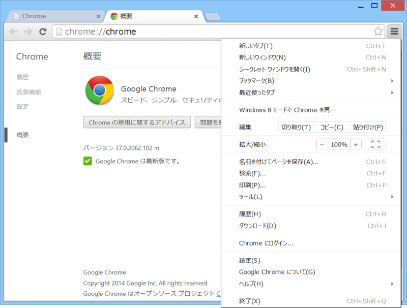
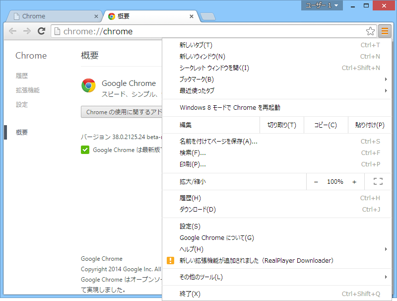

Google Chrome 37 のメニュー。

Google Chrome 38　のメニュー。ボタンのデザインが変わってたり、項目の順序が入れ替わったりしてた。一瞬［ツール］はどこに行ったんだろうと思ったけど、下の方に引っ越したらしい。名前も［その他のツール］になっている。

<ul>
<li><a href="http://www.forest.impress.co.jp/docs/news/20140829_664259.html">&#x65B0;&#x3057;&#x3044;&#x30E6;&#x30FC;&#x30B6;&#x30FC;&#x7BA1;&#x7406;UI&#x3068;&#x30B2;&#x30B9;&#x30C8;&#x30E2;&#x30FC;&#x30C9;&#x3092;&#x642D;&#x8F09;&#x3057;&#x305F;&#x300C;Google Chrome 38&#x300D;&#x30D9;&#x30FC;&#x30BF;&#x7248;&#x304C;&#x516C;&#x958B; - &#x7A93;&#x306E;&#x675C;</a></li>
</ul>
メインの変更はユーザーボタンの追加だろうと思うけれど、こういうのもあるってことで。

