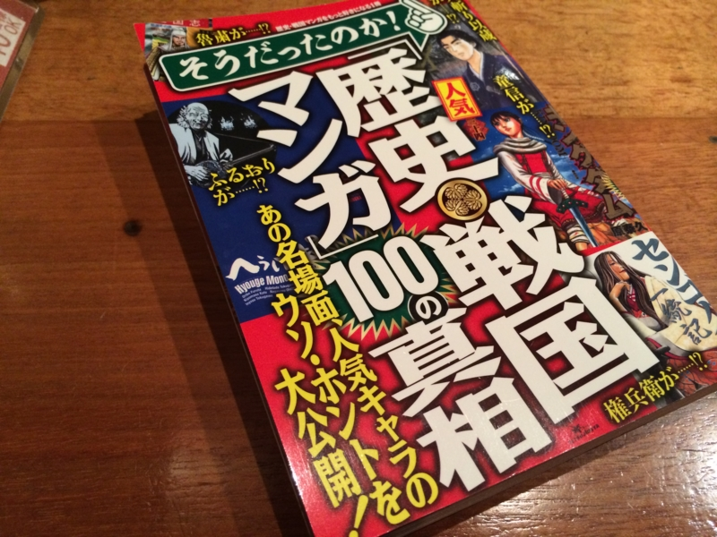

この前、電車で古町まで出かけ、セブンイレブンで『そうだったのか！人気『歴史・戦国マンガ』１００の真相』という本を買いました。

――実はこの本、原稿を何本か書かせていただいてまして。

会社辞めたときは、年内にこんなことなるだなんて想像もしていませんでしたね。ちょっとびっくり。

さてこの本、買ったはいいのだけど、割りと自分が書いたのを読むのは恥ずかしくて……実は飾っているだけで全部は読んでいません。でも、自分以外のところをぺらぺらと読んでいたのですが、割りと面白いんじゃないかなーって思います。歴史マンガをいくつか取り上げて面白く紹介する……という趣旨の本だと思いますが、僕は『へうげもの』が好きなので、そのところはとくに「へぇ」って感じで読ませていただきました。

<a href="http://www.amazon.co.jp/exec/obidos/ASIN/4063724875/bestylesnet-22/">へうげもの(1) (モーニング KC)</a>
<ul><li>作者: 山田芳裕</li><li>出版社/メーカー: 講談社</li><li>発売日: 2005/12/22</li><li>メディア: コミック</li><li>購入: 15人 クリック: 208回</li><li><a href="http://d.hatena.ne.jp/asin/4063724875/bestylesnet-22" target="_blank">この商品を含むブログ (387件) を見る</a></li></ul>

詳しいことについては、酢酸先生がブログで紹介してくれているので、そっちを読んでみるといいかもしれません。

<ul>
<li><a href="http://blog.ch3cooh.jp/entry/20140815/1408077703">&#x3084;&#x306A;&#x304E;&#x3072;&#x3067;&#x3068;&#x3057;&#x3055;&#x3093;&#x3089;&#x304C;&#x57F7;&#x7B46;&#x3055;&#x308C;&#x305F;&#x300C;&#x305D;&#x3046;&#x3060;&#x3063;&#x305F;&#x306E;&#x304B;!&#x4EBA;&#x6C17;&#x300E;&#x6B74;&#x53F2;&#x30FB;&#x6226;&#x56FD;&#x30DE;&#x30F3;&#x30AC;&#x300F;100&#x306E;&#x771F;&#x76F8;&#x300D;&#x3092;&#x8CB7;&#x3044;&#x307E;&#x3057;&#x305F; - &#x9162;&#x308D;&#x3050;&#xFF01;</a></li>
</ul>
そんなわけで、読んでも割と面白いと思うのですが、実は書いてる本人が一番いろいろ勉強になってたり。僕は『ヒストリエ』や『キングダム』、『墨攻』辺りを担当させていただいたのですが、今まで考えたこともなかった切り口で史書を読むのは割と面白いですね。自分はこれでも歴史好きな方だと思うけれど、どちらかというと流れを把握することを重視して、薀蓄の方はとくに興味がなかったように思います。けれど、薀蓄話をしようと思うと細部を掘り下げていかなければならない。すると、歴史の大きな流れとはまた別の、それに翻弄された個人の人生がちょっと見えてきて……書いてるうちに、最初は書くつもりのなかったことまで延々と書いている自分がいました（笑

<a href="http://www.amazon.co.jp/exec/obidos/ASIN/4003340515/bestylesnet-22/">歴史 上 (岩波文庫 青 405-1)</a>
<ul><li>作者: ヘロドトス,松平千秋</li><li>出版社/メーカー: 岩波書店</li><li>発売日: 1971/12/16</li><li>メディア: 文庫</li><li>購入: 3人 クリック: 199回</li><li><a href="http://d.hatena.ne.jp/asin/4003340515/bestylesnet-22" target="_blank">この商品を含むブログ (22件) を見る</a></li></ul>

今回はとくに、ヘロドトスの『歴史』をちゃんと読む機会が得られたのと（よく考えたら読んだことなかったわ）、秦漢期の刑罰・爵位制度について勉強できたのが楽しかったですね。ヘロドトスの『歴史』はわりととんでもな記述も多いので（全体的には素晴らしい歴史書ですが！）、また機会があれば紹介したいかも。

そういえば原稿を書きながら思い出したのですが、まだ小学校の頃、東京への帰省（母方が東京でした）で荷物の晩をしながら母に売店で買ってもらった歴史の本（戦国時代100の謎みたいな感じだったと思います）を読みふけっていたら、知らないおじさんに「小さいのにこんな本を読むんだね、偉いね」って褒められたことがあります。楽しくて読んでただけなのに、褒められてなんか変な気分になったのをちょっと覚えています。

それから時が経ち、いつしかこういう本からは卒業して、お硬めの本をいろいろ読むようになりました。そのうち頭もだんだん硬くなり、歴史は楽しむものではなく、なにか教訓を引き出したり、分析してモデル化する対象だ――大袈裟に言えば、そういう感覚で歴史に接することが多くなってきたように思います。なので、こういう本に協力する機会を得て、楽しいような、懐かしいような、新鮮なような、そんな感覚を覚えました。

興味ある人は、セブンイレブンの本のコーナーをのぞいてみてください。まだ売れ残ってるかも？　ちなみに松山市にはセブンイレブンが18店舗あるそうです！

<ul>
<li><a href="http://www.navitime.co.jp/classified/A38201_L0201001001">&#x611B;&#x5A9B;&#x770C;&#x677E;&#x5C71;&#x5E02;&#x306E;&#x30BB;&#x30D6;&#x30F3;&#x30A4;&#x30EC;&#x30D6;&#x30F3;&#x4E00;&#x89A7; (1/1) - NAVITIME</a></li>
</ul>