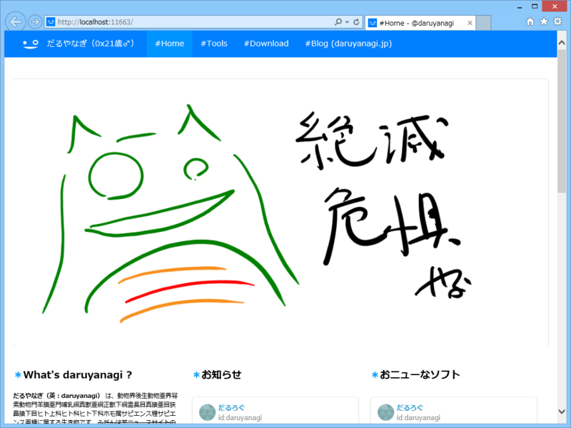
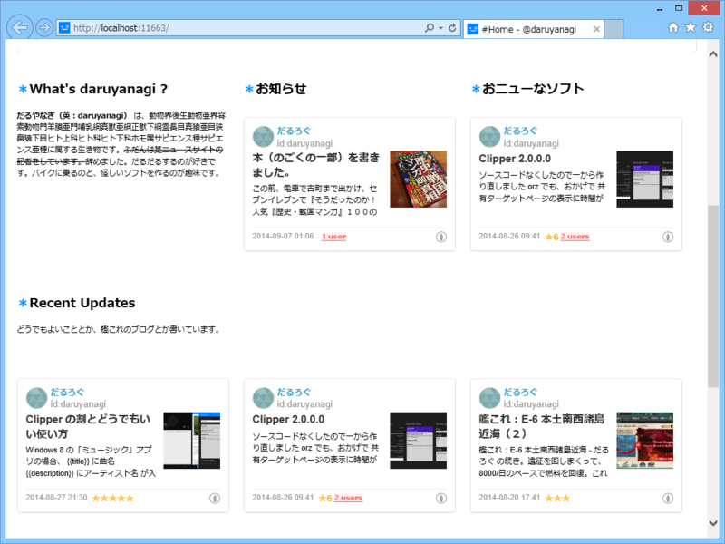
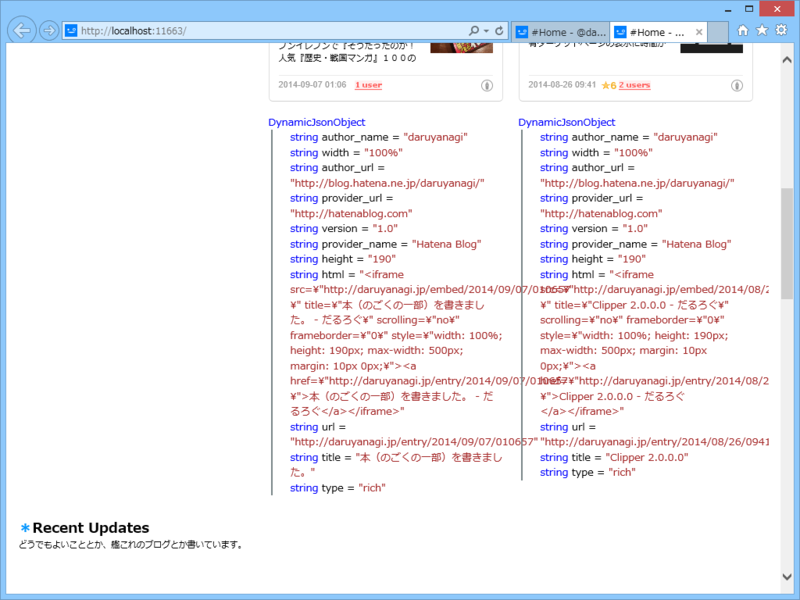

 

<ul>
<li><a href="http://staff.hatenablog.com/entry/2014/09/03/153938">&#x306F;&#x3066;&#x306A;&#x30D6;&#x30ED;&#x30B0;oEmbed API&#x3092;&#x516C;&#x958B;&#x3057;&#x307E;&#x3057;&#x305F;&#x3002;&#x30D6;&#x30ED;&#x30B0;&#x30AB;&#x30FC;&#x30C9;&#x306E;&#x60C5;&#x5831;&#x3092;API&#x3067;&#x53D6;&#x5F97;&#x3067;&#x304D;&#x307E;&#x3059;&#xFF08;&#x958B;&#x767A;&#x8005;&#x5411;&#x3051;&#xFF09; - &#x306F;&#x3066;&#x306A;&#x30D6;&#x30ED;&#x30B0;&#x958B;&#x767A;&#x30D6;&#x30ED;&#x30B0;</a></li>
</ul>
せっかくなので、WebMatrix のヘルパーにしてトップページでも使ってみた。

<pre class="code lang-cs" data-lang="cs" data-unlink># ~/App_Code/OEmbed.cshtml

@helper Hatena (string url) {
try
{
using (var downloader = new WebClient())
{
var request = string.Format(
&quot;http://hatenablog.com/oembed?url={0}&amp;format={1}&quot;,
url, &quot;json&quot;
);

var oembed_data = downloader.DownloadString(request);
var oembed_json = Json.Decode(oembed_data);

@Html.Raw(oembed_json.html);

// @ObjectInfo.Print(oembed_json)
}
}
catch (Exception e)
{
&lt;p class='error'&gt;@url: @e.Message&lt;/p&gt;
}
}
</pre>
使い方はこんな感じ。ちゃんと運用するなら WebCache とか使って少し高速化してみるのもいいかもしれない。

<pre class="code lang-cs" data-lang="cs" data-unlink>@OEmbed.Hatena(&quot;https://blog.daruyanagi.jp/entry/2014/07/03/035624&quot;)
</pre>

はてなブログのところだけデザインがカッコよくて違和感があるけれど、まぁ、とりあえずこれで。 

@ObjectInfo.Print() を有効化してみると JSON でもらえる値がわかるので、これを利用して周りにフィットするようにダサくカードをデザインし直してもいいな（何

