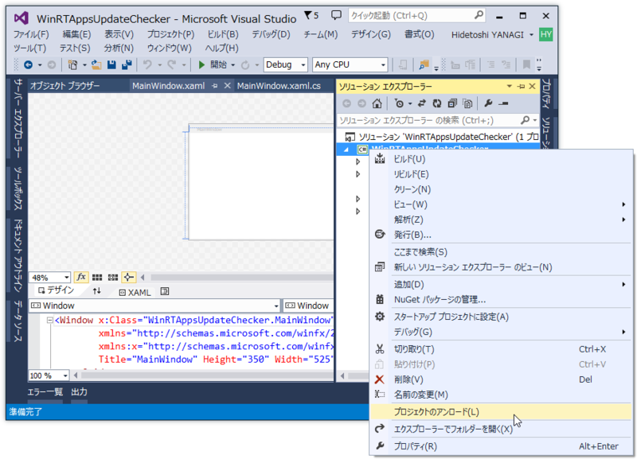
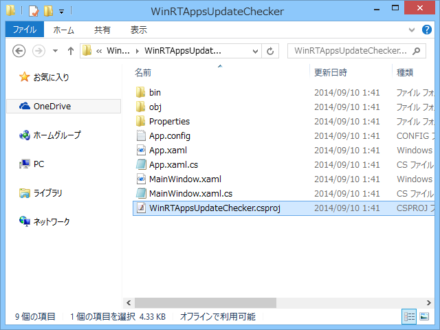
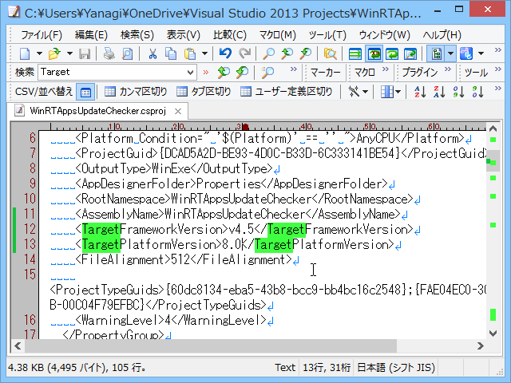
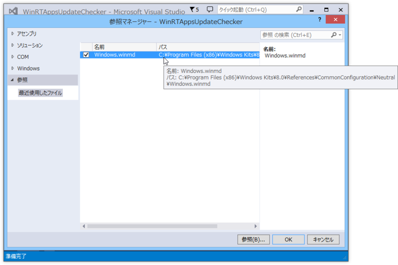
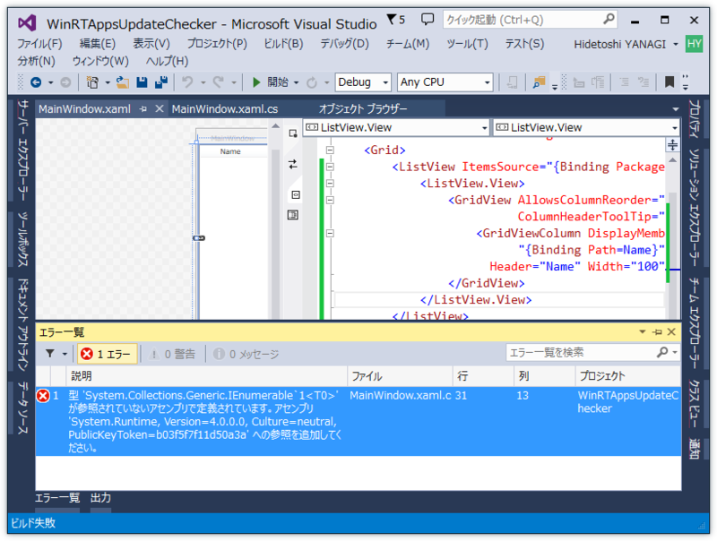
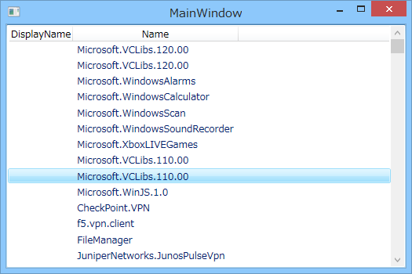

WPF アプリケーションからシステムにインストールされた Windows ストア アプリを列挙するには、この Windows Runtime API を使えばいいらしい。

<ul>
<li><a href="http://msdn.microsoft.com/ja-jp/library/windows/apps/br240968.aspx">PackageManager.FindPackagesForUser(String) Method (Windows)</a></li>
</ul>
ちなみに、Windows ストア アプリからは利用できないとのこと。

<h3>準備</h3>

というわけで、この API を使うために諸々の準備を行う。

<h4>ターゲットプラットフォームバージョンを指定</h4>

まず *.csproj ファイルをテキストエディターなどで開き、ターゲットプラットフォームとして Windows 8 以降を指定する。

プロジェクトを一度アンロード。

プロジェクトフォルダをエクスプローラで開く。いつからかコンテキストメニューにこのコマンドが追加されていてうれしい。

TargetPlatformVersion<a href="http://msdn.microsoft.com/ja-jp/library/microsoft.build.utilities.targetplatformsdk.targetplatformversion(v=vs.110).aspx">TargetPlatformSDK.TargetPlatformVersion &#x30D7;&#x30ED;&#x30D1;&#x30C6;&#x30A3; (Microsoft.Build.Utilities)</a> を記述して保存。プロジェクトをリロード。

<h4>winmd を参照に追加</h4>

次に、winmd を参照に追加。パスが長いけれど、コモンダイアログで winmd を検索すれば簡単に見つかる。これで IntelliSense で PackageManager クラスが補完できるようになるはず。

デスクトップアプリから Windows Runtime API を使う時には、毎回こういう作業が必要になるみたい。知らんけど。

<h3>コーディング</h3>

これで準備はだいたい完了なので、コードを記述していく。

<h4>コードビハインド</h4>

簡便のため、ViewModel は匿名型で済ませる。

<pre class="code lang-cs" data-lang="cs" data-unlink>namespace WinRTAppsUpdateChecker
{
using Windows.Management.Deployment;

/// &lt;summary&gt;
/// MainWindow.xaml の相互作用ロジック
/// &lt;/summary&gt;
public partial class MainWindow : Window
{
public MainWindow()
{
InitializeComponent();

var manager = new PackageManager();

DataContext = new
{
Packages = manager.FindPackagesForUser(string.Empty),
};
}
}
}
</pre>

<h4>XAML</h4>

リストボックスを用意するだけ。Package<a href="http://msdn.microsoft.com/ja-jp/library/windows/apps/windows.applicationmodel.package.aspx">&#x30D1;&#x30C3;&#x30B1;&#x30FC;&#x30B8; Class (Windows)</a> の情報は Package Class 直下にぶら下がっているものと、Package.Id にぶら下がっているものがあるっぽいが、前者はあまり役に立たん感じ（後述）。

<pre class="code lang-xml" data-lang="xml" data-unlink>&lt;ListView ItemsSource=&quot;{Binding Packages}&quot;&gt;
&lt;ListView.View&gt;
&lt;GridView&gt;
&lt;GridViewColumn DisplayMemberBinding=&quot;{Binding Path=DisplayName}&quot; Header=&quot;DisplayName&quot;/&gt;
&lt;GridViewColumn DisplayMemberBinding=&quot;{Binding Path=Id.Name}&quot; Header=&quot;Name&quot;/&gt;
&lt;/GridView&gt;
&lt;/ListView.View&gt;
&lt;/ListView&gt;
</pre>

<h3>実行</h3>

実行するとエラーが発生するので、System.Rumtime を参照へ追加する（64bit Windows 8.1 Update/Visual Studio 2013 Update 3 で開発してるけれど、32bit版 .NET 4 のアセンブリでいいみたい？）。

残念ながら DisplayName はプロパティがあるにもかかわらず取得できない。ほんとこういうところクソだと思う。InstalledLocation にある AppxManifest.xml を読む必要がある。

