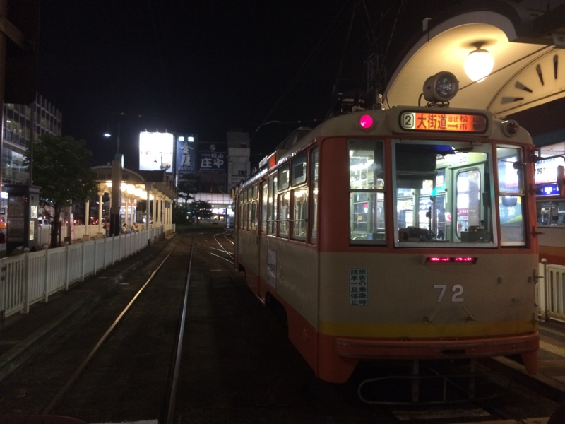
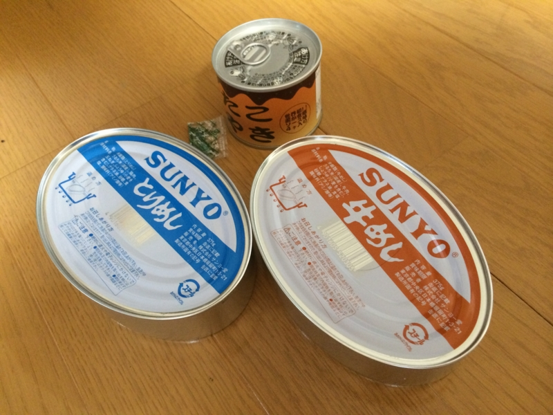
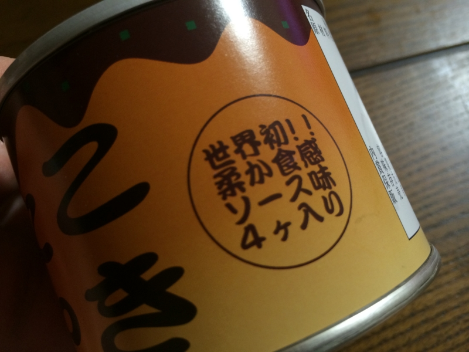
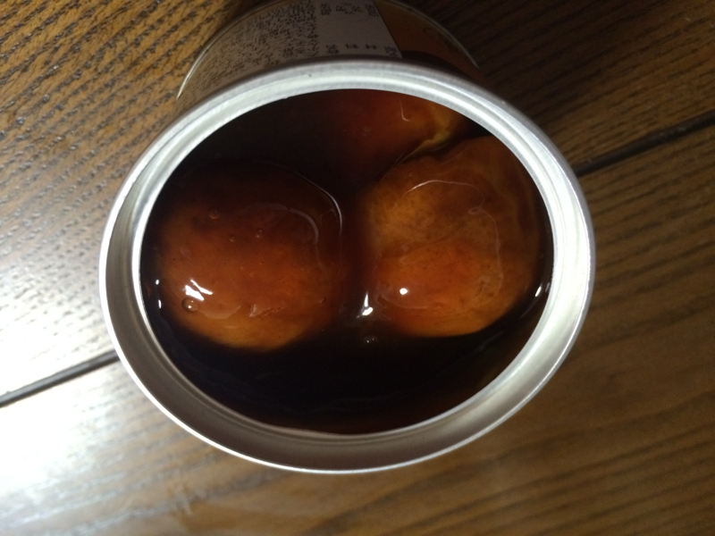
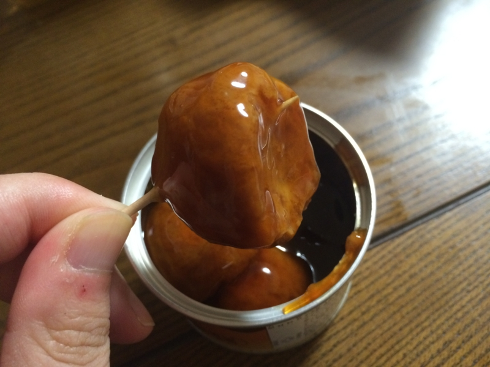
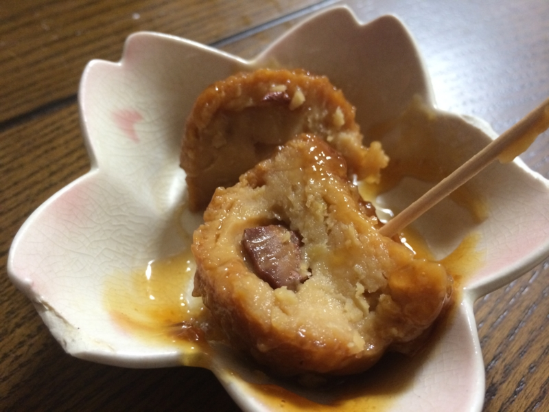

先週の金曜日は、@nakaji と @ramusara とで飲み会（あとで J さんと K さんも合流）。割りと恒例になりつつある。ちょっと面白い愛媛独自プロジェクトが進んでるみたいなので、期待したい。自分もなんかアイデアがあったら出したいけど、いかんせん、松山にきてからそれほど日が経ってないので、どうしても傍観者モード気味になってしまっている。

――で。

二次会（？）で缶詰専門のお店へいった。物珍しかったので、お土産も購入。それが――

たこ焼きの缶詰や。酔っててあまりよくおぼえていないのだけど、無難なもの（とりめしと牛めし）と、お店で一番マズいもの（たこ焼き）をチョイスしてもらった。美味しくないと聞くと、逆に食べたくなるのが人間の Sa・Ga ってヤツだよね。

多少マズくても世界初の試みというのならば、その意気に感じなければならない。もし大災害にあって暗くて寒い避難所で震える夜を過ごすとき、ソウルフードであるたこ焼きが食べられれば……不安解消、勇気百倍間違いなし。この缶詰の存在価値は、めったに使われない我が家のたこ焼き焼き器にけっして勝るとも劣らない。

開けてみた。4つ入ってる。たこ焼きというからには8つぐらいほしいけれど（俺の小さい頃、商店街のたこ焼き屋のおばちゃんのところはいつも2つサービスしてくれたので10個入ってたぞ！！）、缶詰ならば致し方ない。むしろ、かくも大玉のたこ焼きをコンパクトな缶詰に4つも収めたものだと感心する。

爪楊枝を刺して引き上げると、でろっとしたタレを身にまとったたこ焼き様が現れる。このタレは、たこ焼きのソースというよりは、焼き鳥の缶詰によくあるあのタレに雰囲気が似ている。もしかしたら従兄かもしれない。

爪楊枝を振り上げ、たこ焼きを一刀両断してみた。申し訳程度に、硬くなったタコのカケラがひとつ入っている。味は……タレが思ったより酸っぱい感じだが、マズいとは思わなかった。っていうか、あとでナメた。生地は、プレスをかけて十分に焼いたお好み焼きを扇風機の前で1時間冷やした後のような感じ。俺は今、たこ焼きじゃない、なにか新しい、形容しがたいものを食べている。しかし、これはこれでたこ焼きとしてアリなのではないか。たこ焼きとしては落第だが、作り手の「たこ焼きを缶詰にしたい」という汗臭い熱意が凝縮されているのを感じる。タレが酸っぱく、生地がちょっと硬いのはそのせいだろう。これはたこ焼きとして許していい、と僕は思った。

たとえば、カップ焼きそばはけっして焼きそばではない。焼きそばたりえない。しかし、“焼きそば”という名を冠するに値する、なにか“焼きそば”的要素をもったものであることは確かだ。焼いてすらいないのに！！　カップ焼きそばは、焼きそばの本質が“焼き”にはないことを僕たちに教えてくれている。

この缶詰たこ焼きも、いつかそんなカップ焼きそば的な地位を確立するのではないか――僕はそんな可能性を、“たこ焼き”を自称するこの得体のしれない食べ物に感じる。というのも、このたこ焼きは実に多くのモノを僕たちに教えてくれているのだ。

実はたこ焼きは“焼か”なくていいのではないか？　たまにタコが抜けている屋台のたこ焼きより、硬くて小さくても確実にタコを含んでいる缶詰のたこ焼きの方が、ずっとたこ焼きらしいのではないか？　いつか俺たちは焼きたてのたこ焼きの熱さにではなく、甘酸っぱいたれに包まれた缶詰たこ焼きの生地の厚さに懐かしさを感じるようになるのではないか？　僕たちがときに鉄板で焼く焼きそばではなく、あえてシンクをベコンと言わせるカップ焼きそばを求めるように。

いつか、そう遠くない未来、大阪人に<i>「たこ焼きじゃなくて<del>カップたこ焼き</del>缶詰たこ焼きが食いたい気分なんだよー」</i>と言わしめるときが来るのかもしれない。僕は爪楊枝で缶詰たこ焼きのタレをなめてビールを飲みながら、そう予感した。

