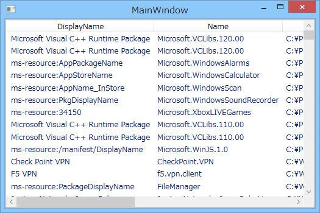
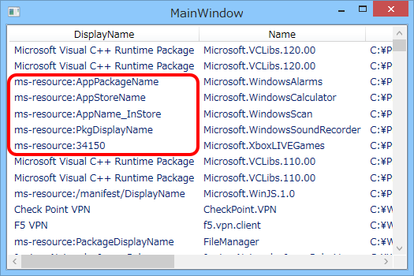
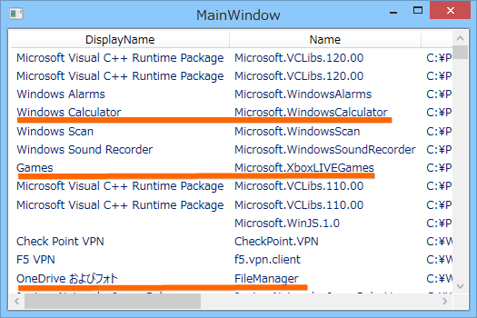
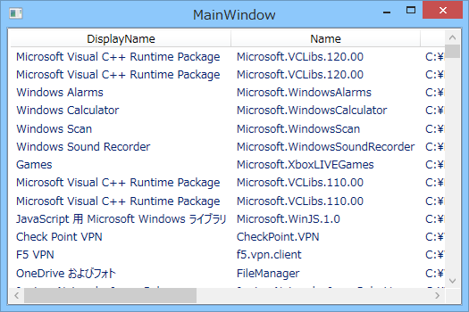

<a href="https://blog.daruyanagi.jp/entry/2014/09/10/021908">WinRT&#xFF1A;&#x30B7;&#x30B9;&#x30C6;&#x30E0;&#x306B;&#x30A4;&#x30F3;&#x30B9;&#x30C8;&#x30FC;&#x30EB;&#x3055;&#x308C;&#x305F; Windows &#x30B9;&#x30C8;&#x30A2; &#x30A2;&#x30D7;&#x30EA;&#x3092;&#x5217;&#x6319;&#x3059;&#x308B; - &#x3060;&#x308B;&#x308D;&#x3050;</a> で未解決だった問題を解決しておく。

<h3>AppxManifest.xml を読んで DisplayName などを取得する</h3>

とりあえず動けばいいので、dynamic（System.Dynamic.ExpandoObject）に AppxManifest.xml で読み込んだ DisplayName、Description、Logo などをぶち込んで ViewModel を作った。

<pre class="code lang-cs" data-lang="cs" data-unlink>namespace WinRTAppsUpdateChecker
{
using System.IO;
using System.Xml.Linq;
using Windows.Management.Deployment;

/// &lt;summary&gt;
/// MainWindow.xaml の相互作用ロジック
/// &lt;/summary&gt;
public partial class MainWindow : Window
{
public MainWindow()
{
InitializeComponent();

var manager = new PackageManager();
var packages = manager
.FindPackagesForUser(string.Empty)
.Select(_ =&gt;
{
dynamic result = new System.Dynamic.ExpandoObject();
result.Id = _.Id;

try
{
var path = _.InstalledLocation.Path; // -&gt; exception
var xml = File.ReadAllText(Path.Combine(path, &quot;AppxManifest.xml&quot;));
var doc = XDocument.Parse(xml);
XNamespace ns = &quot;http://schemas.microsoft.com/appx/2010/manifest&quot;;

result.InstalledLocation = path;
result.DisplayName = doc.Descendants(ns + &quot;DisplayName&quot;).First().Value;
// result.Description = doc.Descendants(ns + &quot;Description&quot;).First().Value;
result.PublisherDisplayName = doc.Descendants(ns + &quot;PublisherDisplayName&quot;).First().Value;
result.Logo = doc.Descendants(ns + &quot;Logo&quot;).First().Value;
result.OSMinVersion = doc.Descendants(ns + &quot;OSMinVersion&quot;).First().Value;
result.OSMaxVersionTested = doc.Descendants(ns + &quot;OSMaxVersionTested&quot;).First().Value;
// result.BackgroundColor = doc.Descendants(ns + &quot;VisualElements&quot;).First().Attributes(&quot;BackgroundColor&quot;).First().Value;
}
catch (Exception e)
{
result.Error = e.Message;
}
return result;
}).ToList();

DataContext = new
{
Packages = packages,
};
}
}
}
</pre>
相変わらずダックタイピングでコーディングしてるので汚いけど、基本的に XDocument で読んでいるだけ。

ちゃんととれているみたい。

Description はない場合も多い。タイルの背景色も取得したかったけれど、書いてない AppxManifest.xml も少なくない感じ。もうちょっと調査してみよう。

<h3>resources.pri を読んでリソース文字列を取得する</h3>

さっきのでだいたいうまくいったかなと思ったのだけど、DisplayName は（おそらく多言語対応のため）ms-resource で指定されている場合がある。ガッデム！

<ul>
<li><a href="http://msdn.microsoft.com/ja-jp/library/windows/apps/jj552947.aspx">Resource Management System | Microsoft Docs</a></li>
</ul>
これを読むには、<a href="http://msdn.microsoft.com/en-us/library/windows/desktop/bb759919(v=vs.85).aspx">SHLoadIndirectString function | Microsoft Docs</a> を利用する。

<ul>
<li><a href="http://www.pinvoke.net/default.aspx/shlwapi.shloadindirectstring">pinvoke.net: shloadindirectstring (shlwapi)</a></li>
</ul><pre class="code lang-cs" data-lang="cs" data-unlink>namespace WinRTAppsUpdateChecker
{
using System.IO;
using System.Runtime.InteropServices;
using System.Xml.Linq;
using Windows.Management.Deployment;

/// &lt;summary&gt;
/// MainWindow.xaml の相互作用ロジック
/// &lt;/summary&gt;
public partial class MainWindow : Window
{
[DllImport(&quot;shlwapi.dll&quot;, BestFitMapping = false, CharSet = CharSet.Unicode, ExactSpelling = true, SetLastError = false, ThrowOnUnmappableChar = true)]
public static extern int SHLoadIndirectString(string pszSource, StringBuilder pszOutBuf, int cchOutBuf, IntPtr ppvReserved);

public MainWindow()
{
InitializeComponent();

var manager = new PackageManager();
var packages = manager
.FindPackagesForUser(string.Empty)
.Select(_ =&gt;
{
dynamic result = new System.Dynamic.ExpandoObject();
result.Id = _.Id;

try
{
var path = _.InstalledLocation.Path; // -&gt; exception
var xml = File.ReadAllText(Path.Combine(path, &quot;AppxManifest.xml&quot;));
var doc = XDocument.Parse(xml);
XNamespace ns = &quot;http://schemas.microsoft.com/appx/2010/manifest&quot;;

result.InstalledLocation = path;
result.DisplayName = doc.Descendants(ns + &quot;DisplayName&quot;).First().Value;
// ここから
if ((result.DisplayName as string).StartsWith(&quot;ms-resource&quot;))
{
var pri = Path.Combine(path, &quot;resources.pri&quot;);
var resourceKey = (result.DisplayName as string).Split(':').Last();
var resourcePath = string.Format(&quot;@{{{0}? ms-resource://{1}/resources/{2}}}&quot;, pri, _.Id.Name, resourceKey);
var buffer = new StringBuilder(1024);
SHLoadIndirectString(resourcePath, buffer, buffer.Capacity, IntPtr.Zero);
result.DisplayName = buffer.ToString();
}
// ここまで
// result.Description = doc.Descendants(ns + &quot;Description&quot;).First().Value;
result.PublisherDisplayName = doc.Descendants(ns + &quot;PublisherDisplayName&quot;).First().Value;
result.Logo = doc.Descendants(ns + &quot;Logo&quot;).First().Value;
result.OSMinVersion = doc.Descendants(ns + &quot;OSMinVersion&quot;).First().Value;
result.OSMaxVersionTested = doc.Descendants(ns + &quot;OSMaxVersionTested&quot;).First().Value;
// result.BackgroundColor = doc.Descendants(ns + &quot;VisualElements&quot;).First().Attributes(&quot;BackgroundColor&quot;).First().Value;
}
catch (Exception e)
{
result.Error = e.Message;
}
return result;
}).ToList();

DataContext = new
{
Packages = packages,
};
}
}
}
</pre>
リソースのパスの指定がよくわかんなかったのだけど、いろいろ試した結果、これでイケている感じ。ms-resource の読み込み処理はべた書きしたけど、ViewModel をちゃんとクラス化するときに関数にパッケージングして、Description などがリソースで指定されているときにも対応できるようにしておけばいいと思う。

ちゃんと名前もとれている感じ。よくみたら WinJS の名前が取れてないケド、見ないことにした。

<h3>追記（2014/09/11 03:08）</h3>

リソースパスの指定方法をちょっと変えたら、WinJS にも対応できた。

<pre class="code lang-cs" data-lang="cs" data-unlink>var resourceKey = (result.DisplayName as string).Split(':').Last();
if (!resourceKey.StartsWith(&quot;/&quot;)) resourceKey = &quot;/resources/&quot; + resourceKey;
var resourcePath = string.Format(&quot;@{{{0}? ms-resource://{1}{2}}}&quot;, pri, _.Id.Name, resourceKey);
</pre>
だたキーが指定されているときは /resources/* で、階層付きで指定されているときはそれをそのまま渡してやればいいみたい。ドキュメントちゃんと読んでないから知らんけど。

