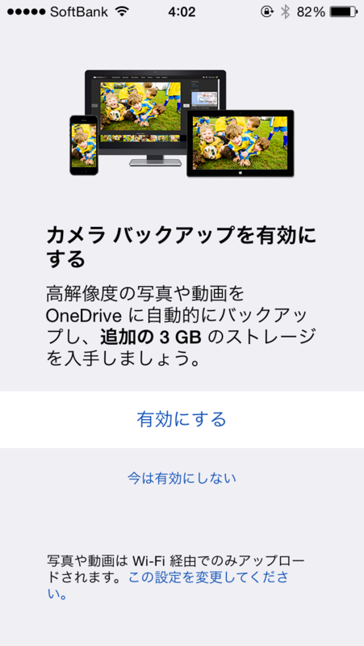
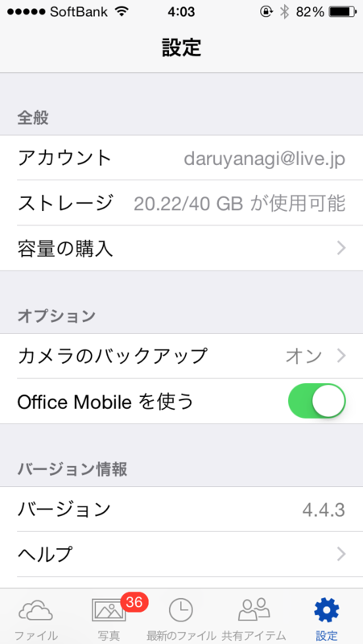

 

iOS 版の「OneDrive」で“カメラ バックアップ”機能を有効化すると 3GB のボーナスが得られるが、これが9月末までの期間限定で 15GB へ増量されているらしい（iOS 以外のプラットフォームでも“カメラ バックアップ”機能を有効化すれば同様の特典が得られる）。

自分の環境だと、ボーナスの案内画面では 3GB と表示されたが、実際には 15GB 増えている。ウチの OneDrive はもともと 25GB あったので、合計 40GB になった。

The Verge によると、これは空き容量不足で iOS 8 へアップデートできないユーザーに対する救済措置なのだそうだ。

<iframe src="http://hatenablog.com/embed?url=http%3A%2F%2Fwww.theverge.com%2F2014%2F9%2F20%2F6619717%2Fmicrosoft-free-onedrive-space-30gb" title="Microsoft plays on iOS 8 issues by doubling free OneDrive space to 30GB" scrolling="no" frameborder="0" style="width: 100%; height: 155px; max-width: 500px; margin: 10px 0px;"><a href="http://www.theverge.com/2014/9/20/6619717/microsoft-free-onedrive-space-30gb">Microsoft plays on iOS 8 issues by doubling free OneDrive space to 30GB</a></iframe>

iOS 8 はアップデートに空き容量を 5.7GB 要求する。16GB モデルだと全体の 35％ をフリーにしておかなければならなくなる計算だが、これはかなり厳しい制限だと思う<a href="#f-bb537a3e" name="fn-bb537a3e" title="自分は一度初期化してアップデートした">*1</a>。

<iframe src="http://hatenablog.com/embed?url=https%3A%2F%2Fblog.onedrive.com%2Fyou-can-now-get-30-gb-of-free-storage-with-onedrive%2F" title="Hey iPhone Users…You Can Now Get 30 GB of Free Storage with OneDrive! | OneDrive Blog" scrolling="no" frameborder="0" style="width: 100%; height: 155px; max-width: 500px; margin: 10px 0px;"><a href="https://blog.onedrive.com/you-can-now-get-30-gb-of-free-storage-with-onedrive/">Hey iPhone Users…You Can Now Get 30 GB of Free Storage with OneDrive! | OneDrive Blog</a></iframe>

<a href="#fn-bb537a3e" name="f-bb537a3e" class="footnote-number">*1</a>:自分は一度初期化してアップデートした

