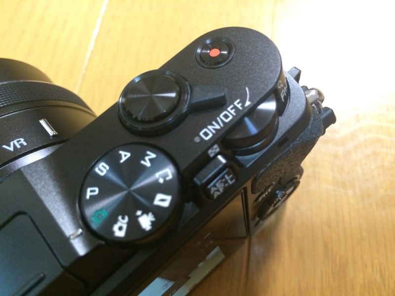
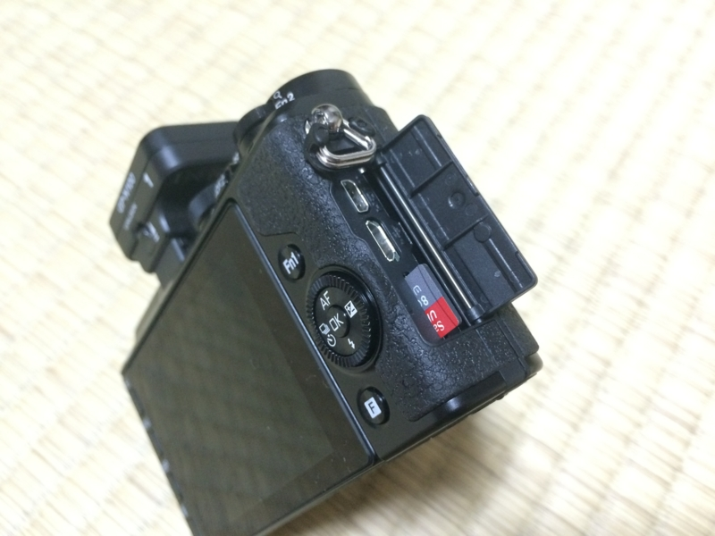
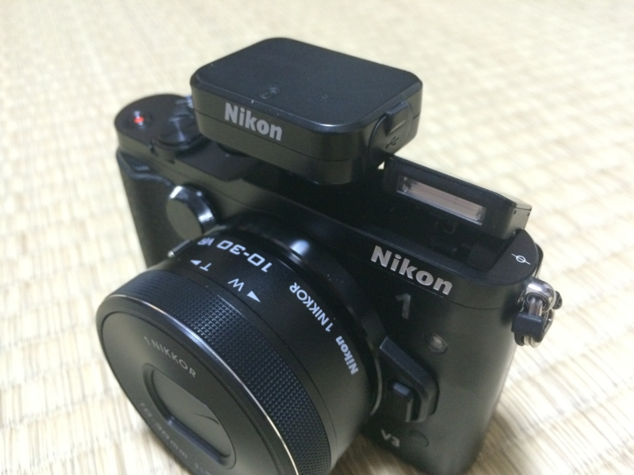

<a href="http://www.amazon.co.jp/exec/obidos/ASIN/B00IZ6EWJG/bestylesnet-22/">Nikon ミラーレス一眼Nikon 1 V3 プレミアムキット ブラック</a>
<ul><li>出版社/メーカー: ニコン</li><li>発売日: 2014/04/14</li><li>メディア: Camera</li><li><a href="http://d.hatena.ne.jp/asin/B00IZ6EWJG/bestylesnet-22" target="_blank">この商品を含むブログ (1件) を見る</a></li></ul>

Nikon 1 V1 はそろそろ力不足かなと感じたので、近所にあるカメラのキタムラで売却。Nikon D300s もお金できたら Nikon Df に乗り換えたいので、ついでに手放した（たぶん、当分出番ないだろうし）。使わなくなるであろう DX フォーマットのレンズを数本つけて120,000円、Nikon 1 V3（普通のレンズキット）は80,000円。差し引き40,000円は、10月末が期限の住民税の支払いに消える予定だ。さすがにヤフオクで処分するよりは安かったけれど、それなりに高く引き取ってもらえたかな。まぁ、Yahoo! プレミアム会員やめちゃったし、オークションでトラブルに遭うリスクも考えるとまったくの許容範囲。

代わりに買った Nikon 1 V3 も、本当は店で買うよりネットで買う方が安かったが、キタムラではお店に機材を買ってもらう“買い取り”ではなく、買い取ってもらって何か別の機材を買う“下取り”を選ぶと1割増しのお値段で買い取ってもらえる（逆に“買い取り”にするとさらに買いたたかれるというべきか）。その差額を考えるとお店で買ってもそれほど損にはならない。これからの付き合いも考えれば、ここはお店で買うべきだろう。

まだあんまり触ってないのだけど、ダイヤル回りが気に入った。V1 はカバンに入れていると撮影モードのダイヤルが勝手に動いてしまってかなりウザかったのだけど、V3 はカッチリしていて大丈夫そうだ。電源の ON/OFF もボタンではなくレバー式になっていてグッド（ぶっちゃけそんなに詳しくないケド、こっちのほうが Nikon だよね）。

あと、ファンクションキーが2つ付いたのもうれしいかな。自分は Nikon 1 のターゲット追尾照準が好きなのだけど、景色をとるときはウザいので切りたい。V1 ではわざわざメニューをいじらなきゃいけなくてめんどくさかったが、V3 はファンクションキーに割り当てておけば簡単に切り替えが可能。ほほー

本体右のグリップが滑りにくくなってるのもいい。本体もコンパクトで、凝縮されてソリッドになった感じ。ストレージが MicroSD になったのはそれほど気にならない。Surface Pro の SD カードスロットも MicroSD なのデ。大容量のやつを1枚買って、Wi-Fi でやり取りすれば（そう！　Wi-Fi 内蔵なのだ！）抜き差しするときになくすこともなさそう。転送速度は……まぁ、大丈夫なんだろう、知らんけど。

レンズカバーが不要になったレンズ（ほかのレンズもこのタイプに刷新してよね？　じゃないと意味ない感じ）や、バリアングル液晶は今のところどうでもいい。今度改めて見せていただこうか、その実力とやらを。

逆にクソだなと思ったのが、GPS ユニットと内蔵フラッシュが干渉するところ。ちゃんと上まで上がらねぇ……。GPS ユニットをつけていると EVF もつけられないのもなんとかしてほしいと思う。

ちなみに、Nikon Df はシャッター回数一桁の中古品がそこのキタムラで19万円ぐらいだった。税金の申告頑張ったら、ご褒美に経費で買ってもいいかもしれぬな。

