
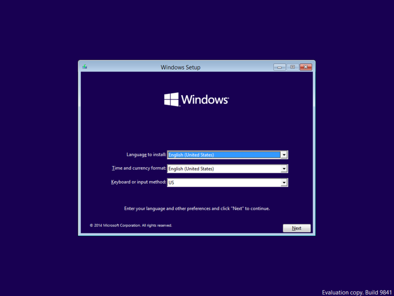

割とみんなやってるので今さらだけど、自分も公開日にインストールしてみましたやで（英語版、x64）。

最初が肝心で、ちゃんとロケールを“英語（米国）”から“日本（日本語）”にしておくやで。そしたら UI は英語だけれども、日本語の入力もできるようになる。まぁ、ここで忘れてもあとでごにょごにょすればイケるので心配はしなくていいのだけど、めんどくさいので。

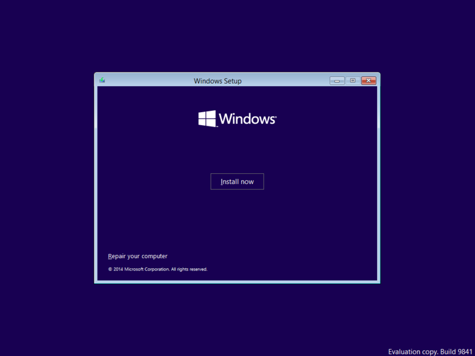

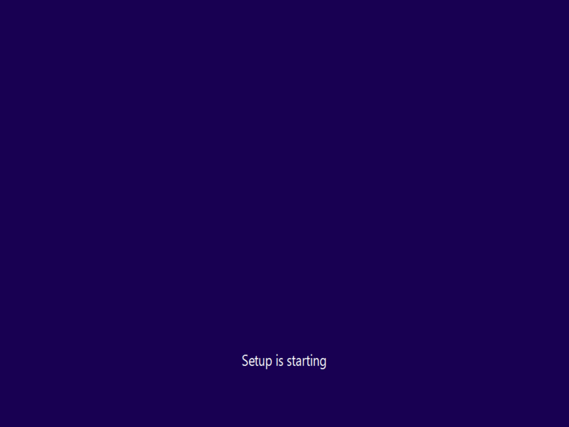

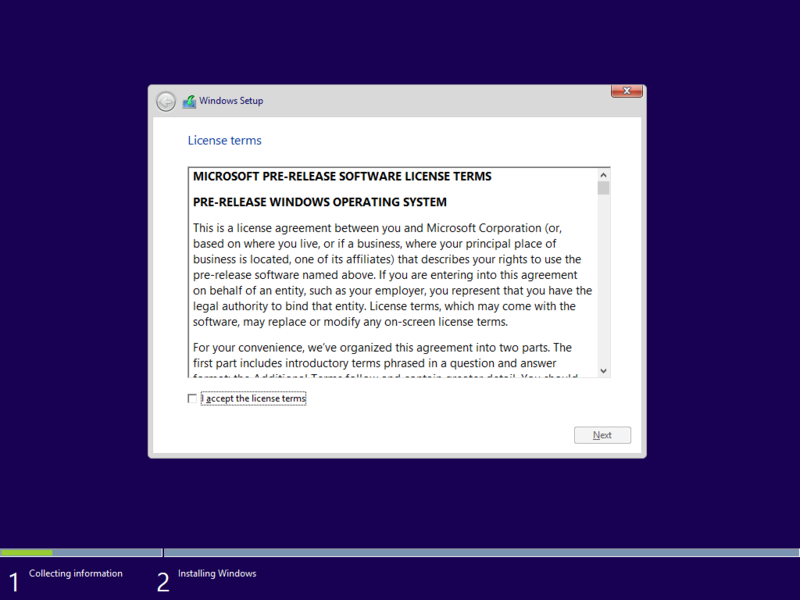

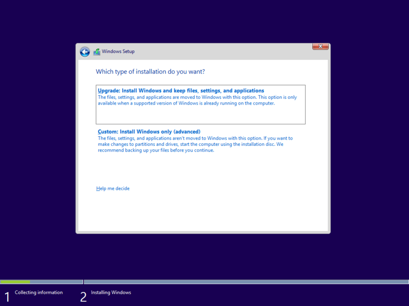

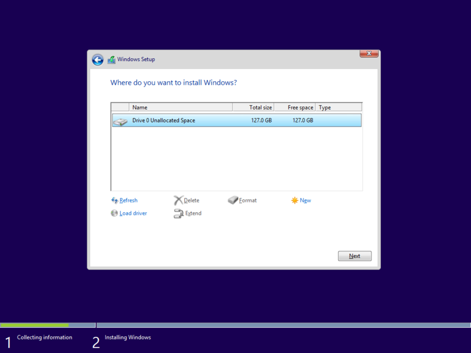

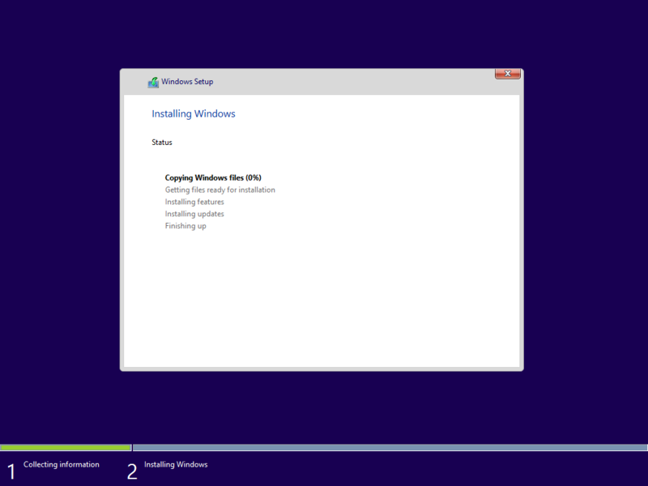

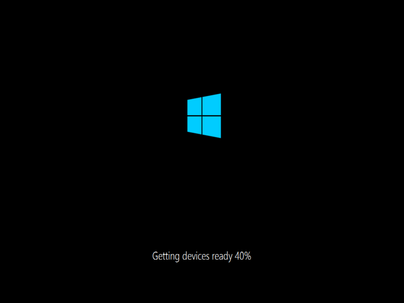

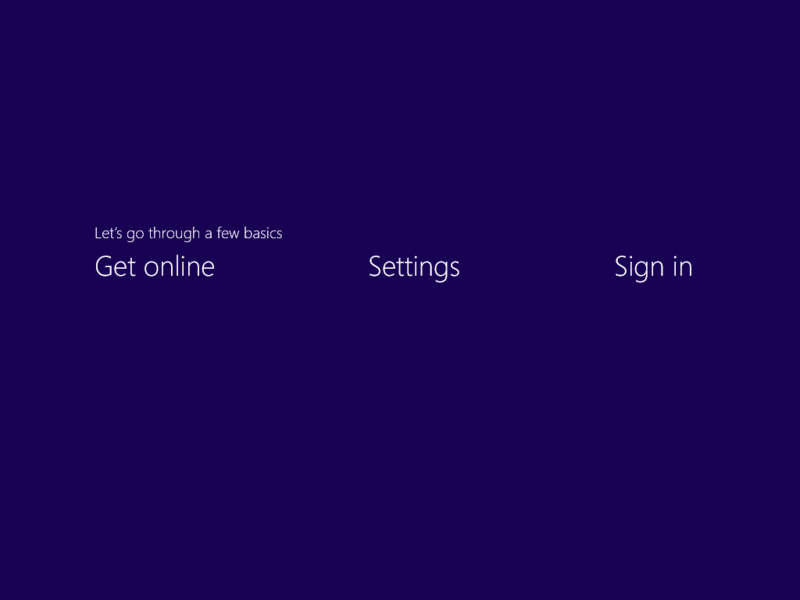

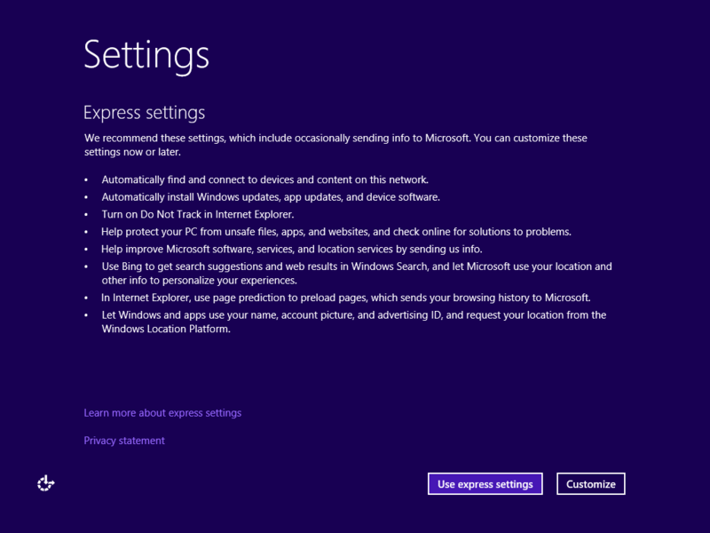

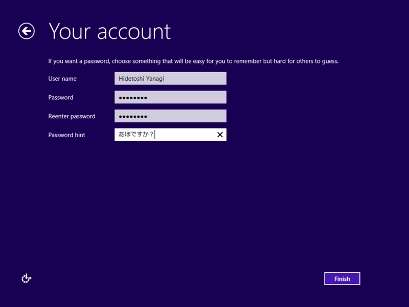

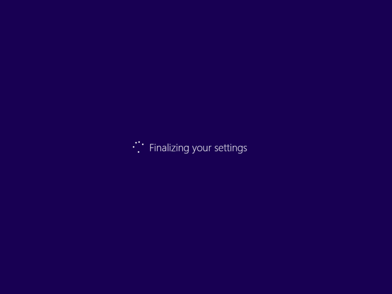

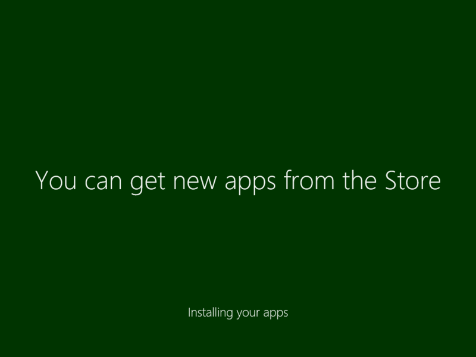

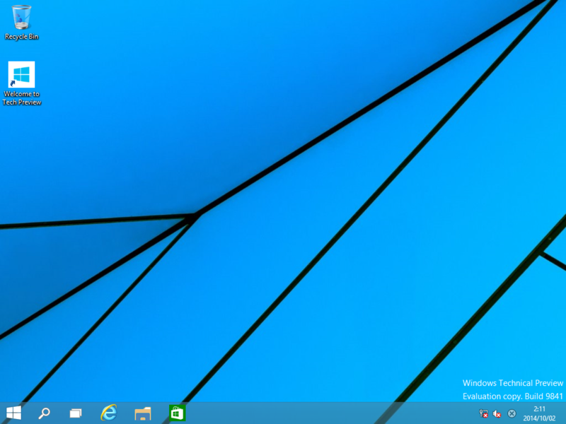

途中で二回再起動。Surface Pro 3 の Hyper-V を有効化して仮想マシンに入れたのだけど、30分もかかららなかった（ネットワーク共有をセットアップするのを忘れていたので、Microsoft アカウントではなくローカルアカウントになった）。今のところセットアップは Windows 8 とほとんど変わらない感じ。

ざっと触ってみた感じは……まぁ、（今のところ）あんまり面白味はないかな、と思った。とはいえ、コンソールの実験的機能は大歓迎だし、エクスプローラーもちょっと変わってるみたいで（“Home”が新設されたのかな）、割とイケそうではあるけど。タスク ビューもなかなかよさそうだけど、まだ使い慣れてなくてしっくりとは来ていない。［Alt］＋［Tab］キーを押しちゃうぜ……あと、Windowed なストア アプリはわりとバグバグで、実用的になるまではまだもう少し時間がかかりそう。アップデートも頻繁に行われるのかな？　実機に入れないと感触がつかめない部分もありそうなので（タブレット時代になってから、手で触らないと UI のイケ具合がよくわからなくなってきてるの、ちょっと面白いと思ってる）、ちょっとまともで安価なタブレットがあればテスト用に買ってもいいかなと思う。

ちなみに、スタートメニューは速攻潰して、スタート画面にした。確かにスタート画面には改良の余地が多いけれど、わざわざチマチマしたスタートメニューに回帰しなければならないほどではないと個人的には思っている。あと、OS の付属ツールぐらい HiDPI（Per-Monitor DPI）に対応してほしいかなと思うけれど、まだまだ初期プレビュー版とのことで、文句を言う段階ではないかも。

<ul>
<li><a href="http://www.forest.impress.co.jp/docs/news/20141002_669590.html">Microsoft&#x3001;&#x6B21;&#x671F;OS&#x300C;Windows 10&#x300D;&#x306E;&ldquo;Technical Preview&rdquo;&#x7248;&#x3092;&#x7121;&#x511F;&#x516C;&#x958B; - &#x7A93;&#x306E;&#x675C;</a></li>
</ul>