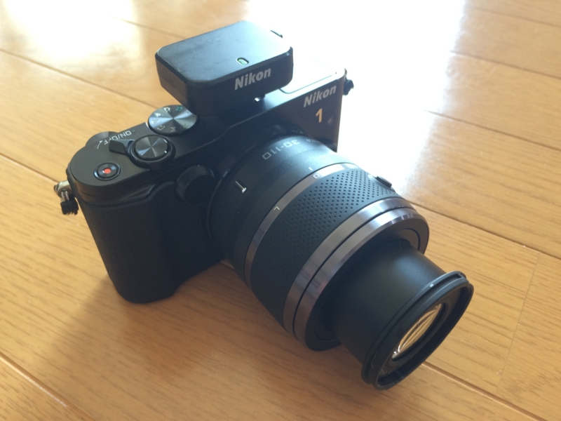
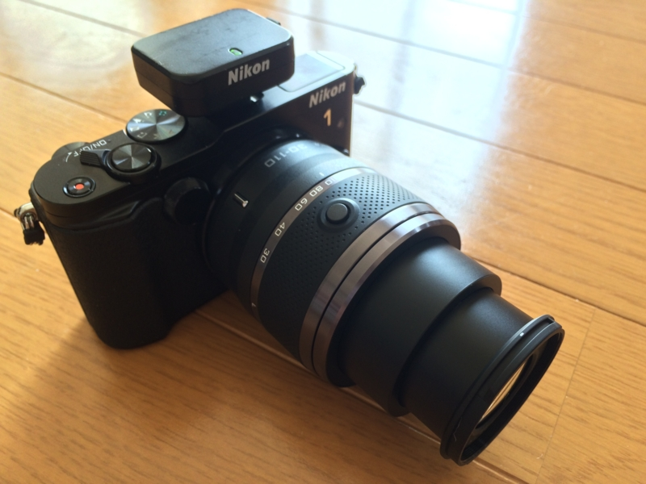
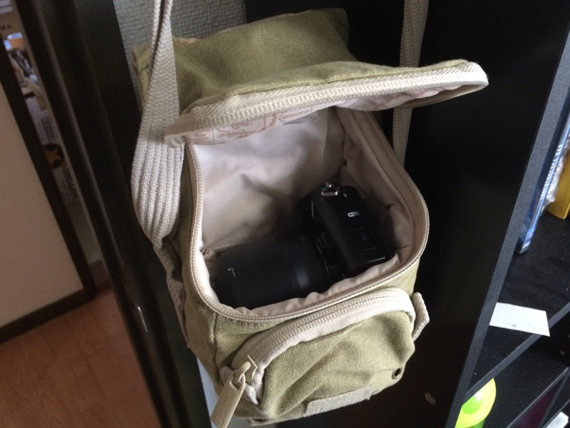

<a href="http://www.amazon.co.jp/exec/obidos/ASIN/B005OD1CH8/bestylesnet-22/">Nikon 望遠ズームレンズ 1 NIKKOR VR 30-110mm f/3.8-5.6 ブラック ニコンCXフォーマット専用</a>
<ul><li>出版社/メーカー: ニコン</li><li>発売日: 2011/10/20</li><li>メディア: 付属品</li><li> クリック: 101回</li><li><a href="http://d.hatena.ne.jp/asin/B005OD1CH8/bestylesnet-22" target="_blank">この商品を含むブログを見る</a></li></ul>

標準の 10-30mm（35mm判換算で27-81mm）だけでは物足りないので、Nikon 1 用の 30-110mm 望遠レンズを買った。ヤフオクでレンズキットをバラした新品が出ていたのでそれをゲット。Amazon で 23,000円 するところを 18,000円 程度に抑えられた。

35mm判換算で81-297mm。買ってから思い出したのだけど、V1 時代はこのレンズがダサく思えて買わなかったのだった（ぉぃ）。

めいいっぱい伸ばした状態。これに付属のレンズフードを付けると、二つのダサさがハーモニーを奏ではじめてえらいことになる。

でも、手持ちの NATIONAL GEOGRAPHIC のカバンにすっぽり入るコンパクトさはいいかな。V1 時代にも買っておけばよかった。

レンズを付け替えずに済む 10-100mm（PD であれば40,000円程度）とどちらにするか迷ったけれど<a href="#f-75948111" name="fn-75948111" title="記者で取材するときは場事前に会場の大きさがわかんなくて、手広いレンズがあると便利なんだな。でもそういう機会はこれからあまりなさそうだし">*1</a>、画質はそれなりだろうし、この 30-110mm に明るい単焦点レンズ1本を使い分けるのがよさそうな気がしてきた。

<a href="http://www.amazon.co.jp/exec/obidos/ASIN/B0060FNSLW/bestylesnet-22/">NATIONAL GEOGRAPHIC ショルダーバッグ アースエクスプローラー 1.3L 撥水加工 グリーン(カーキキャンバス) NG 2342</a>
<ul><li>出版社/メーカー: ナショナルジオグラフィック</li><li>発売日: 2011/10/17</li><li>メディア: 付属品</li><li><a href="http://d.hatena.ne.jp/asin/B0060FNSLW/bestylesnet-22" target="_blank">この商品を含むブログを見る</a></li></ul>

<a href="#fn-75948111" name="f-75948111" class="footnote-number">*1</a>:記者で取材するときは場事前に会場の大きさがわかんなくて、手広いレンズがあると便利なんだな。でもそういう機会はこれからあまりなさそうだし

