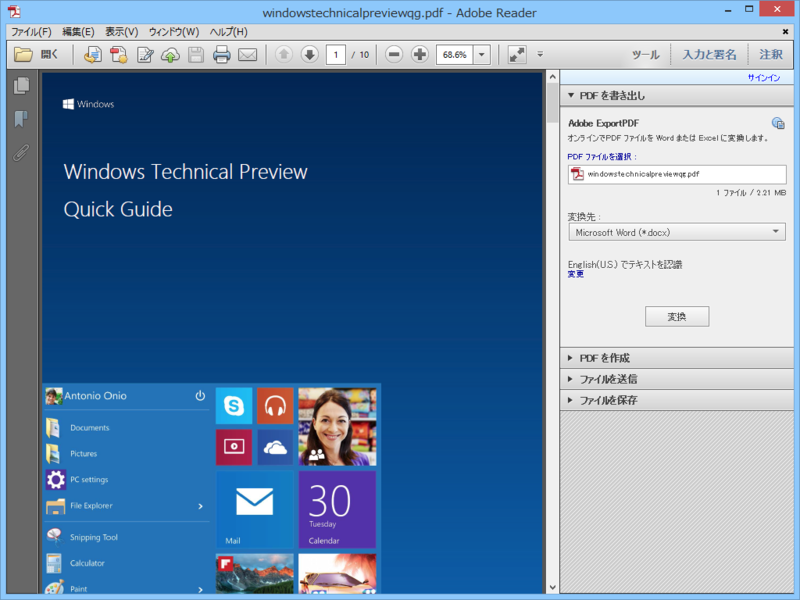

Windows Technical Preview Quick Guide（英語版）が公開されています（<a href="http://news.softpedia.com/news/Download-the-Windows-10-Preview-User-Guide-461076.shtml">Download the Windows 10 Preview User Guide - Softpedia</a>）。

<ul>
<li><a href="http://news.microsoft.com/download/presskits/windows/docs/windowstechnicalpreviewqg.pdf">http://news.microsoft.com/download/presskits/windows/docs/windowstechnicalpreviewqg.pdf</a>（PDF形式、直接リンク）</li>
</ul>
Windows 10 の新機能のさらっとした説明と、フィードバックツールの使い方がメインですかね。

