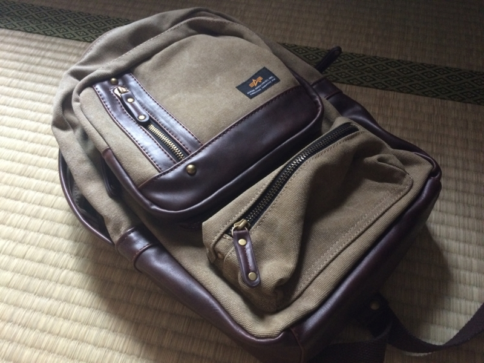
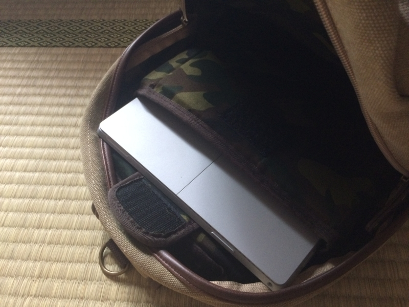
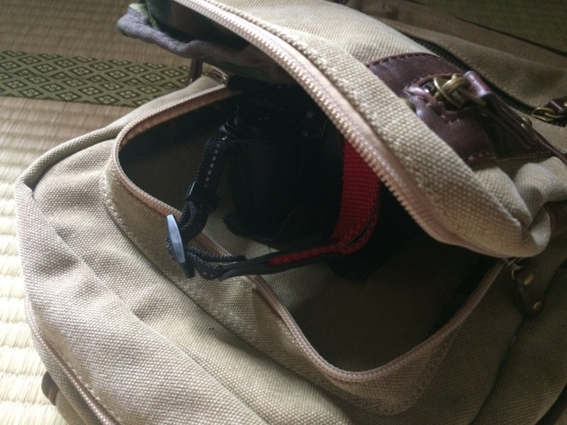

ふとボディバッグがほしいなーと思って、Amazon を徘徊していたら見つけた。

<a href="http://www.amazon.co.jp/exec/obidos/ASIN/B00EZF8VS4/bestylesnet-22/">[アルファ インダストリーズ] ALPHA INDUSTRIES INC SailCloth LE ボディバッグ (4757) 47570071 BE (BE)</a>
<ul><li>出版社/メーカー: ALPHA INDUSTRIES INC(アルファ インダストリーズ)</li><li>メディア: ウェア&シューズ</li><li><a href="http://d.hatena.ne.jp/asin/B00EZF8VS4/bestylesnet-22" target="_blank">この商品を含むブログを見る</a></li></ul>

条件は Surface Pro 3 クラスのタブレットが収納できること。できたらペットボトルと本、カメラも入るとうれしい。

とりあえず、1つ目の条件は問題なし。本当はもうワンサイズ小さいタブレットをターゲットにしているようだけど、Surface Pro 3 も許容範囲内。裏地が迷彩色になっているのも、ブリティッシュな感じ（なにが！）。帆布なので雨には気を付けなきゃいけないけれど、軽いし収納力は十分だ。いつも使っている鞄<a href="#f-9b257a71" name="fn-9b257a71" title="ペットボトルでできたロハスなオレンジのカバンだ">*1</a>よりも小さいのに、たくさんモノが入りそう。

前面のポケット部分にカメラ（Nikon 1 V3）を入れてみたけど、これはやめておいた方がよさそう。ぶつけたらカメラが破損しそうだ。ティッシュやメモ帳なんかを入れておくのにとどめておこう。

5,000円弱だったけど、まぁ、値段相応の働きはしてくれるんじゃないかなって気がする。

<a href="#fn-9b257a71" name="f-9b257a71" class="footnote-number">*1</a>:ペットボトルでできたロハスなオレンジのカバンだ

