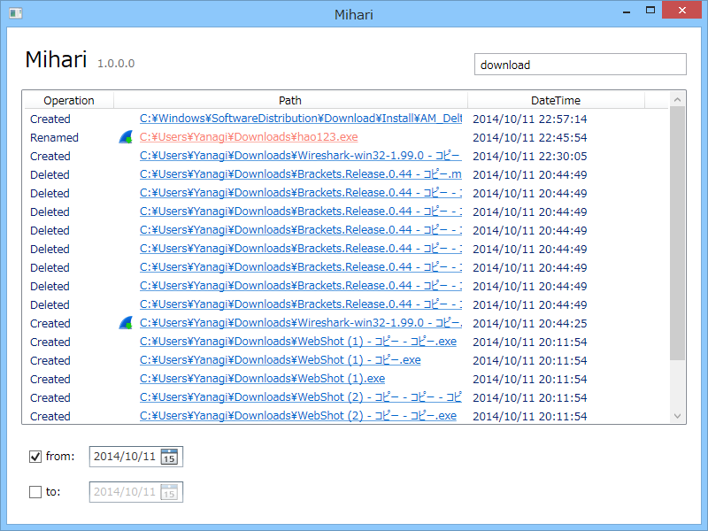

システム内に実行ファイルが作成されたらトーストで（Windows 8未満の場合はバルーンになるはずだけど試す環境がない）お知らせしてくれるタスクトレイ常駐型のソフトです。ごくごく簡単なログのフィルタリング機能がついています。

<ul>
<li><a href="http://download.daruyanagi.net/Mihari%20for%20Windows%20Desktop">Mihari for Windows Desktop - &#x3060;&#x308B;&#x3084;&#x306A;&#x304E;&#xFF08;0x22&#x6B73;&#x2642;&#xFF09;</a></li>
</ul>
動作には Windows 8.1/.NET Framework 4.5 が必要（Windows 7 で動いたら教えてください）。

<ul>
<li>1.0.0.0 (2014/10/12)
<ul>
<li>Initial Release.</li>
<li>Exe/Jar/Msi Monitoring.</li>
<li>Open Explorer from log view.</li>
<li>Log Filtering (you can use wildcard, and date filter).</li>
<li>Highlight malicious exe. (for example, hao123)</li>
<li>Notification by toast (Windows 8 or later). </li>
<li>Mihari.exe.config</li>
<li>Log cleaning, Keep logs only 7 days (default)</li>
</ul></li>
</ul>