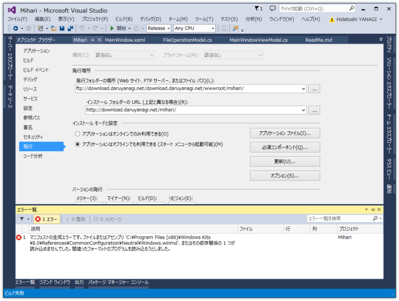
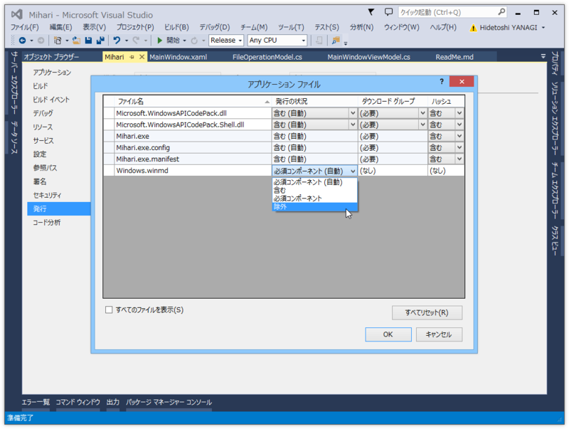

<a href="https://blog.daruyanagi.jp/entry/2014/10/12/133551">Mihari 1.0.0.0 - &#x3060;&#x308B;&#x308D;&#x3050;</a> を ClickOnce で配置しようと思ったら、エラーが出てビルドできなくなった。

<blockquote>

マニフェストの生成エラーです。ファイルまたはアセンブリ '…\Windows.winmd'、またはその依存関係の 1 つが読み込めませんでした。間違ったフォーマットのプログラムを読み込もうとしました。

</blockquote>

ガッデム！　ClickOnce のセキュリティ設定を無効にするとビルドはできるようになるのだけど、［発行ウィザード］で配置しようとするとセキュリティ設定が勝手に有効になってビルドに失敗し、配置できない。

<h4>解決策</h4>

［アプリケーション ファイル］ボタンを押して、Windows.winmd を除外すればいいらしい。

<ul>
<li><a href="https://connect.microsoft.com/VisualStudio/feedback/details/874199/clickonce-resolvemanifestfiles-task-failed-when-using-windows-runtime">Microsoft Connect is Retired - Collaborate | Microsoft Docs</a></li>
</ul>
WindowsRuntime を使ったデスクトップアプリケーションを ClickOnce で配布しようとするときは注意なのかも。で、ClickOnce ってメンテされてる気配がないのだけど大丈夫なのかな……個人的には気に入っているのだけど。

