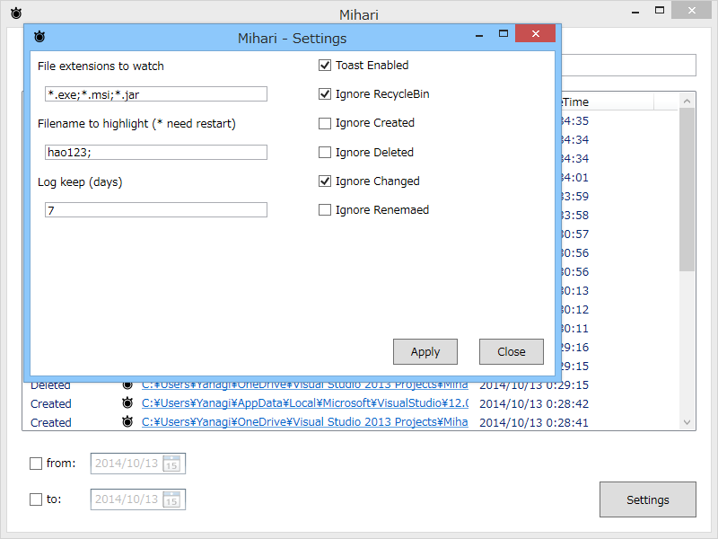

Mihari.exe.config をイジってください――というのではあまりにも配慮に欠けるかなと思って、かんたんな設定ダイアログをつけました。

<ul>
<li><a href="http://download.daruyanagi.net/Mihari%20for%20Windows%20Desktop">Mihari for Windows Desktop - &#x3060;&#x308B;&#x3084;&#x306A;&#x304E;&#xFF08;0x22&#x6B73;&#x2642;&#xFF09;</a></li>
</ul>
XAML でプロパティの綴りミスってうまくバインディングされず、小一時間ハマったのは秘密です。

<ul>
<li>1.1.0.3 (2014/10/13)
<ul>
<li>[FIX] Can not save some setting.</li>
</ul></li>
</ul>
<ul>
<li>1.1.0.2 (2014/10/13)
<ul>
<li>[FIX] Get Clickonce Version</li>
</ul></li>
</ul>
<ul>
<li>1.1.0.1 (2014/10/13)
<ul>
<li>Setting Dialog</li>
<li>[FIX] Mutex bug</li>
</ul></li>
</ul>
メインマシンの環境がぶっ壊れていて、ClickOnce でインストールできないのがツラい……。

<h4>追記</h4>

<ul>
<li>1.1.0.4 (2014/10/13)
<ul>
<li>[FIX] Ignore RecycleBin does not work.</li>
</ul></li>
</ul>
パスのチェックで大文字小文字の区別をつけていたので、一部環境で IgnoreRecycleBin オプションが動いてなかった。カッコ悪い。

