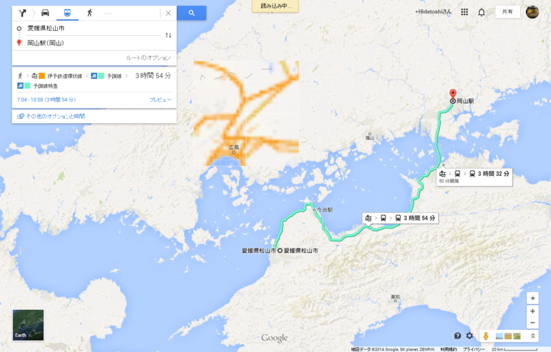

待ちに待った「国際だるやなぎ会議」が、とうとう明日、開催されます。「国際だるやなぎ会議」っていうのはイマイチ何をする会なのかよくわかんないのですが、だるやなぎをダシに楽しむ勉強会だと思っていただければ。いつもネタにしてる C# だの Web だのの代わりに、だるやなぎ が題材になるだけです。――すみません、よくわかりませんね。

<ul>
<li><a href="http://kaigi.daruyanagi.net/">&#x56FD;&#x969B;&#x3060;&#x308B;&#x3084;&#x306A;&#x304E;&#x4F1A;&#x8B70; 2014</a></li>
</ul>
開催地は、日本が誇る大都会・岡山。とはいえ、わしは岡山に降り立ったことがないので、酢ろぐを読んで勉強していました。

<ul>
<li><a href="http://blog.ch3cooh.jp/entry/20141013/1413164930">&#x56FD;&#x969B;&#x3060;&#x308B;&#x3084;&#x306A;&#x304E;&#x4F1A;&#x8B70; 2014&#x304C;&#x5CA1;&#x5C71;&#x3067;&#x958B;&#x50AC;&#x3055;&#x308C;&#x308B;&#x3089;&#x3057;&#x3044;&#x306E;&#x3067;&#x5CA1;&#x5C71;&#x57CE;&#x306B;&#x3064;&#x3044;&#x3066;&#x66F8;&#x3044;&#x3066;&#x307F;&#x305F; - &#x9162;&#x308D;&#x3050;&#xFF01;</a></li>
</ul>
なるほど……岡山城は現存天守閣じゃないので割とどうでもいいなと思っていたのですが、考えを改めました（ぉ　1泊して訪れてみようと思っているので、だいぶ楽しみです。セッションの方も、だいぶ楽しみな内容になりそう。自分の分は今からスライド作るんでアレなのですが……。半生を語るって何を語ればええんや！ ( ‘д‘⊂彡☆))Д´) ﾊﾟｰﾝ

あと、国際だるやなぎ会議じゃないとゲットできないオリジナルグッズを個人的にいくつか用意しました。あんまりお金持ちじゃないので人数分用意できなかったのが心苦しいですが、ぜひじゃんけんで勝ち取ってください。

では、参加者の方々、岡山でお会いできることを楽しみにしています。

<h4>追記</h4>

意外に遠くて震えている。

