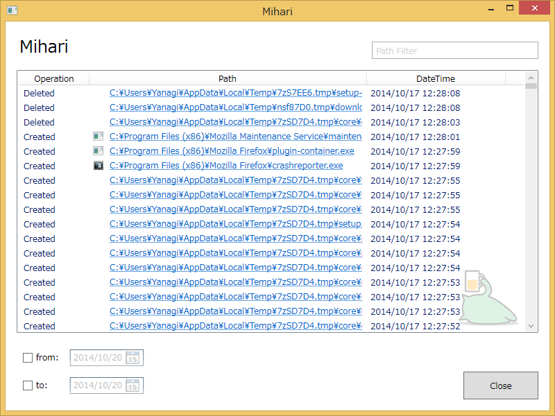

国際だるやなぎ開催記念！　ログウィンドウにだるやなぎが付きました！！　これはダウンロードするしかない！

<ul>
<li><a href="http://download.daruyanagi.net/Mihari%20for%20Windows%20Desktop">Mihari for Windows Desktop - &#x3060;&#x308B;&#x3084;&#x306A;&#x304E;&#xFF08;0x22&#x6B73;&#x2642;&#xFF09;</a></li>
</ul>
その他の変更点

<ul>
<li>だるやなぎエディション（嫌だったら設定ファイルいじれば無効化できます）</li>
<li>スタートアップに登録するオプション付けた（デフォルト有効</li>
<li>その他、いろいろバグ修正しかたかも</li>
</ul>
会議の模様は……ちょっと疲れてるのでまたの機会に。

<h4>おまけ</h4>

ベクターに登録しようとしたけど、README が入ってないという理由で却下された。README.md じゃダメっぽい……めんどくさいので、まぁ、そのまま放置。

