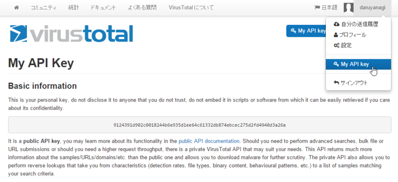
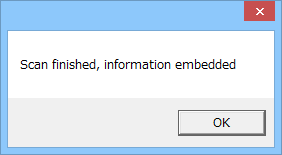
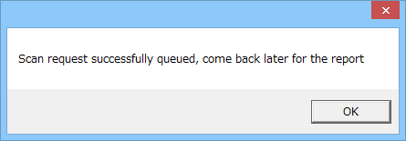
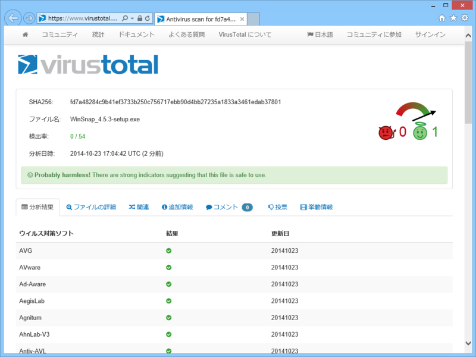
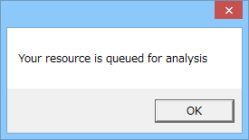
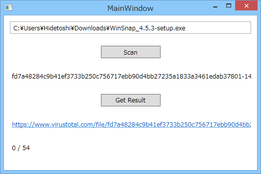
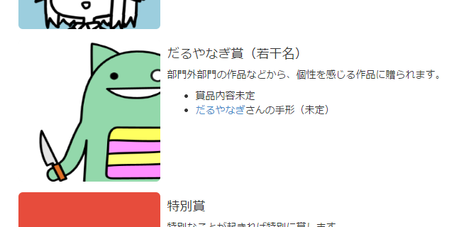

WPF で VirusToral API を利用するサンプルを書いてみました（書いた後に気付いたのですが、あんまり WPF 要素なかったです）。

<h3>VirusTotal とは</h3>

指定したファイルをいろんなウイルス対策エンジンでスキャンしてくれるサービスです。

<iframe src="http://hatenablog.com/embed?url=https%3A%2F%2Fwww.virustotal.com%2F" title="VirusTotal - Free Online Virus, Malware and URL Scanner" scrolling="no" frameborder="0" style="width: 100%; height: 155px; max-width: 500px; margin: 10px 0px;"><a href="https://www.virustotal.com/">VirusTotal - Free Online Virus, Malware and URL Scanner</a></iframe>

結構利用制限はきついのですが、一応 API も用意されています。

<ul>
<li><a href="https://www.virustotal.com/ja/documentation/public-api/">Public API version 2.0 - VirusTotal</a></li>
</ul>
これを使えば、比較的簡単にアプリケーションへウイルススキャン機能を追加できますね。

<h3>準備</h3>

まずはアカウントを作成し、API キーを取得します。API キーには Public と Private がありますが、今回は Public を利用します。Private なキーのほうが制限が少ないのですが、個別にリクエストしなければならないようです。

<h3>VirusToral にファイルのスキャンをお願いする</h3>

VirusToral にファイルのスキャンをお願いするには、以下の URL に API キーとファイルを Post します。

<pre class="code" data-lang="" data-unlink>https://www.virustotal.com/vtapi/v2/file/scan</pre>
今回は HttpClient を利用して、こんなコードにしてみました。本当ならばちゃんと帰ってきたデータをクラスにマッピングして……ということをすべきなのでしょうが、めんどくさいので DynamicJson（NuGet で入手しましょう）でパースして dynamic 型の変数として返しています。

<pre class="code lang-cs" data-lang="cs" data-unlink>public async Task&lt;dynamic&gt; RequestFileScan(string filename)
{
using (var http = new HttpClient())
{
var uri = &quot;https://www.virustotal.com/vtapi/v2/file/scan&quot;;
var multipart = new MultipartFormDataContent();
multipart.Add(new StringContent(APIKey), &quot;apikey&quot;);
multipart.Add(new ByteArrayContent(File.ReadAllBytes(filename)), &quot;file&quot;, Path.GetFileName(filename));
var response = await http.PostAsync(uri, multipart);
var content = await response.Content.ReadAsStringAsync();
var json = DynamicJson.Parse(content);

return json;
}
}
</pre>
HttpClient の使い方、これであってるのかな……。まだ使い慣れてなくて、あんまりよく分かってません。GetAsync()、PostAsync() で簡単に非同期リクエストが投げられるのはわかりやすいのですけど、ファイルを送りたいとか、Cookie をセットしたいとか、ちょっとヒネったことをしようとするとすぐに Google 先生に泣きつかなきゃいけませんね。……僕だけですか、そうですか。Windows ストア アプリなんかではもっぱらこちらを使うようですので、慣れていきたいものです。

ちなみに、返り値の Json の中身はこんな感じです。

<pre class="code" data-lang="" data-unlink>{&#34;response_code&#34;: 1,
&#34;verbose_msg&#34;: &#34;Scan request successfully queued, come back later for the report&#34;,
&#34;resource&#34;: &#34;999f7d93aa3d4a1a94cccfb4ea96bc2e28fd48020a481aa2dc7e215f3ce27bc0&#34;,
&#34;scan_id&#34;: &#34;999f7d93aa3d4a1a94cccfb4ea96bc2e28fd48020a481aa2dc7e215f3ce27bc0-1324376258&#34;,
&#34;permalink&#34;: &#34;https://www.virustotal.com/file/999f7d93aa3d4a1a94cccfb4ea96bc2e28fd48020a481aa2dc7e215f3ce27bc0/analysis/1324376258/&#34;,
&#34;sha256&#34;: &#34;999f7d93aa3d4a1a94cccfb4ea96bc2e28fd48020a481aa2dc7e215f3ce27bc0&#34;,
&#34;sha1&#34;: &#34;2cc875bca8030d745adfd14388b8c001471c2474&#34;,
&#34;md5&#34;: &#34;4a00e1a3a14e4fec6f2b353b4f20bb73&#34;}</pre>
response_code が 1 であればとりあえず成功。verbose_msg に「スキャンしているから後でレポートを取りに来てね」というメッセージが格納されます。

レポートは scan_id で問い合わせますので、どこかに保存しておきましょう。

<h3>VirusToral のスキャンレポートを取得する</h3>

お次はスキャンレポートの取得です。

<pre class="code" data-lang="" data-unlink>https://www.virustotal.com/vtapi/v2/file/repor</pre>
さっきの要領で、この URL を叩きます。

<pre class="code lang-cs" data-lang="cs" data-unlink>public async Task&lt;dynamic&gt; GetFileScanResults(string id)
{
using (var http = new HttpClient())
{
var uri = &quot;https://www.virustotal.com/vtapi/v2/file/report&quot;;
var parameters = new Dictionary&lt;string, string&gt;
{
{ &quot;resource&quot;, id },
{ &quot;apikey&quot;, APIKey },
};
var response = await http.PostAsync(uri, new FormUrlEncodedContent(parameters));
var content = await response.Content.ReadAsStringAsync();
var json = DynamicJson.Parse(content);

return json;
}
}
</pre>
スキャンのリクエスト処理よりも簡単でした。成功すると、こんな Json が返ってきます。

<pre class="code" data-lang="" data-unlink>{
&#34;response_code&#34;: 1,
&#34;verbose_msg&#34;: &#34;Scan finished, scan information embedded in this object&#34;,

&#34;resource&#34;: &#34;99017f6eebbac24f351415dd410d522d&#34;,
&#34;scan_id&#34;: &#34;52d3df0ed60c46f336c131bf2ca454f73bafdc4b04dfa2aea80746f5ba9e6d1c-1273894724&#34;,
&#34;md5&#34;: &#34;99017f6eebbac24f351415dd410d522d&#34;,
&#34;sha1&#34;: &#34;4d1740485713a2ab3a4f5822a01f645fe8387f92&#34;,
&#34;sha256&#34;: &#34;52d3df0ed60c46f336c131bf2ca454f73bafdc4b04dfa2aea80746f5ba9e6d1c&#34;,

&#34;scan_date&#34;: &#34;2010-05-15 03:38:44&#34;,

&#34;positives&#34;: 40,
&#34;total&#34;: 40,

&#34;scans&#34;: {&#34;nProtect&#34;: {&#34;detected&#34;: true, &#34;version&#34;: &#34;2010-05-14.01&#34;, &#34;result&#34;: &#34;Trojan.Generic.3611249&#34;, &#34;update&#34;: &#34;20100514&#34;},
&#34;CAT-QuickHeal&#34;: {&#34;detected&#34;: true, &#34;version&#34;: &#34;10.00&#34;, &#34;result&#34;: &#34;Trojan.VB.acgy&#34;, &#34;update&#34;: &#34;20100514&#34;},
&#34;McAfee&#34;: {&#34;detected&#34;: true, &#34;version&#34;: &#34;5.400.0.1158&#34;, &#34;result&#34;: &#34;Generic.dx!rkx&#34;, &#34;update&#34;: &#34;20100515&#34;},
&#34;TheHacker&#34;: {&#34;detected&#34;: true, &#34;version&#34;: &#34;6.5.2.0.280&#34;, &#34;result&#34;: &#34;Trojan/VB.gen&#34;, &#34;update&#34;: &#34;20100514&#34;},
&#34;VirusBuster&#34;: {&#34;detected&#34;: true, &#34;version&#34;: &#34;5.0.27.0&#34;, &#34;result&#34;: &#34;Trojan.VB.JFDE&#34;, &#34;update&#34;: &#34;20100514&#34;},
&#34;NOD32&#34;: {&#34;detected&#34;: true, &#34;version&#34;: &#34;5115&#34;, &#34;result&#34;: &#34;a variant of Win32/Qhost.NTY&#34;, &#34;update&#34;: &#34;20100514&#34;},
&#34;F-Prot&#34;: {&#34;detected&#34;: false, &#34;version&#34;: &#34;4.5.1.85&#34;, &#34;result&#34;: null, &#34;update&#34;: &#34;20100514&#34;},
&#34;Symantec&#34;: {&#34;detected&#34;: true, &#34;version&#34;: &#34;20101.1.0.89&#34;, &#34;result&#34;: &#34;Trojan.KillAV&#34;, &#34;update&#34;: &#34;20100515&#34;},
&#34;Norman&#34;: {&#34;detected&#34;: true, &#34;version&#34;: &#34;6.04.12&#34;, &#34;result&#34;: &#34;W32/Smalltroj.YFHZ&#34;, &#34;update&#34;: &#34;20100514&#34;},
&#34;TrendMicro-HouseCall&#34;: {&#34;detected&#34;: true, &#34;version&#34;: &#34;9.120.0.1004&#34;, &#34;result&#34;: &#34;TROJ_VB.JVJ&#34;, &#34;update&#34;: &#34;20100515&#34;},
&#34;Avast&#34;: {&#34;detected&#34;: true, &#34;version&#34;: &#34;4.8.1351.0&#34;, &#34;result&#34;: &#34;Win32:Malware-gen&#34;, &#34;update&#34;: &#34;20100514&#34;},
&#34;eSafe&#34;: {&#34;detected&#34;: true, &#34;version&#34;: &#34;7.0.17.0&#34;, &#34;result&#34;: &#34;Win32.TRVB.Acgy&#34;, &#34;update&#34;: &#34;20100513&#34;},
&#34;ClamAV&#34;: {&#34;detected&#34;: false, &#34;version&#34;: &#34;0.96.0.3-git&#34;, &#34;result&#34;: null, &#34;update&#34;: &#34;20100514&#34;},
&#34;Kaspersky&#34;: {&#34;detected&#34;: true, &#34;version&#34;: &#34;7.0.0.125&#34;, &#34;result&#34;: &#34;Trojan.Win32.VB.acgy&#34;, &#34;update&#34;: &#34;20100515&#34;},
&#34;BitDefender&#34;: {&#34;detected&#34;: true, &#34;version&#34;: &#34;7.2&#34;, &#34;result&#34;: &#34;Trojan.Generic.3611249&#34;, &#34;update&#34;: &#34;20100515&#34;},
&#34;Comodo&#34;: {&#34;detected&#34;: true, &#34;version&#34;: &#34;4842&#34;, &#34;result&#34;: &#34;Heur.Suspicious&#34;, &#34;update&#34;: &#34;20100515&#34;},
&#34;F-Secure&#34;: {&#34;detected&#34;: true, &#34;version&#34;: &#34;9.0.15370.0&#34;, &#34;result&#34;: &#34;Trojan.Generic.3611249&#34;, &#34;update&#34;: &#34;20100514&#34;},
&#34;DrWeb&#34;: {&#34;detected&#34;: true, &#34;version&#34;: &#34;5.0.2.03300&#34;, &#34;result&#34;: &#34;Trojan.Hosts.37&#34;, &#34;update&#34;: &#34;20100515&#34;},
&#34;AntiVir&#34;: {&#34;detected&#34;: true, &#34;version&#34;: &#34;8.2.1.242&#34;, &#34;result&#34;: &#34;TR/VB.acgy.1&#34;, &#34;update&#34;: &#34;20100514&#34;},
&#34;TrendMicro&#34;: {&#34;detected&#34;: true, &#34;version&#34;: &#34;9.120.0.1004&#34;, &#34;result&#34;: &#34;TROJ_VB.JVJ&#34;, &#34;update&#34;: &#34;20100514&#34;},
&#34;McAfee-GW-Edition&#34;: {&#34;detected&#34;: true, &#34;version&#34;: &#34;2010.1&#34;, &#34;result&#34;: &#34;Generic.dx!rkx&#34;, &#34;update&#34;: &#34;20100515&#34;},
&#34;Sophos&#34;: {&#34;detected&#34;: true, &#34;version&#34;: &#34;4.53.0&#34;, &#34;result&#34;: &#34;Troj/VBHost-A&#34;, &#34;update&#34;: &#34;20100515&#34;},
&#34;eTrust-Vet&#34;: {&#34;detected&#34;: true, &#34;version&#34;: &#34;35.2.7490&#34;, &#34;result&#34;: &#34;Win32/ASuspect.HDBBD&#34;, &#34;update&#34;: &#34;20100515&#34;},
&#34;Authentium&#34;: {&#34;detected&#34;: false, &#34;version&#34;: &#34;5.2.0.5&#34;, &#34;result&#34;: null, &#34;update&#34;: &#34;20100514&#34;},
&#34;Jiangmin&#34;: {&#34;detected&#34;: true, &#34;version&#34;: &#34;13.0.900&#34;, &#34;result&#34;: &#34;Trojan/VB.yqh&#34;, &#34;update&#34;: &#34;20100514&#34;}, [...] },

&#34;permalink&#34;: &#34;https://www.virustotal.com/file/52d3df0ed60c46f336c131bf2ca454f73bafdc4b04dfa2aea80746f5ba9e6d1c/analysis/1273894724/&#34;
}</pre>
permalink はレポートページの URL です。こういうページですな。

total はスキャンに利用したウイルス対策エンジンの数、positives はそのなかで指定したファイルがマルウェアだと答えた（陽性）エンジンの数です。ウイルス対策エンジンのバージョンや、検知したウイルスを彼らが何と呼んでいるかも取得できますね。

ウイルススキャンをリクエストしてレポートが出来上がるまでには少し時間がかかるので、気を付けましょう。まだレポートができあがっていない場合は、「おとといこいや（意訳）」という verbose_msg がいただけます（response_code は -2 かな）。

あとは適当にデータバインディングして、それっぽく UI を作ってください。簡単ですけど、今日はこの辺で。

<h3>だるやなぎはマスコットアプリ文化祭 2014を応援しています</h3>

<iframe src="http://hatenablog.com/embed?url=http%3A%2F%2Fpronama.github.io%2Fmascot-apps-contest%2F2014%2F" title="マスコットアプリ文化祭 2014 (Mascot Character Apps Contest)" scrolling="no" frameborder="0" style="width: 100%; height: 155px; max-width: 500px; margin: 10px 0px;"><a href="http://pronama.github.io/mascot-apps-contest/2014/">マスコットアプリ文化祭 2014 (Mascot Character Apps Contest)</a></iframe>

謎の「だるやなぎ部門」には素敵なプレゼントを用意しています。ぜひ参加してみてくださいね。

