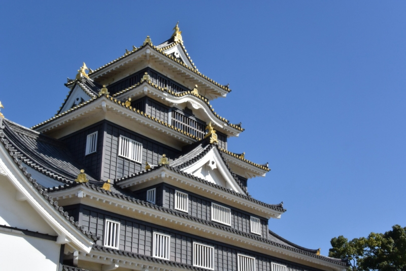
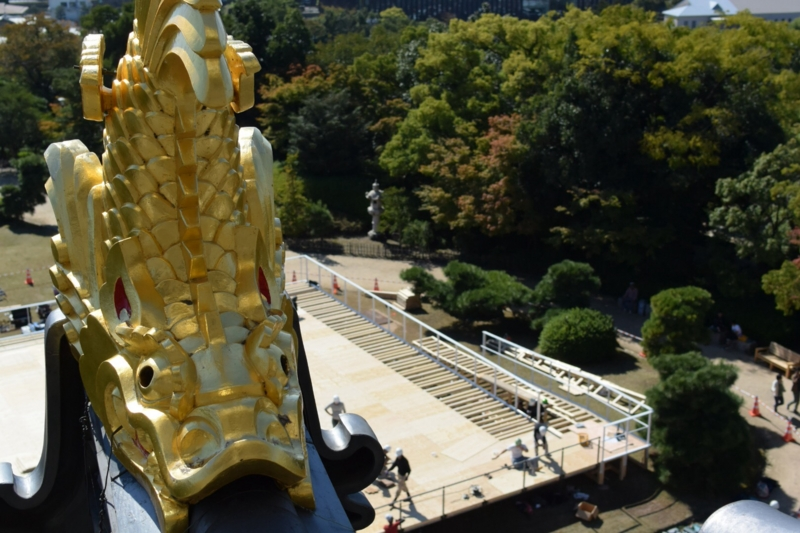

<a href="http://www.amazon.co.jp/exec/obidos/ASIN/B009A77Q1K/bestylesnet-22/">Nikon 単焦点レンズ 1 NIKKOR 18.5mm f/1.8  ブラック ニコンCXフォーマット専用</a>
<ul><li>出版社/メーカー: ニコン</li><li>発売日: 2012/11/01</li><li>メディア: Camera</li><li> クリック: 1回</li><li><a href="http://d.hatena.ne.jp/asin/B009A77Q1K/bestylesnet-22" target="_blank">この商品を含むブログ (5件) を見る</a></li></ul>

この前望遠レンズ買ったので、今回は明るい単焦点（35mm判換算で50mm相当）。カメラのフタ代わりにつけっぱなしにしておくレンズとして。

<a href="https://blog.daruyanagi.jp/entry/2014/10/17/183616">&#x56FD;&#x969B;&#x3060;&#x308B;&#x3084;&#x306A;&#x304E;&#x4F1A;&#x8B70; 2014&#x3001;&#x59CB;&#x307E;&#x308A;&#x307E;&#x3059;&#xFF01; - &#x3060;&#x308B;&#x308D;&#x3050;</a> で岡山に行ったときに持っていったのだけど……旅行用としてはもう少し広角のほうがいいなーと感じた。

もうちょっと引いて撮りたいわな。でも、絵的には望遠レンズよりもクリアに写ってる気がする？

ヤフオクでゲットしたので15,000円ぐらいだったけど、このお値段でこれなら割といいなーと思った。でも、前に持っていた 1 NIKKOR 10mm f/2.8 のほうがコンパクトだし使いやすいかなーとも。また近いうちに買うような気がする（ホワイトをもっていたが V3 のボディ色にホワイトがなく売ってしまった）。

<a href="http://www.amazon.co.jp/exec/obidos/ASIN/B005OD1CDM/bestylesnet-22/">Nikon 単焦点レンズ 1 NIKKOR 10mm f/2.8 ブラック ニコンCXフォーマット専用</a>
<ul><li>出版社/メーカー: ニコン</li><li>発売日: 2011/10/20</li><li>メディア: Camera</li><li> クリック: 2回</li><li><a href="http://d.hatena.ne.jp/asin/B005OD1CDM/bestylesnet-22" target="_blank">この商品を含むブログを見る</a></li></ul>

