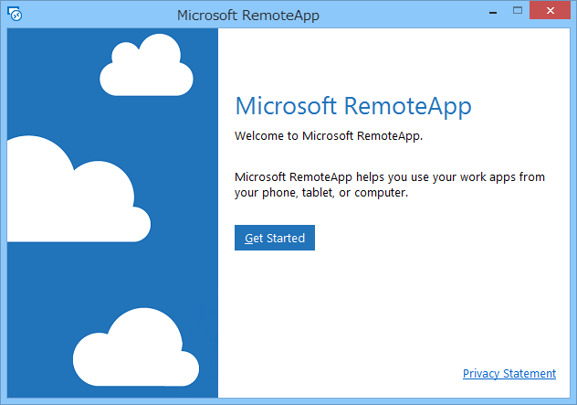
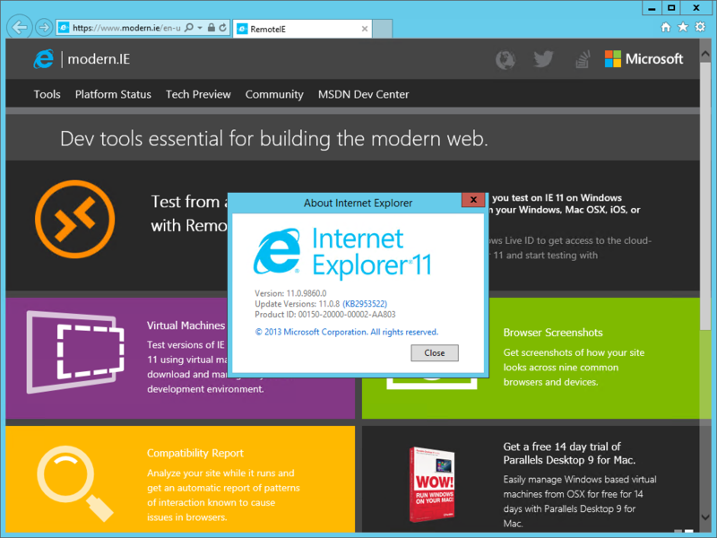
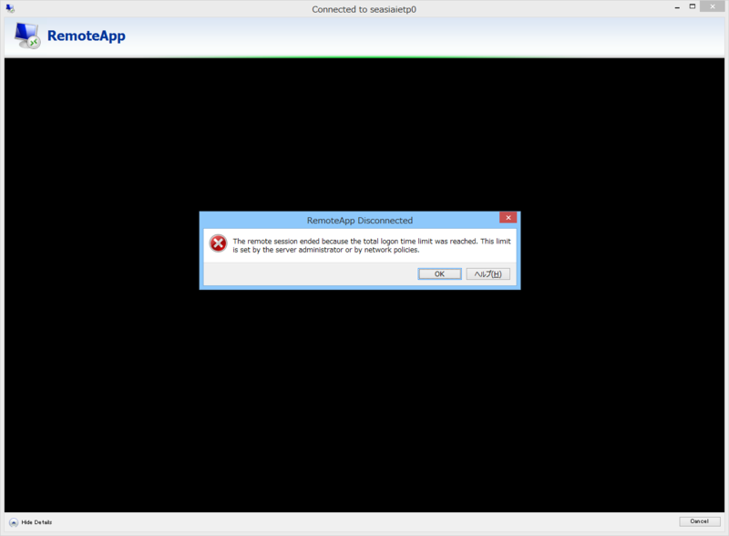

今のところ Windows 10 Technical Preview でしか利用できない次期バージョンの Internet Exolorer が、ほかの環境にも提供されることになった。名前は RemoteIE というらしい。

<ul>
<li><a href="http://blogs.msdn.com/b/ie/archive/2014/11/02/announcing-remoteie-test-the-latest-ie-on-windows-mac-os-x-ios-and-android.aspx">MSDN Blogs</a> （はてなは MSDN Blog のタイトルが取れないバグをさっさと直してほしいと思う）</li>
</ul>
前回は確か Hyper-V で、それ以外にも仮想マシンイメージなんかでも提供されたことがあった気がするが、今回は Microsoft RemoteApp で提供される。デカい OS イメージをわざわざダウンロードせずに済むし、Windows だけでなく、Mac、iOS、Android でも試せる。

<ul>
<li><a href="https://remote.modern.ie/">RemoteIE</a></li>
</ul>
まず Microsoft アカウントでログインし、RemoteApp クライアントをダウンロード・インストールする。

対応プラットフォームは以下の通り。

<ul>
<li>Mac</li>
<li>iPhone and iPad</li>
<li>Android</li>
<li>Windows x86</li>
<li>Windows x64</li>
<li>Windows RT</li>
</ul>
自分は Windows x64 をインストールした。remote.modern.ie で登録した Microsoft アカウントで Remote App クライアントにログインすると、RemoteIE の招待が届いているのでこれを許可すると、RemoteIE が使えるようになる。

うぇーぃ。ほとんどローカルアプリと変わらんぜー。バージョンは 11.0.9860.0。手持ちの Windows 10 環境をぶっ壊してしまったので今は確認できないが、まぁ、たぶん一緒のバージョンだと思う。

10分ぐらい放置するとセッションが切られる。また、1時間以上は連続して使えないようだ。

