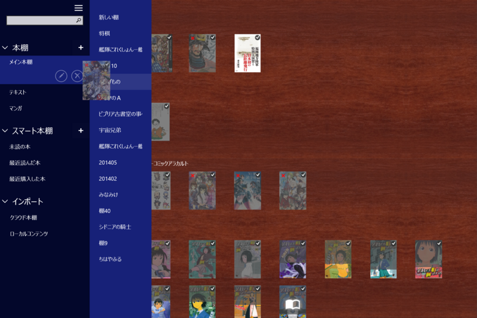
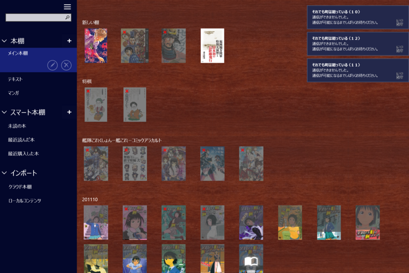

<blockquote class="twitter-tweet" lang="ja">
大変お待たせ致しました。紀伊國屋書店Kinoppy for Windowsストア版Ver.2.0 をリリースしました。<a href="http://t.co/oEiDit2XuA">http://t.co/oEiDit2XuA</a>
&mdash; Kinoppy 開発チーム (@Kinoppy_Dev) <a href="https://twitter.com/Kinoppy_Dev/status/529835942664613888">2014, 11月 5</a></blockquote>

複数本棚、スマート本棚、グリッドビュー・リストビューなどに対応。これで Surface Pro 3 でも iPad mini と同じ感じで使えるなぁ。

グリッドビューは割と気に入った。Windows ストア アプリの「Kinoppy」は本棚で縦にも横にもスクロールバーが出るのがウザかったけれど、グリッドビューにしておけば横スクロールは発生しない。とても快適だ。

複数本棚・スマート本棚は、実は iPad でも使ってない。そのうちもっと蔵書が増えてくればほしくなるかもしれないけど（今で300冊ぐらいだろうか）。

ちょっとイケてないな、と感じたのは、グリッドビューで本が一冊も登録されていない棚へ本をドラッグ＆ドロップして移動できない点。グリッドビューでは本の登録数に応じて棚の高さが変わるのだけど、一冊も登録していない場合はゼロになってしまうのだろうか、ドラッグ＆ドロップのターゲットにできなくなる。

あとでサイドパネルの本棚へドラッグ＆ドロップすればいいと気づいたのだけど、ドラッグ＆ドロップ周りの処理が全般的にこなれていないことも相まって、わりと難易度の高い操作に感じる。

あと、これはうちの環境だけかもしれないが、複数の本を一度にダウンロードしようとすると高確率で転送が途中で止まる（×マークがつく、一冊ずつだと今のところ失敗はない）。これはまぁ、ネットワークアプリとしてしょうがないし別にいいのだけど、問題は転送が途中で終わってしまったのをどうやってリトライすればいいのかわからないということ。ホールドすると“通信できるようになるまでお待ちください”と表示されるので、放っておけばそのうち直るのかもしれないが、ちょっと不親切かなーと思った。

ほかにも、本のロードやシークバーでページ移動する時に一瞬だけ“読み込み中”と表示されるのも、前のバージョンと同じ（こういうのはバックグラウンドでスマートにやってほしいなぁ）。Windows ストア アプリの開発ノウハウがたまっていないせいか（プラットフォームが普及しない → アプリが開発されない・バージョンアップに投資できない → ノウハウたまらない・アプリがしょぼい → プラットフォームが……）、どうも iPad なんかと比べるとスマートじゃないところが見受けられるけれども、今後も頑張ってほしいなーと思う。

