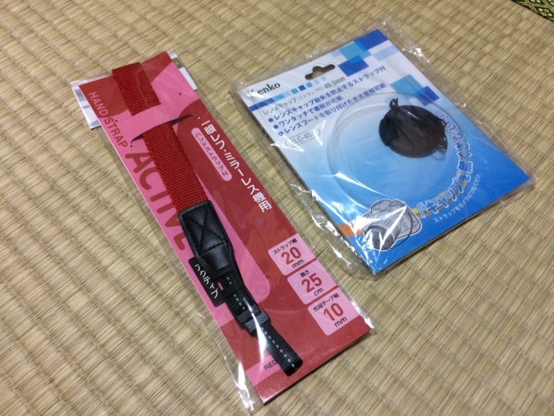

まずは、レンズキャップ。自分はよくレンズキャップをなくすので、本体にヒモでつなげておけるヤツを愛用している。

<a href="http://www.amazon.co.jp/exec/obidos/ASIN/B006FUSQDM/bestylesnet-22/">Kenko レンズアクセサリ ストラップ付レンズキャップ40.5mm KLC-40.5</a>
<ul><li>出版社/メーカー: ケンコー</li><li>発売日: 2011/12/16</li><li>メディア: Camera</li><li>購入: 2人 クリック: 2回</li><li><a href="http://d.hatena.ne.jp/asin/B006FUSQDM/bestylesnet-22" target="_blank">この商品を含むブログを見る</a></li></ul>

V3 のレンズキットについてくる標準ズームレンズはレンズキャップそのものがない自動シャッター付きなのだけど、そのほかのレンズにはそんな便利機能などついていないので、結局これが必要になる。

2つ目は、ストラップ。今回はなんとなく手首にかけるタイプを選んでみた。肩にかけるタイプは、カバンに入れるときに邪魔になる。

<a href="http://www.amazon.co.jp/exec/obidos/ASIN/B00DYNZL0O/bestylesnet-22/">【アマゾンオリジナル】ETSUMI ハンドストラップ ハンドストラップN ACTIVE(アクティブ) ミラーレス一眼用 シンプル レッド ETM-9752</a>
<ul><li>出版社/メーカー: エツミ</li><li>発売日: 2013/07/08</li><li>メディア: Camera</li><li><a href="http://d.hatena.ne.jp/asin/B00DYNZL0O/bestylesnet-22" target="_blank">この商品を含むブログを見る</a></li></ul>

使ってみて思ったのだけど、フリーハンドにならないのは肩にかけるタイプに劣る点だなー。手首に絡ませてしっかりホールドできる点は大変よろしい。

Amazon のレビューで「わっかが小さくて手首が通らない」っていう記述があったけど、自分は大丈夫だった。まぁ、こんなもんなんじゃないかな？

<a href="http://www.amazon.co.jp/exec/obidos/ASIN/B00IZ6EZ2U/bestylesnet-22/">Nikon Li-ion リチャージャブル バッテリー ENEL20A</a>
<ul><li>出版社/メーカー: ニコン</li><li>発売日: 2014/04/14</li><li>メディア: Camera</li><li><a href="http://d.hatena.ne.jp/asin/B00IZ6EZ2U/bestylesnet-22" target="_blank">この商品を含むブログ (1件) を見る</a></li></ul>

最後は予備のバッテリー。4,000円とか、高すぎんよ……でも、自分は GPS 大好き人間だし、V3 の無線 LAN 機能も便利でよく使う。バッテリーはいくらあっても足りないことはないって感じだ。昔にみたいに乾電池でも使えるようにしてくれてあると、いざというときも安心なんだけどなぁ。

