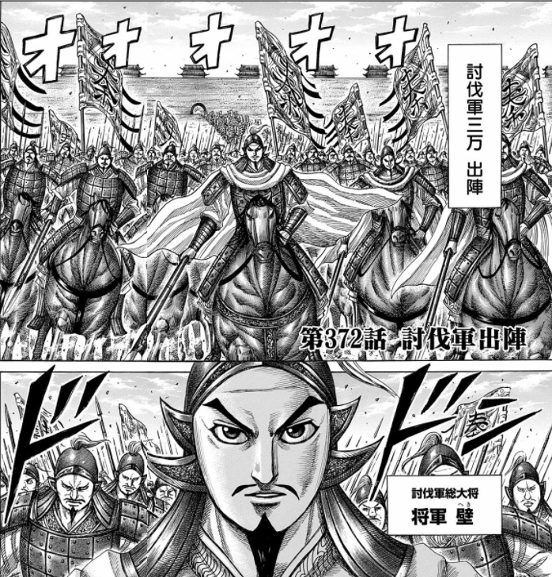

昔ちょっと調べたとき（<a href="https://blog.daruyanagi.jp/entry/2014/07/06/000703">&#x300E;&#x30AD;&#x30F3;&#x30B0;&#x30C0;&#x30E0;&#x300F;&#x306E;&#x767B;&#x5834;&#x4EBA;&#x7269;&#x3063;&#x3066;&#x307B;&#x3068;&#x3093;&#x3069;&#x67B6;&#x7A7A;&#x3067;&#x3057;&#x3087;&#xFF1F;&hellip;&hellip;&#x305D;&#x3046;&#x3067;&#x3082;&#x306A;&#x304B;&#x3063;&#x305F;&#x4EF6;&#x3002; - &#x3060;&#x308B;&#x308D;&#x3050;</a>）に少し驚いたのが、「壁」が実在の（？）人物だということだった。

<blockquote cite="http://ctext.org/shiji/qin-shi-huang-ben-ji/zh#n4734">

八年，王弟長安君成蟜將軍擊趙，反，死屯留，軍吏皆斬死，遷其民於臨洮。
 

（始皇八年（紀元前239年）、秦王の弟である長安君成蟜が将軍として隣国の趙を攻撃したが、（途中で）反乱を起こし、屯留で死んだ。（反乱に加担した屯留の）軍事関係者はみな切り殺され、一般市民は臨洮という街（のちの万里の長城の西の起点）へ移された。）
 

<b>將軍壁死</b>，卒屯留、蒲鶴反，戮其尸。河魚大上，輕車重馬東就食。

<cite><a href="http://ctext.org/shiji/qin-shi-huang-ben-ji/zh#n4734">&#x53F2;&#x8A18; : &#x672C;&#x7D00; : &#x79E6;&#x59CB;&#x7687;&#x672C;&#x7D00; - &#x4E2D;&#x570B;&#x54F2;&#x5B78;&#x66F8;&#x96FB;&#x5B50;&#x5316;&#x8A08;&#x5283;</a></cite>
</blockquote>

問題のテキスト。「将軍壁死」を「将軍・壁が死んだ」と解釈すれば、“壁”は実在の人物ということになる。

しかし、これには「将軍が壁死した」という別の解釈もあって、これだと「成蟜が屯留の街に籠城したが、そこで死んだ」「壁の中で自殺した」と解釈できる。

この一説の冒頭で成蟜が将軍と呼ばれているのだから、“壁”という将軍を新たに作らず、“将軍＝成蟜”と解釈するのが自然だが、ざっと調べたところ、「壁死」を熟語として使っているのは、ほかに同時代の古典も含めてこの一節だけなのが気になる。「壁死」なんていう言葉、あったのだろうか。

マンガのあとがきによると、著者は最初「将軍壁・死」と解釈して“壁”あんちゃんというキャラクターを作り出したけど、あとで「将軍・壁死」という解釈を知り、シナリオの流れもあって、本来死ぬべき屯留で死に損なった――という流れらしい。てっきり死ぬのだと思って、どんな感じで死ぬんだろう、惜しいキャラクターなのになと身構えていた俺氏は、ハシゴを外された気分で、うれしいようなだまされたような。最近の巻では、壁のあんちゃんが兵法をマスターしてかなり成長していたから、このあたりから殺す気がなくなっていたのかもしれない。

ちなみに「蒲鶴」は作中で人名と解釈されているが、南朝宋の裴駰による注釈書『史記集解』によると「屯留」も「蒲鶴」も地名だという。『史記正義』によると、「蒲」「鶴（鶮）」という別の街だともいう。でも、それだと“戮（りく、死体を損壊する刑罰の一種）”がいくつもの街全体で行われたことになるので、さすがにそれはない気がする（反乱を起こした罰ならば、ありえない話ではないが）。ここはやはり人名でいいかな。

また、“卒”には兵士（兵卒っていうよね）、貴人が死ぬこと（卒す＝しゅっす、亡くなる）、唐突に（卒倒！）、終わる（卒業とかで使うね）などの意味があり、“卒屯留”のとらえ方も自分には難しい。

『史記』だけに限って用例を調べてみたところ、“卒”は“兵士”の意味で使っている例が圧倒的に多く、残りは“おわる”の意味で使ってるところが少しある程度。成蟜が割と偉い人だったので“亡くなる”の意味かとも思ったけど、“壁死”と“卒す（死ぬ）”だとダブり感が半端ないし、この時代にその用法があったのかわからない。

というわけで、“屯留の兵士・蒲鶴が反乱した”っていう解釈が自然かと思うけど（軍吏はみな殺されたので兵士が反乱を起こしたのだろう）、それも語句の並びが変に感じる。

あるいは、もしかしたら“卒”は“成蟜が籠城して戦死し、屯留の破却・住民移住が終わった”ってことを指したりするのかもしれない。屯留は上党（秦・趙の境）にあったそうで、臨洮への移住はかなり過酷なものであったろう。そうなると、蒲鶴は屯留への処置に不服を感じて反乱を起こしたが、殺されて戮されたことになる。マンガとはかなりイメージが違うけれど、これはこれで面白い解釈かもしれない。

<blockquote>

始皇八年（紀元前239年）、秦王の弟である長安君成蟜が将軍として隣国の趙を攻撃したが、途中で反乱を起こし、屯留で死んだ。反乱に加担した屯留の軍事関係者はみな切り殺され、一般市民は臨洮という街へ移された。成蟜が屯留で籠城して死んだあと、町が破却されることに抗議して蒲鶴というものが再び反乱を起こしたが、これもすぐに鎮圧され、その屍は戮せられた。
 

その年は黄河が氾濫し、河魚がたくさん打ち上げられた。西方は飢饉になったので、ひとびとは馬や車を連ねて東方へ向かい、そこで食にありついた。

</blockquote>

最後の一節が“春秋の筆法”だとすれば、始皇帝のやりように対して、世論は批判的だったのだろう。

<a href="http://www.amazon.co.jp/exec/obidos/ASIN/4088900278/bestylesnet-22/">キングダム 36 (ヤングジャンプコミックス)</a>
<ul><li>作者: 原泰久</li><li>出版社/メーカー: 集英社</li><li>発売日: 2014/10/17</li><li>メディア: コミック</li><li><a href="http://d.hatena.ne.jp/asin/4088900278/bestylesnet-22" target="_blank">この商品を含むブログ (4件) を見る</a></li></ul>

