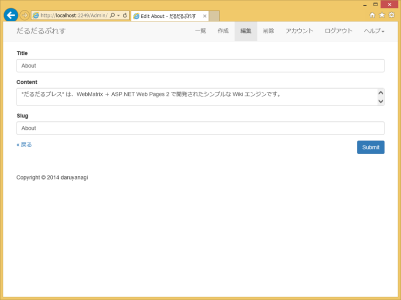
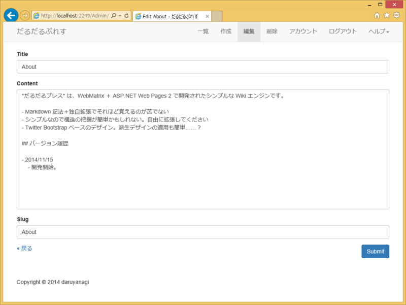
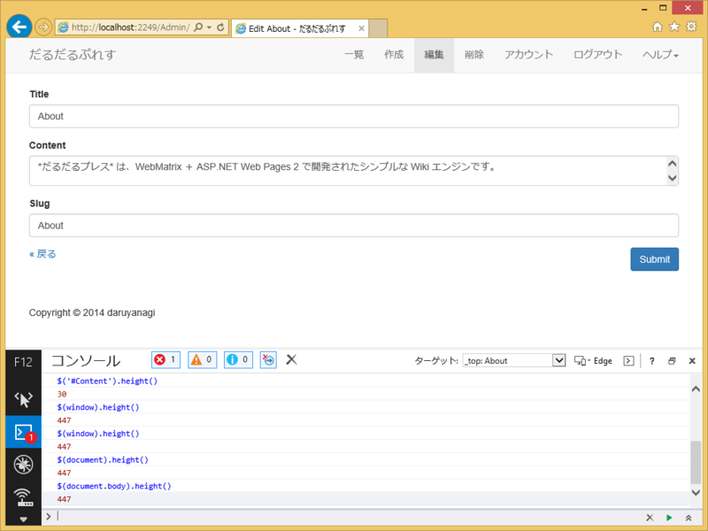

テキストエリアの高さって、いつもなやむ。適当に &lt;textarea rows="10" &gt; みたいな感じで決め打ちにすると、最悪、テキストエリアにもウィンドウにもスクロールバーがでてウザい（2重スクロールバーはもっとも避けるべきユーザーインターフェイスだと思う！）。なんかいい感じにウィンドウの高さに合わせてテキストエリアの高さもできるだけ大きくとりたい。

要はこうしたいんや！ 最初はググってコードをコピったろうと思っていたのだけど、「入力に応じてサイズを大きくする」みたいなサンプルばっかりで参考にならなかったので、自分で考えてみた――ら、簡単だった。

<pre class="code lang-javascript" data-lang="javascript" data-unlink>&lt;script&gt;
$(window).bind(&quot;resize ready&quot;, function(event){
$('#Content').height(
$('#Content').height()  +
$(window).height() -
$(document.body).height()
);
});
&lt;/script&gt;
</pre>
#Content がテキストエリアの ID な。JavaScript（jQuery）はさっぱりわからないのだけど、$(window).bind() を使うと複数のイベントに単一の関数を割り当てられるらしい（今回は ready と resize に割り当てたよ！）。テキストエリアが2つ以上になると破たんするけれど、まぁ、とりあえずこれでイケてる。

ひよっこなので、コンソールでぷちぷち式を入力して結果を確認しながら作ってみた。入力補完も効くので（jQuery の関数はダメだけど。ここらへんは Visual Studio がすごいらしい）、右も左もわからない状態でも割となんとかなる。

