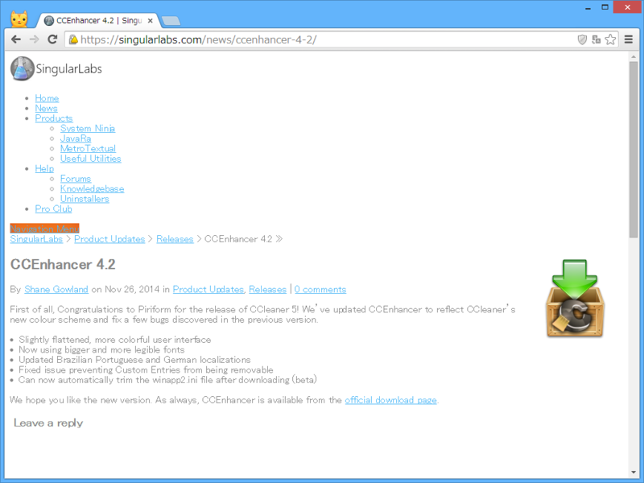
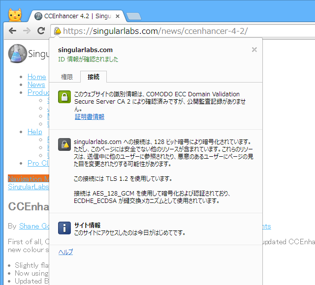
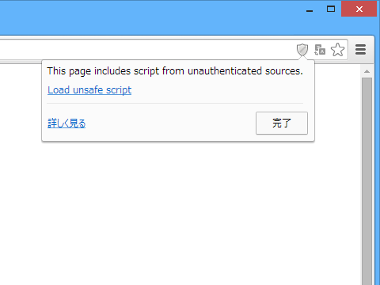
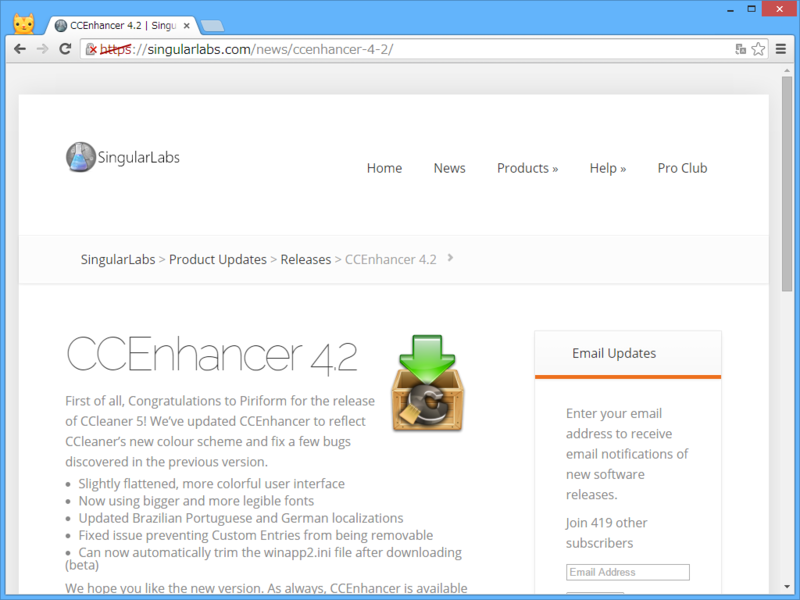
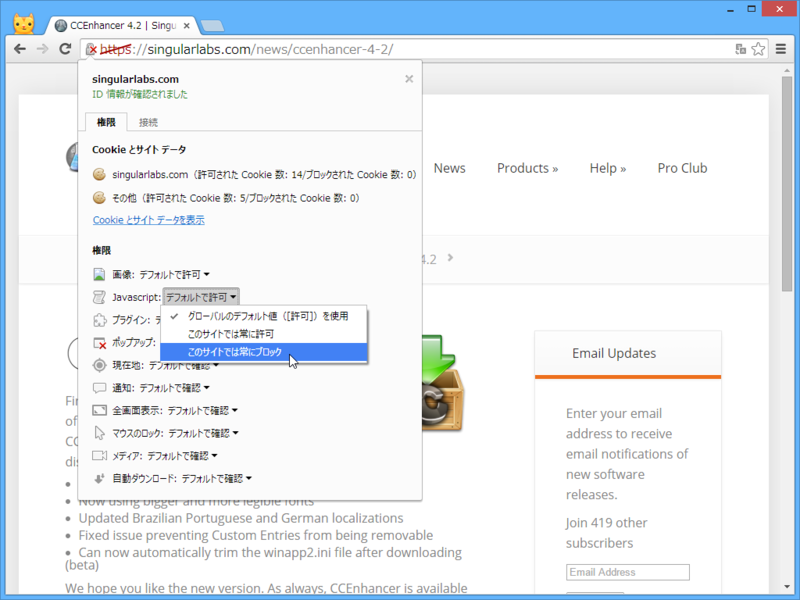

とあるサイトを Google Chrome で見ていると、なんかデザインが崩れている。

いわゆる Mixed Content （混合コンテンツ）のブロックらしい。混合コンテンツというのは、セキュアなものとセキュアでないものが混じったコンテンツのことを言うようだ。たとえば、https 接続のページに http 接続で取得した外部コンテンツが混じっている、みたいな状況を指す。

こういった機能は、最近のブラウザーではもう珍しくない。Google Chrome はもちろん、Internet Explorer や Mozilla Firefox にも同様の機能は搭載されている。

Google Chrome の場合、アドレスバー右端に盾アイコンが現れ、セキュアでないコンテンツをブロックしたことを通知してくれる。ブロックの解除はここから行える。

正常なデザインに。アドレスバーの https:// に打消し線が表示されていることに注目。

ただ、ブロック機能を再び有効化するにはどうすればいいのだろう。スクリプトならばサイトごとにブロックできるが……。まぁ、信頼している（ここには悪意がないだろうと個人的に思える）サイトでのみ許可したほうがいいのかもしれない。

<ul>
<li><a href="https://developer.mozilla.org/en-US/docs/Security/MixedContent">Mixed Content - Security | MDN</a></li>
</ul>