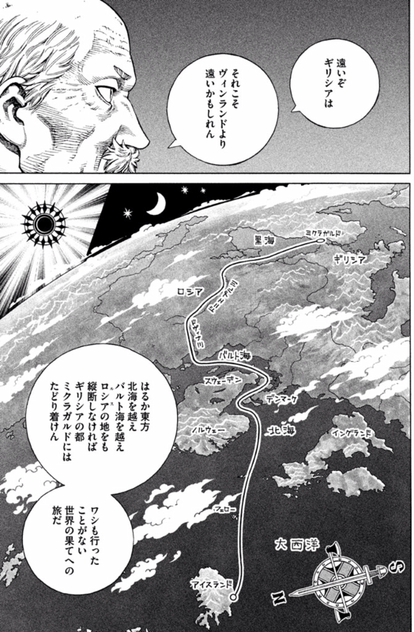
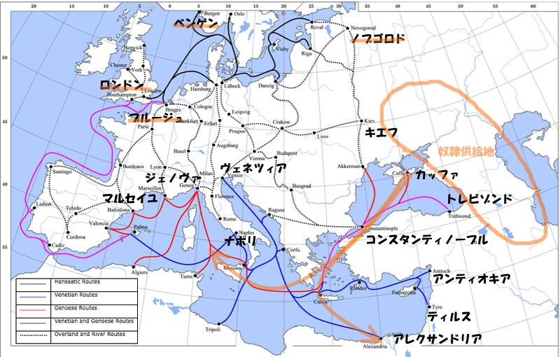

<a href="http://www.amazon.co.jp/exec/obidos/ASIN/4063879992/bestylesnet-22/">ヴィンランド・サガ(15) (アフタヌーンKC)</a>
<ul><li>作者: 幸村誠</li><li>出版社/メーカー: 講談社</li><li>発売日: 2014/10/23</li><li>メディア: コミック</li><li><a href="http://d.hatena.ne.jp/asin/4063879992/bestylesnet-22" target="_blank">この商品を含むブログ (15件) を見る</a></li></ul>

なるほど……地図をこういう向きで見たことなかったな……。

なんでキエフだのノブゴロドなんかの都市が栄えるんだろうってピンときてなかったのだけど、ちょっとだけわかる気もする。

 

<blockquote cite="http://ja.wikipedia.org/wiki/%E9%BB%92%E6%B5%B7">

9世紀前半以降、ヴァイキングの一派であるスウェーデン人（ヴァリャーグ）によって、「ヴァリャーグからギリシャへの道」と呼ばれるバルト海と黒海を結ぶ交易ルートが開設される。ルーシを貫き、ノヴゴロドからキエフを通りドニエプル川で黒海へと向かうこのルートは、ヨーロッパの南北を東側で結ぶ主要ルートとなり、キエフ大公国などのルーシ諸国家を東ローマ帝国と強く結びつけた。この時期に、東ローマの国教であるギリシア正教がロシアに受容されている。

<cite><a href="http://ja.wikipedia.org/wiki/%E9%BB%92%E6%B5%B7">&#x9ED2;&#x6D77; - Wikipedia</a></cite>
</blockquote>

実は黒海のあたりは奴隷の一大供給地になっていた。奴隷≒黒人というのはだいぶ後の時代になってからの話で、中世において奴隷とはスラブ系・ゲルマン系・中央アジア系だった。そもそも Slave という言葉は、スラブに由来するともいう。あれだけヴェネツィアとジェノヴァがコンスタンティノープルでの商業的自由にこだわったのも、ここが奴隷を地中海世界へ輸出する窓口であったからだ。

