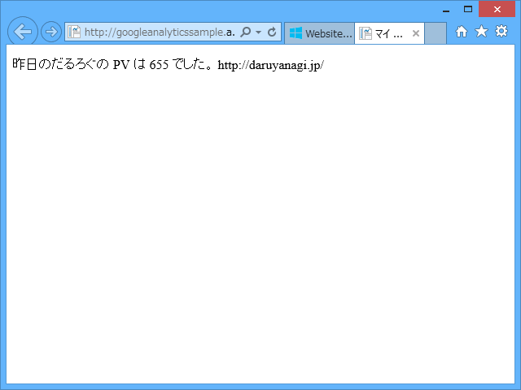
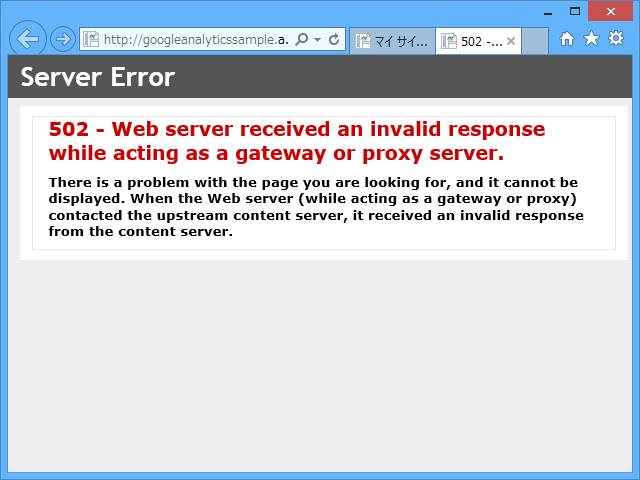
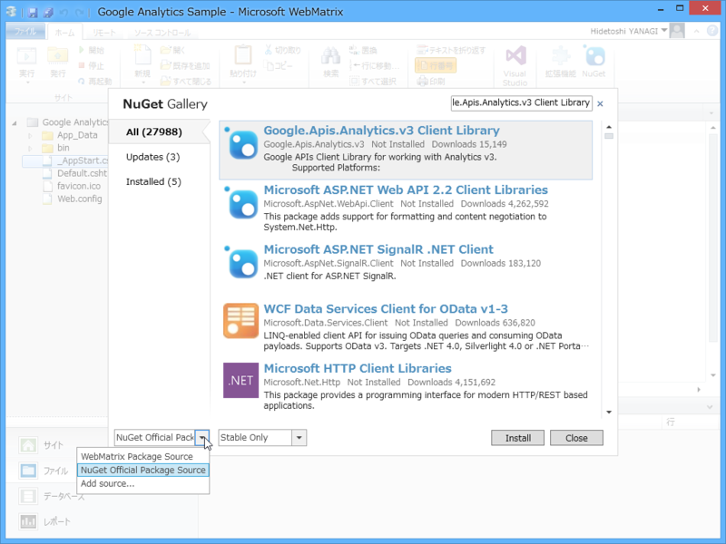

<a href="http://blog.shibayan.jp/entry/20140803/1407059293">Google Analytics API &#x3092;&#x4F7F;&#x3063;&#x3066;&#x524D;&#x65E5;&#x306E; PV &#x3092;&#x53D6;&#x5F97;&#x3059;&#x308B;&#x30B3;&#x30FC;&#x30C9;&#x3092; C# &#x3067;&#x66F8;&#x3044;&#x3066;&#x307F;&#x305F; - &#x3057;&#x3070;&#x3084;&#x3093;&#x96D1;&#x8A18;</a> を WebMatrix でやってみた。とりあえず、前日の PV を表示するとことまで。

<h3>つまづいたところその一</h3>

 

<blockquote>

'/' アプリケーションでサーバー エラーが発生しました。

Error:"invalid_grant", Description:"", Uri:"" 

</blockquote>

パラメーターが間違っていたりすると、認証エラーが出る。自分の場合は、<b>PC の時刻が狂っていた</b>。ちゃんと合わせておきましょう。

<h3>つまづいたところその二</h3>

 

<blockquote>

502 - Web server received an invalid response while acting as a gateway or proxy server.

There is a problem with the page you are looking for, and it cannot be displayed. When the Web server (while acting as a gateway or proxy) contacted the upstream content server, it received an invalid response from the content server.

</blockquote>

ローカルではちゃんと動くのに、Windows Azure に置くと 502 エラーが出る。

<pre class="code lang-cs" data-lang="cs" data-unlink>var certificate = new X509Certificate2(
HttpContext.Current.Server.MapPath(key),
&quot;notasecret&quot;,
X509KeyStorageFlags.Exportable
);
</pre>
この部分を、以下のように修正。

<pre class="code lang-cs" data-lang="cs" data-unlink>var certificate = new X509Certificate2(
HttpContext.Current.Server.MapPath(key),
&quot;notasecret&quot;,
X509KeyStorageFlags.Exportable |
X509KeyStorageFlags.MachineKeySet
);
</pre>
StackOverflow さまさまやでぇ。

<ul>
<li><a href="http://stackoverflow.com/questions/16992031/google-analytics-api-on-azure">c# - Google Analytics Api on Azure - Stack Overflow</a></li>
</ul>

<h3>つまづいたところその三</h3>

そもそもレポジトリのソースを変えないと <a href="https://www.nuget.org/packages/Google.Apis.Analytics.v3/">NuGet Gallery | Google.Apis.Analytics.v3 1.38.0.1306</a> が出てこない感じ。

で、やっとこさ検索しても、肝心の NuGet パッケージがインストールできねえ……NuGet Package Manager のバージョンが古いからみたいだけど、結局 Visual Studio にスイッチして NuGet をバージョンアップしたりごにょごにょして解決。

結局こんな感じになった。

<pre class="code lang-cs" data-lang="cs" data-unlink># ~/_App_Start.cshtml

@using System.Security.Cryptography.X509Certificates
@using Google.Apis.Auth.OAuth2
@using Google.Apis.Analytics.v3
@using Google.Apis.Services

@{
var key = @&quot;~/API Project-***.p12&quot;;
var mail = @&quot;***@developer.gserviceaccount.com&quot;;
var app_name = &quot;sample app&quot;;
var view_id = &quot;***&quot;;

var certificate = new X509Certificate2(
HttpContext.Current.Server.MapPath(key),
&quot;notasecret&quot;,
X509KeyStorageFlags.Exportable |
X509KeyStorageFlags.MachineKeySet
);

var credential = new ServiceAccountCredential(
new ServiceAccountCredential.Initializer(mail)
{
Scopes = new[] {
AnalyticsService.Scope.Analytics,
AnalyticsService.Scope.AnalyticsReadonly
}
}.FromCertificate(certificate)
);

var service = new AnalyticsService(new BaseClientService.Initializer
{
HttpClientInitializer = credential,
ApplicationName = app_name,
});

// Azure は UTC なので +9 時間して -1 日
var date = DateTime.UtcNow.AddHours(9).AddDays(-1).ToString(&quot;yyyy-MM-dd&quot;);

App.PageView = service.Data.Ga
.Get(&quot;ga:&quot; + view_id, date, date, &quot;ga:pageviews&quot;)
.Execute()
.Rows[0][0];
}
</pre>
（別に ~/_AppStart.cshtml に書く必要はないけど、成り行きで何となくそうしてしまった）

<pre class="code" data-lang="" data-unlink># Default.cshtml

@{

}

&lt;!DOCTYPE html&gt;

&lt;html lang=&#34;ja&#34;&gt;
&lt;head&gt;
&lt;meta http-equiv=&#34;Content-Type&#34; content=&#34;text/html; charset=utf-8&#34;/&gt;
&lt;meta charset=&#34;utf-8&#34; /&gt;
&lt;title&gt;マイ サイトのタイトル&lt;/title&gt;
&lt;link href=&#34;~/favicon.ico&#34; rel=&#34;shortcut icon&#34; type=&#34;image/x-icon&#34; /&gt;
&lt;/head&gt;
&lt;body&gt;
&lt;p&gt;昨日のだるろぐの PV は @App.PageView でした。 https://blog.daruyanagi.jp/&lt;/p&gt;
&lt;/body&gt;
&lt;/html&gt;</pre>
ほとんどしばやんのコードのまるパクリになったので、こんど万世のローストビーフでもおごってあげようと思った。

