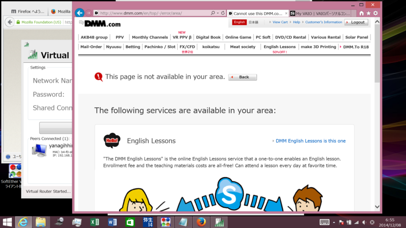
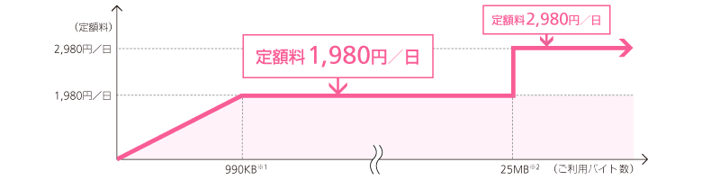
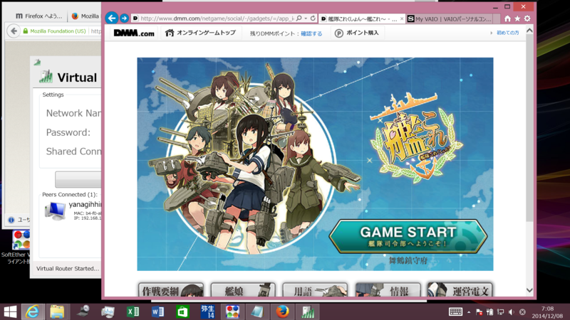
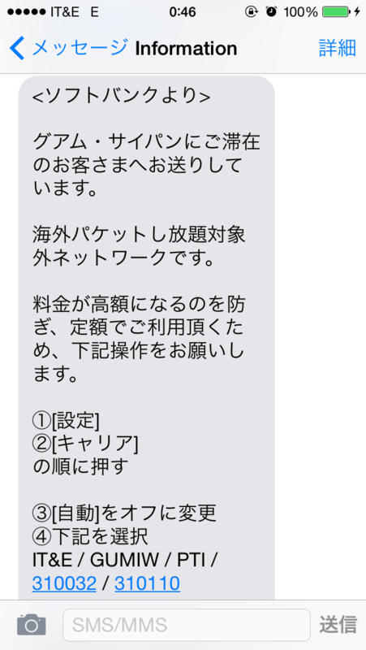
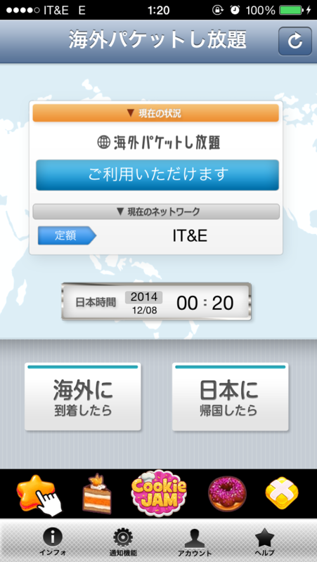
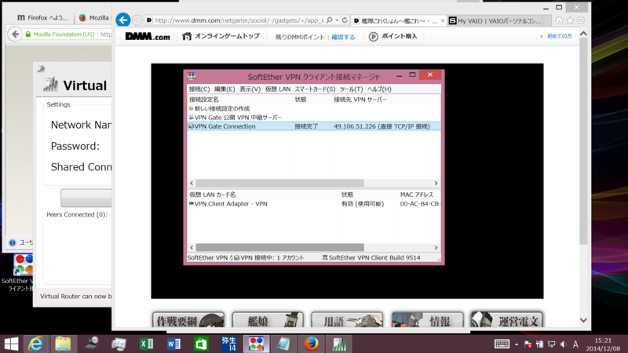
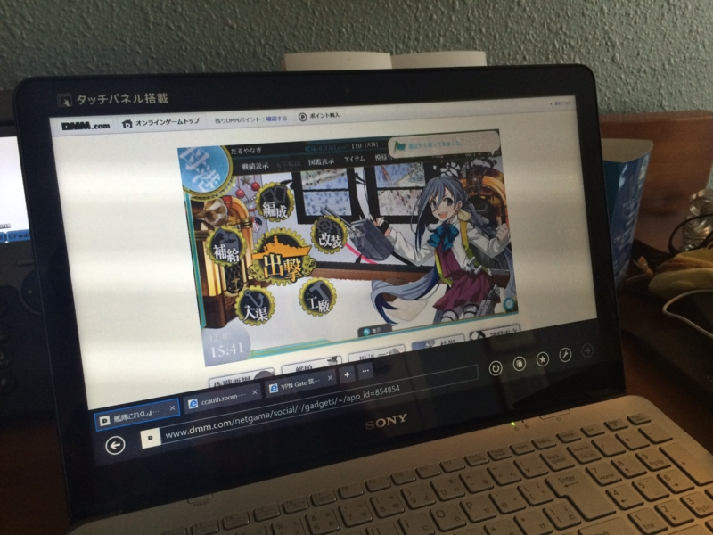
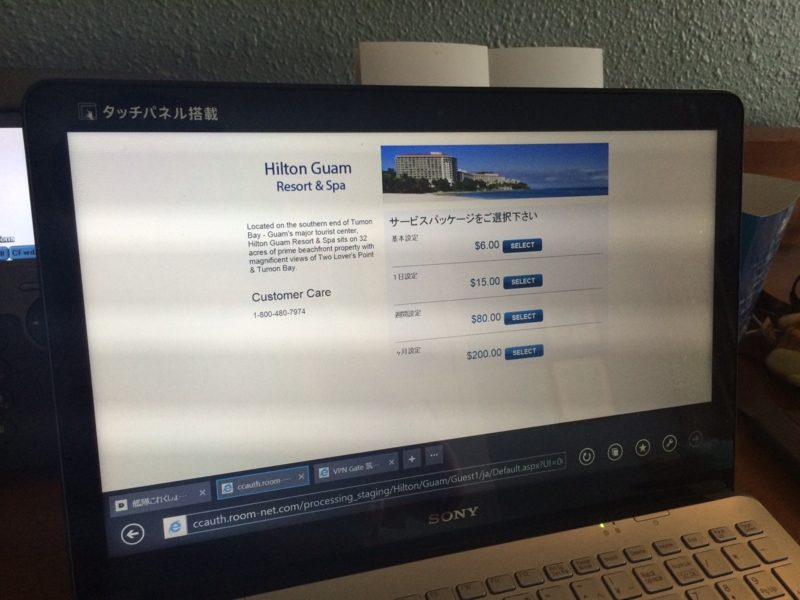

弟2号がグアムで結婚式を挙げるというので、出席してきますタ。いつもちゃらけてる印象のあった弟2号ですが、正装しているのをみるとわりとイケメンだなと思いますタ。顔も小さく、卵型。俺はアンパンマンみたいなのに、どこで何を間違ったんだろう。兄を差し置いて結婚なんてマジ許すマジですが、まぁ、ご飯おいしかったから許す。

さて、海外旅行で一番困るのは、“艦これ”ができないことだと思います。

米国から接続するとエラーページが表示され、怪しげな英語レッスンのページに誘導されます。まずはこれを何とかせネバダ州。

<h3>ソフトバンクの「海外パケットし放題」を使う</h3>

もしあなたがソフトバンクユーザーならば、一番楽な方法は「海外パケットし放題」を使うことかもしれません。

<blockquote cite="http://www.softbank.jp/mobile/service/global/overseas/web/packet-flat-late/">

<b>1.どれだけ使っても定額なので安心</b> 
0～1,980円／日※3、25Mバイト※3以上なら2,980円／日※3 
安心してメールやウェブをご利用いただけます。 
※3 
iPhone、iPad、SoftBank スマートフォンでウェブ（3G）をご利用の場合。iPhone、iPad、SoftBank スマートフォンでウェブ（3G）をご利用の場合。 
渡航先の現地時間ではなく、日本時間（午前0時～午後23時59分）の1日を基準に課金されます。 
<b>2.渡航先の99.6%※4をカバー</b> 
渡航先の99.6%をカバー！いつもお使いのソフトバンク携帯電話を世界各国でご利用いただけます。 
※4 
当社のお客さまの利用実績（2012年5月）より算出 
<b>3.お申し込み不要でそのまま使える</b> 
「海外パケットし放題」のお申し込みは不要です。 
設定方法については下記ご確認ください。

<cite><a href="http://www.softbank.jp/mobile/service/global/overseas/web/packet-flat-late/">&#x6D77;&#x5916;&#x30D1;&#x30B1;&#x30C3;&#x30C8;&#x3057;&#x653E;&#x984C; | &#x56FD;&#x969B;&#x30B5;&#x30FC;&#x30D3;&#x30B9; | &#x30B5;&#x30FC;&#x30D3;&#x30B9; | &#x30E2;&#x30D0;&#x30A4;&#x30EB; | &#x30BD;&#x30D5;&#x30C8;&#x30D0;&#x30F3;&#x30AF;</a></cite>
</blockquote>

料金はこんな感じ。

要するに、「日額3,000円でパケット通信がし放題」ということで、ちょっとお高いですけど、わかりやすい。これで繋ぐと「日本からつないでいる（IP アドレスが日本）」になるようで、特別な設定不要で艦これができました。

うぇーぃ。

 

グアムに着いて［ローミング］を ON にすると、SMS で案内が来ます。それに従って［キャリア］設定を変更するだけで、パケ放題が適用されます（スクリーンショットのように“対象外”というメッセージが来たら要注意！　今すぐ［キャリア］設定を変更してください）。グアムだと“IT&E”にしておけばよいみたい。

あと、「海外パケットし放題」の適用キャリアかどうかを調べるアプリが用意されているので、それを日本にいるうちにインストールしておくと安心ですね（Android/iOS）。

<h3>「VPN Gate」を利用する</h3>

しかし、残念ながら「海外パケットし放題」ではネットワークが不安定で、安定して接続できませんでした（時間帯によっては「遠征」ぐらいはできるかなーっていう程度）。その場合は、なんとか無線 LAN を確保して（自分はホテルの有料 Wi-Fi を使いました。無料 Wi-Fi も割とあります。あと、空港でモバイルルーターの貸し出しもしているようです）、VPN をつなぐとよいでしょう。

VPN というのは仮想的な LAN ネットワークを構築する技術ですが、ざっくり簡単にいうと、IP アドレスを日本のものに偽装できます。これがあれば、アメリカからも艦これができる！

VPN サービスは有償・無償いろいろありますけど、

<ul>
<li><a href="http://www.vpngate.net/ja/">VPN Gate &#x7B51;&#x6CE2;&#x5927;&#x5B66;&#x306B;&#x3088;&#x308B;&#x516C;&#x958B; VPN &#x4E2D;&#x7D99;&#x30B5;&#x30FC;&#x30D0;&#x30FC;&#x30D7;&#x30ED;&#x30B8;&#x30A7;&#x30AF;&#x30C8;</a></li>
</ul>
これなんかがタダで、かつ割と簡単ではないかなと思います（ほかにもあるかも？）。使い方は……まぁ、多少 PC に慣れた人ならだれでも使えるんじゃないでしょうか。説明するのめんどいんで、各自“艦これ”愛を発揮して頑張ってください。

うぇーぃ。

<h3>番外編</h3>

うちが泊まったホテル（ヒルトン）の場合、無線 LAN の課金は端末ごとでした。つまり、艦これをやるノートパソコン、本を読む iPad、Twitter をする iPhone、それぞれにお金がかかります（1日15ドル）。これはさすがにあほらしい。

なので、ノートパソコンに無線 LAN のアクセスポイントにするソフトを入れるといいと思います。1つのインターネット回線を分岐させる、分配器にするわけですね。

<ul>
<li><a href="http://www.forest.impress.co.jp/docs/news/20130212_587364.html">&#x4EEE;&#x60F3;&#x7121;&#x7DDA;LAN&#x30EB;&#x30FC;&#x30BF;&#x30FC;&#x30BD;&#x30D5;&#x30C8;&#x300C;Virtual Router&#x300D;&#x304C;&#x5B89;&#x5B9A;&#x7248;&#x306B;&#x3001;Windows 8&#x3092;&#x30B5;&#x30DD;&#x30FC;&#x30C8; - &#x7A93;&#x306E;&#x675C;</a></li>
</ul>
お勧めはこのソフトでしょうか。「VPN Gate」との併用もできますが、自分の PC ではちょっと不安定だったかも（どっちのせいかよくわかりませんでしたが）。

海外旅行はネットワークの確保がクソ面倒ですね。空港で SIM カード売ってないか探したのですが、迎えのタクシーがすぐに来ちゃった関係もあって、見つけられませんでした（よく考えたら、誰かに聞けばよかった！）。もうちょっと経験値貯めて、スムーズに回線が確保できるマンになりたいですねー。

