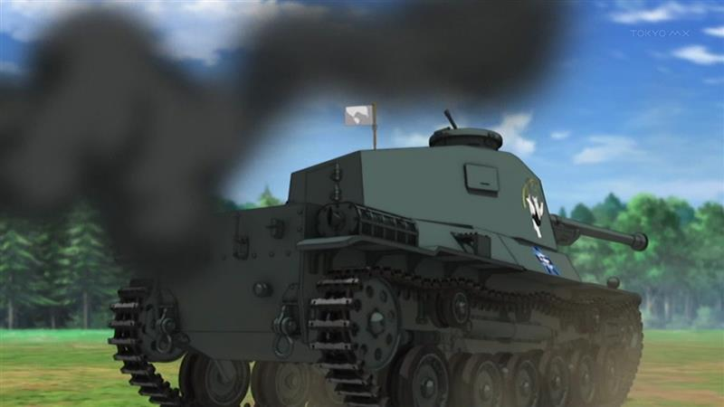

 

<ul>
<li><a href="http://fury-movie.jp/">http://fury-movie.jp/</a></li>
</ul>
<a href="https://blog.daruyanagi.jp/entry/2014/12/14/215629">&#x30B0;&#x30A2;&#x30E0;&#x3067;&#x8266;&#x3053;&#x308C;&#x3057;&#x3066;&#x304D;&#x305F; - &#x3060;&#x308B;&#x308D;&#x3050;</a> の前の日、古い友人と川崎で観た。ロンメルの話みたいに、戦車戦を題材にした映画はいくつかみたことがあったけど、よく考えたら“戦車兵”にフォーカスした映画は初めて見るかもしれない。

それもあってか、ぶっちゃけブラピが“俺Tueeee！”するだけの話だったけれど（最後辺りとか、ツッコミどころ満載過ぎて口あんぐりだった）、それも含めて割と面白かった。とくにドイツのティーガーと戦うシーンは圧巻。シャーマン戦車の砲塔をブッ飛ばすに足る巨砲に、砲弾をことごとく弾き返す装甲。<i>「こんな化け物、どーやって倒すんだよ！」</i>味方のシャーマン戦車が1輌、2輌と討ち減らされ、最後1対1の勝負になるところなんか、思わず手に汗握ってしまった。

ってなわけで割とお勧めするけれど、描写はやっぱりエグいので注意。

ガルパンみたいにヤラれたら白旗がピョコッとでるだけなら平和なのだけどｗ

まぁ、戦車兵にはなりたくないな。鉄の棺桶の中で蒸し焼き or あぶり焼きになって死ぬなんて、歩兵でもやってる方がまだマシだと思った。

ちなみに、二本目は宇宙戦艦ヤマトを見たのだけど、とくにコメントするべきことはないので省略。

