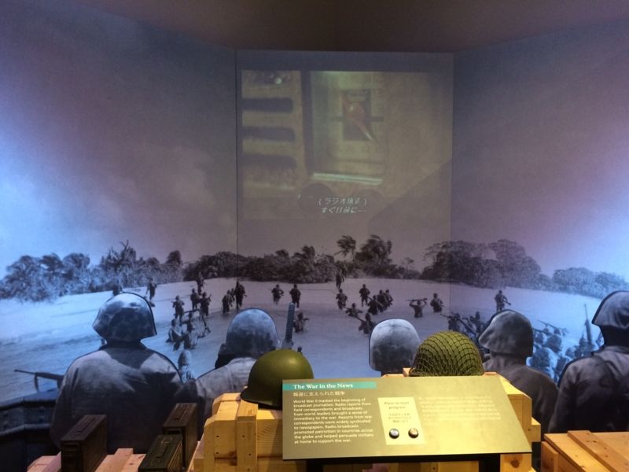

グアム旅行（<a href="https://blog.daruyanagi.jp/entry/2014/12/14/215629">&#x30B0;&#x30A2;&#x30E0;&#x3067;&#x8266;&#x3053;&#x308C;&#x3057;&#x3066;&#x304D;&#x305F; - &#x3060;&#x308B;&#x308D;&#x3050;</a>）で午前中2時間だけ時間が取れたので、レンタカーを借りて太平洋戦争記念館へ行きました。グアムって、日本の免許証でクルマが借りられるんですね。知らなかったかも。

お代は保険料込みで70ドル弱。タクシーを往復で借りるよりは安かったです。

グアムは南北に長い島です（渡される地図は横向きになっているので、最初は東西に長いのかなとか思ってました）。これを南北に縦断するのが“マリンコー・ドライブ”で、これが多分1号線になるのかな？　とりあえず、この道を覚えておけばいいようです。

グアムは道路の案内板がちょっと小さくてみにくいのですが、ちゃんと向かっている方角が“North”だの“South”だのと書かれているので、方向音痴でもどちらに向かっているのかわかります。ちなみに、道案内をおかんに任せていたのですが、見事に15分ぐらい逆走しました。

ホテルのあるタモンビーチから、いろいろ楽しそうなものがあるアガナ地区、眺めが素晴らしいアサンビーチと“海兵隊通り”を南下すると、ピティというところに着きます。すると右手に見えるのが、今回の目的地、War in Pacific Museum です。

日本海軍の二人乗り潜水艦が出迎えてくれます。

説明文を写真に撮ったつもりだったのですが残っていないという大失態（！）を犯したのですが、たぶん特殊潜航艇  <a href="http://ja.wikipedia.org/wiki/%E7%94%B2%E6%A8%99%E7%9A%84">&#x7532;&#x6A19;&#x7684; - Wikipedia</a> ですね。英語の Wikipedia だと シドニー、グアム、ガダルカナル、キスカで捕獲されているそうなので、その一つなのかもしれません。

博物館のなかはそれほど大きくなく、5分もあれば一周できる感じ（陸奥記念館（<a href="https://blog.daruyanagi.jp/entry/2014/08/30/221903">&#x6226;&#x8266;&#x9678;&#x5965;&#x306E;&#x304A;&#x5893;&#x53C2;&#x308A;&#x884C;&#x3063;&#x3066;&#x304D;&#x305F; - &#x3060;&#x308B;&#x308D;&#x3050;</a>）より少し小さい感じ？）。すごく大がかりなものを期待していると、少し肩すかしを食らうかもしれません。

でも、展示はどれもビジュアルで音声にも凝っていて（最近リニューアルされたという話も聞きました）、しっかり見れば1時間は優にかかるのではないでしょうか。内容は――どうせ日本の悪口しかないんだろうなと思っていたのですが……

たとえばメディア戦略のコーナーでは日本の軍国主義を助長した報道を批判しつつも、アメリカ側もメディアを活用して英雄を作り出した点が指摘されているなど、わりと公平な感じで好感がもてましたね。現地のチャモロ人の証言も、日本批判一辺倒ではなく、むしろ日米という大きな勢力に翻弄された悲しみが伝わってきたように思います。

日本軍の侵攻と、米軍の反攻をグラフィカルに。とても分かりやすい。

資料は英語が中心ですが、日本語訳も充実（もう一つの言語はチャモロ語でしょうか？）。僕のように日本語と関西弁しかしゃべれない人でも大丈夫だと思います。

時間があれば Pacific War Museum（こことはまた違うところ）や公園の方も行ってみたかったのですが、ここでタイムアウト。右側通行でも割と普通にクルマが運転できることも分かったし、今度来るときはもっといろんなところに行ってみたいですね。

