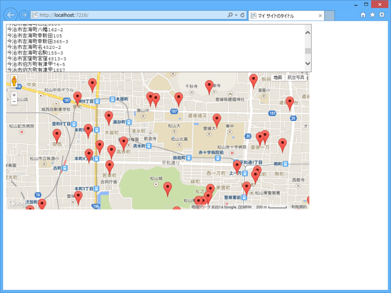

<a href="http://nakaji.hatenablog.com/entry/2014/12/16/090000">SGMLReader&#x3067;&#x300C;&#x3048;&#x3072;&#x3081;FreeWi-Fi&#x300D;&#x30B5;&#x30FC;&#x30D3;&#x30B9;&#x63D0;&#x4F9B;&#x7B87;&#x6240;&#x3092;&#x30B9;&#x30AF;&#x30EC;&#x30A4;&#x30D4;&#x30F3;&#x30B0; - &#x306A;&#x304B;&#x65E5;&#x8A18;</a> を読んで存在を知った。

<blockquote cite="http://www.pref.ehime.jp/h12600/wifi/osirase260822.html">

産学官で構成する愛媛県公衆無線LAN推進協議会では、外国人観光客や県内外の旅行者、地域住民等が無料で利用できるWi-Fiスポットの整備を民設民営で進めることにより、その利便性を確保し、愛媛県内の地域活性化を図る「えひめFreeWi-Fiプロジェクト」を推進しています。

<cite><a href="http://www.pref.ehime.jp/h12600/wifi/osirase260822.html">&#x611B;&#x5A9B;&#x770C;&#x5E81;&#xFF0F;&#x3048;&#x3072;&#x3081;Free Wi-Fi&#x30B5;&#x30FC;&#x30D3;&#x30B9;&#x63D0;&#x4F9B;&#x7B87;&#x6240;&#x7B49;&#x306E;&#x304A;&#x77E5;&#x3089;&#x305B;</a></cite>
</blockquote>

“利便性を確保し”とか“地域活性化を図る”とかいってる割りには、クソ不便なテーブルデータしか用意してないのって、ほんとお役所だなーと思いますね。

というわけで、なかじが作ってくれたコードをまるパクリして、それを Google Map へマッピングしてみた。これで、ちょっとは利便性が向上するんじゃないだろうか。

マッピングのライブラリは、

<ul>
<li><a href="http://www.ryokurian.jp/atelier/google/maps_sample1.html">&#x30B5;&#x30F3;&#x30D7;&#x30EB;&#xFF11; - &#x300C;google&#x30DE;&#x30C3;&#x30D7;&#x3067;&#x8907;&#x6570;&#x4F4F;&#x6240;&#x3092;&#x4E00;&#x62EC;&#x8868;&#x793A;&#x300D;&#x306E;&#x4F5C;&#x308A;&#x65B9; - &#x7DD1;&#x91CC;&#x5EB5;</a></li>
</ul>
をもらってきた。ちょっとコードが古いので、TypeScript で書き直したりしてみたい。

Web ページのコードはこんな感じ（spotList あたりのコードとか汚いけど）。WebMatrix（ASP.NET Web Pages）はこういう“ペライチ”のページを作るときに便利よね。

<pre class="code lang-cs" data-lang="cs" data-unlink># ~/Default.cshtml

@using System.Xml.Linq
@using Sgml

@{
var urlString = &quot;http://www.pref.ehime.jp/h12600/wifi/osirase260822.html&quot;;

XDocument xml;
using (var sgml = new SgmlReader() { Href = urlString, IgnoreDtd = true })
{
xml = XDocument.Load(sgml);
}

var ns = xml.Root.Name.Namespace;
var spots = xml.Descendants(ns + &quot;table&quot;)
.Last()
.Descendants(ns + &quot;tr&quot;)
.Skip(1) // タイトルをスキップ
.Select(e =&gt; e.Elements(ns + &quot;td&quot;).ToList())
.Select(x =&gt; new
{
Place = x[1].Value,
Address = x[2].Value,
ServiceProvider = x[3].Value
});

var spotList = string.Join(&quot;\r\n&quot;, spots.Select(_ =&gt; _.Address.Replace(&quot;&amp;minus;&quot;, &quot;-&quot;)).ToArray());
}

&lt;!DOCTYPE html&gt;

&lt;html lang=&quot;ja&quot;&gt;
&lt;head&gt;
&lt;meta http-equiv=&quot;Content-Type&quot; content=&quot;text/html; charset=utf-8&quot;/&gt;
&lt;meta charset=&quot;utf-8&quot; /&gt;
&lt;title&gt;マイ サイトのタイトル&lt;/title&gt;
&lt;link href=&quot;~/favicon.ico&quot; rel=&quot;shortcut icon&quot; type=&quot;image/x-icon&quot; /&gt;
&lt;script src=&quot;http://maps.google.com/maps/api/js?sensor=false&quot;&gt;&lt;/script&gt;
&lt;script src=&quot;http://ajax.googleapis.com/ajax/libs/jquery/1.10.0/jquery.min.js&quot;&gt;&lt;/script&gt;
&lt;script src=&quot;~/Scripts/sirusiizu.js&quot;&gt;
&lt;/script&gt;
&lt;/head&gt;
&lt;body&gt;

&lt;textarea id=&quot;addressList&quot; style=&quot;width: 80%; height: 120px;&quot;&gt;@spotList&lt;/textarea&gt;

&lt;div id=&quot;map&quot; style=&quot;width: 80%; height: 360px;&quot;&gt;

&lt;/div&gt;

&lt;script&gt;
sirusiizu.initialize(&quot;map&quot;);
sirusiizu.marking(document.getElementById(&quot;addressList&quot;).value);
&lt;/script&gt;
&lt;/body&gt;
&lt;/html&gt;
</pre>

割とたくさんあるんやなー。

<blockquote class="twitter-tweet" lang="ja">
<a href="https://twitter.com/daruyanagi">@daruyanagi</a> 俺かやろうとしてたことを・・・(ToT)
&mdash; なかじ (@nakaji) <a href="https://twitter.com/nakaji/status/544782999317778434">2014, 12月 16</a></blockquote>

まじ申し訳ないけど、割とやっつけ仕事なので、キレイに仕上げてくれていいのよ？

<ul>
<li><a href="http://ehime-wifi.azurewebsites.net/">http://ehime-wifi.azurewebsites.net/</a></li>
</ul>