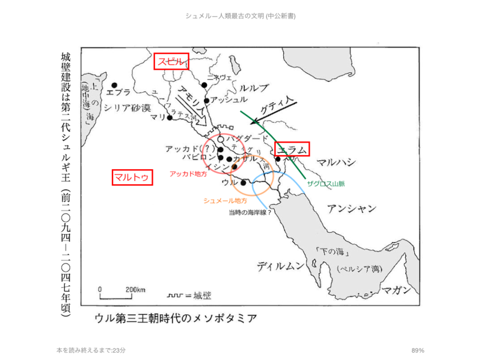
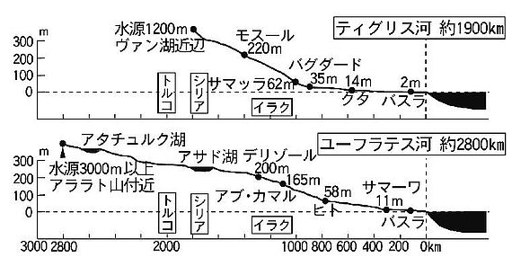

<a href="http://www.amazon.co.jp/exec/obidos/ASIN/B00LMB2M5C/bestylesnet-22/">シュメル神話の世界　粘土板に刻まれた最古のロマン (中公新書)</a>
<ul><li>作者: 岡田明子,小林登志子</li><li>出版社/メーカー: 中央公論新社</li><li>発売日: 2014/07/11</li><li>メディア: Kindle版</li><li><a href="http://d.hatena.ne.jp/asin/B00LMB2M5C/bestylesnet-22" target="_blank">この商品を含むブログを見る</a></li></ul>

面白いは面白いのだけど、シュメールのことがあんまりよく分かってなくて楽しめない感じだったので、追加で下記の本も購入。

<a href="http://www.amazon.co.jp/exec/obidos/ASIN/B00LMB0KVK/bestylesnet-22/">シュメル―人類最古の文明 (中公新書)</a>
<ul><li>作者: 小林登志子</li><li>出版社/メーカー: 中央公論新社</li><li>発売日: 2014/07/11</li><li>メディア: Kindle版</li><li><a href="http://d.hatena.ne.jp/asin/B00LMB0KVK/bestylesnet-22" target="_blank">この商品を含むブログを見る</a></li></ul>

結果的には『人類最古の文明』を先に読んで『神話の世界』を読むのが正解だったが、まぁ、両方読んだので問題ない。

世界史の教科書を開くと、たぶん最初はメソポタミアかエジプトのことをやるのだと思うけれど、学生の頃はここら辺の話があまり得意でなかったと思う。「～だったそうだ」「～だったという」と、どうも話が具体的でなく、面白くない。結果、「ウル、ウルク、ラガシュ」と街の名前だけ呪文のようにして覚えて終わってしまう。アッカドもアッシリアもバビロニアも、あんまり区別がついてなくてよくわからないまま終わる。

でも、この時代はそのまま旧約聖書などの世界につながっていて、ちゃんとわかっていると面白いんだな。ノアの箱舟の話も、バベルの塔も、もとは最古の文明人・シュメールの話だった。地名や地理、歴史、人名、文化が分かっていれば、あの世界にもさっくりはいれたんだ。そうやって教えてくれていれば、興味を持って勉強したのにな。

――さて、そのシュメール。

日本が木の文明、エジプトやギリシア・ローマが石の文明だとすれば、彼らが築いたのは“泥土（粘土）”の文明だった。彼らは粘土を焼いてレンガを作り、街を建設した。そして、粘土に文字を書き、文学（と大量の報告書、手紙）を残した。

彼らは割と日本人と似ていて面白い。たとえば、

<ul>
<li>八百万の神様を信じている（多神教）。ギルガメシュのような半神半人のものもいるし、神格化されて神になる人もいる</li>
<li>ハンコ大好き（ただし、スタンプではなく、粘土板にころがして跡をつけるタイプ）</li>
<li>魚が結構好き（魚の楔形文字もある。でもたぶん食べてたのは川魚？）</li>
<li>膠着語を使う</li>
</ul>
おかげで、日本人とシュメール人を無理やり繋ぎあわせる荒唐無稽な話も作られた（義経＝チンギスハン説みたいなものだろう）。違うところを挙げれば、こちらもキリがないのだから、そうした話はファンタジーとしては面白くてもほんとうとは思われない。

シュメール人は、働くのが嫌になった神様の代わりに作り出された。この人間観はちょっと面白い。彼らはパンを食べ、ビールを飲んだ。街に住み、そうする人間こそが、シュメール人にとっての“文明人”だった。

シュメール人の世界。ティグリス川とユーフラテス川の間が彼らの“中原”。北にはアッカド人という人々が住んでいる。彼らもまた、シュメール人のまねをして街に住み、パンを食べ、ビールを飲む。なので、シュメール人はアッカド人にはあまり敵対心をもたなかったらしい。ギリシャ人とローマ人のような関係だったのだろうか。アフロディテとヴェヌス（ビーナス）みたいに、神様も習合していたらしい。ちなみに彼女たちはシュメールではイナンナ、アッカドではイシュタルと呼ばれていた。

アッカド人はシュメール語を古典語として学んだが、のちに日常語として優勢になったのはアッカド語らしい。アッカドの王がシュメール名を名乗ったり、シュメールの王がアッカド風の名前を使うといった混合も見られたという。両書でもシュメール読みとアッカド読みが入り混じっていて、ちょっと混乱するところがあったかも。

そのシュメール・アッカド世界の周りを、スビル、エラム、マルトゥという未開人が住んでいて、シュメール・アッカドの諸都市を襲う。彼らから街を守るのは、王（エン、ルガル）たちの重大な責務だった。けれど、ときどき神様たちが会議で街を滅ぼすを決めてしまうと、王の手には負えず、滅ぼされてしまうこともある（この神様たちは大洪水のときも会議で人間を滅ぼすと決めた。理由は、「増えすぎて騒がしくなったから」らしい。ひでぇ）。

シュメール人の世界は、都市国家集まりだった。本を読んで想像するに、どうやらその時々で優勢な街があり、“神から王権を下されていた”らしい。中国の春秋戦国時代でいうところの“覇者”のようなものかな？　たとえば、ウルが優勢だったころは三回あり、その最後の時代は「ウル第三王朝」期と呼ばれている。異民族のグティ人に支配されていた時代もある。また、アッカドが王権を得ることもあり、これは「アッカド王朝」と呼ばれた。この王朝は、旧約聖書にも出てくるサルゴン王が、シュメール・アッカド世界を超えて地中海（彼らは“上の海”と読んだ）にまで版図を拡大したので「アッカド帝国」と呼ばれたりもする。サルゴン王は、中国で言えば秦の始皇帝に相当するだろうか。いや、そのあと遠くエジプトまでを傘下に入れたアッシリア王・アッシュール・バニパルに比すべきだろうか。

「ウル第三王朝」のあと、シュメール人が二度と覇権を握ることはなく、アッシリア、バビロニアと時代を経るにつれ、シュメール人はセム系民族の中で埋もれて行ってしまう。シュメール語は古典語として学校で教えられる存在になったが、それもやがて行われなくなる。しかし、シュメールで作られた物語は、のちの民族・宗教に大きな影響を与えた。

あと、関係ないけどティグリス川のほうが暴れ川だっていうのは地理のトリビアだよね。こういうのを知っておくと、古代シュメールの有力都市の多くがユーフラテス川沿いにあったのもうなずける話だ。

