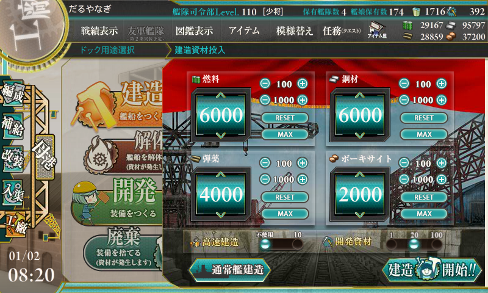
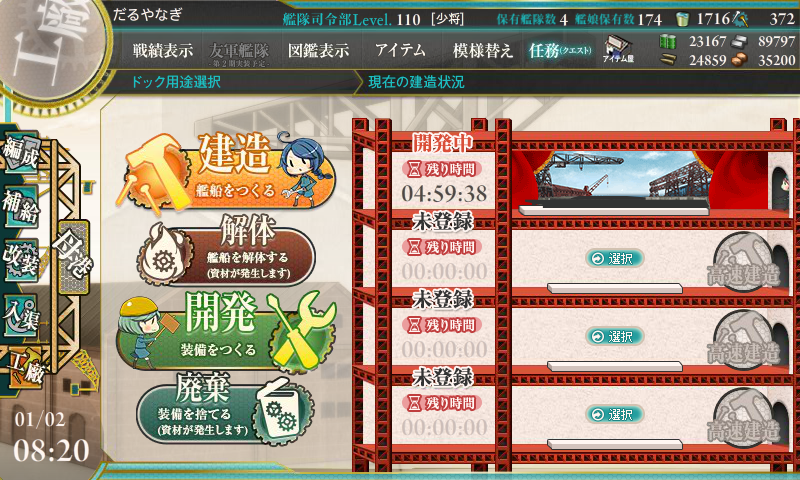
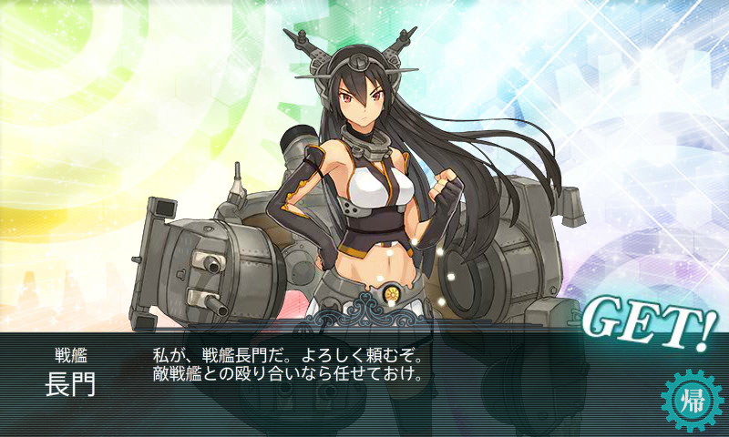

あけましておめでとうございます。今年もよろしくお願いします。

――というわけで、一年の抱負でも書こうかなと思って去年の年初の記事を読み返してみたのですが。

<ul>
<li><a href="https://blog.daruyanagi.jp/entry/2014/01/01/174309">&#x8266;&#x3053;&#x308C;: &#x5927;&#x578B;&#x5EFA;&#x9020;&#x3067;&#x4ECA;&#x5E74;&#x306E;&#x904B;&#x52E2;&#x3092;&#x5360;&#x3063;&#x3066;&#x307F;&#x305F;&#x3002; - &#x3060;&#x308B;&#x308D;&#x3050;</a></li>
</ul>
こんな有様でした。しょうがないので、今年も大型建造をやってみました。

秘書官は Z1、レシピは 6000/4000/6000/2000/20 のビス子狙いで。

見事、建造時間 5:00 を引き当てました！　あとは陸奥じゃないことを祈るのみ……。

結果。まぁ、そんなことだろうと思っていたけど。たぶん今年もこんな感じなんだろうなーと思いました。

