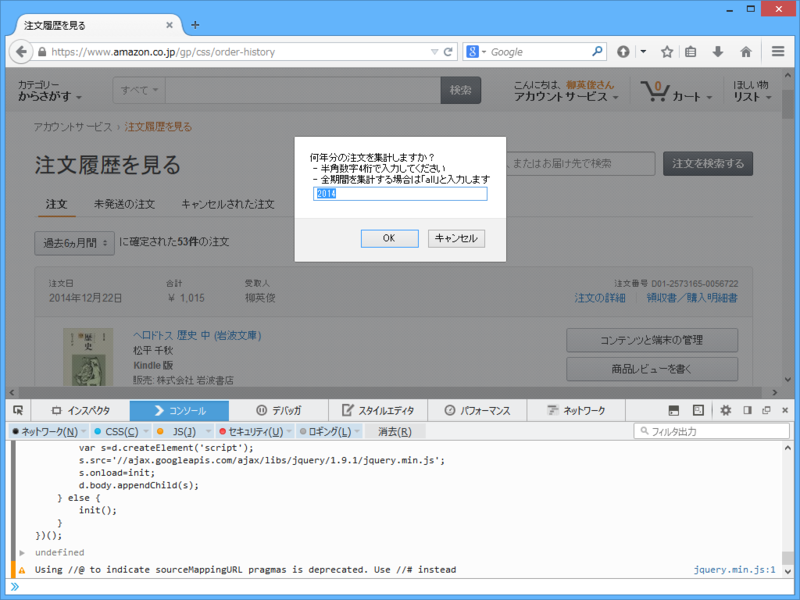
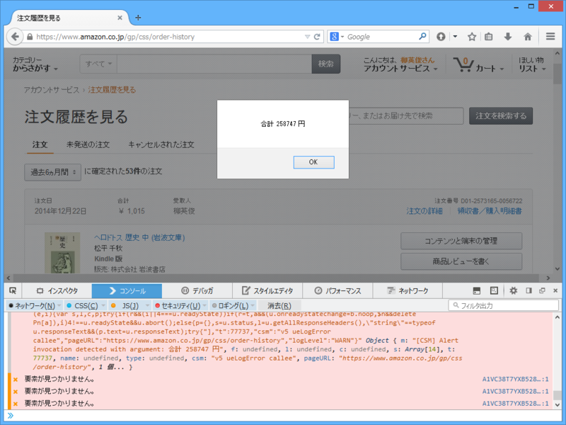

以下の記事を参考に、「Firefox」で集計。

<ul>
<li><a href="http://qiita.com/kyproject/items/d8b259f1eb75a01d3a0b">bookmarklet - Amazon&#x3067;&#x4E00;&#x5E74;&#x9593;&#x306B;&#x4F7F;&#x3063;&#x305F;&#x91D1;&#x984D;&#x3068;&#x3001;&#x6CE8;&#x6587;&#x5C65;&#x6B74;&#x306E;TSV&#x3092;&#x51FA;&#x529B;&#x3059;&#x308B;&#x30D6;&#x30C3;&#x30AF;&#x30DE;&#x30FC;&#x30AF;&#x30EC;&#x30C3;&#x30C8;&#x3010;2015&#x5E74;&#x7248;&#x3011; - Qiita</a></li>
</ul>
まず、［F12］キーを押し、［コンソール］タブを開く。次に、

<ul>
<li><a href="https://gist.githubusercontent.com/polamjag/866a8af775c44b3c1a6d/raw/9607877660bd04ea06d65328e2eb53d0134b6572/amazon-calc.js">https://gist.githubusercontent.com/polamjag/866a8af775c44b3c1a6d/raw/9607877660bd04ea06d65328e2eb53d0134b6572/amazon-calc.js</a></li>
</ul>
に掲載されているコードをコピーして、［コンソール］タブ下部のテキストボックスへペースト。［Enter］キーで実行すると、以下のようなダイアログが表示される。

調べたい年を入力して処理を継続すると、最後にその年に Amazon で使った金額の合計が出力される。

なんかエラーたくさん出たけど気にしないことにした。

<table>
<tr>
<td>2014</td>
<td>258747 円</td>
</tr>
<tr>
<td>2013</td>
<td>186103 円</td>
</tr>
<tr>
<td>2012</td>
<td>277831 円</td>
</tr>
<tr>
<td>2011</td>
<td>258747 円</td>
</tr>
<tr>
<td>2010</td>
<td> 93949 円</td>
</tr>
<tr>
<td>2009</td>
<td> 35289 円</td>
</tr>
<tr>
<td>2008</td>
<td> 66638 円</td>
</tr>
<tr>
<td>2007</td>
<td>283066 円</td>
</tr>
<tr>
<td>2006</td>
<td> 71180 円</td>
</tr>
</table>
2010年ぐらいまでは本と CD しか買っておらず、年間10万円を突破することがなかったが<a href="#f-9efef2cc" name="fn-9efef2cc" title="2007 年の消費が異常に多いのは、実家の会社で使うソフト（Windows Vista/Office 2007）やビジネスプリンターを代わりに買ってあげたからのようだ（総額15万ほど）。ほかに実家＆親戚へのクリスマスプレゼントに Wii を2台買ってあげたようだ">*1</a>、2011年からは家具なども買うようになり激増。最近ではビールや食べ物まで買うようになっている<a href="#f-229c37ca" name="fn-229c37ca" title="とくにビールは年に5万ぐらい使っているらしい（憤死">*2</a>。最近は Kindle で本を読むようになったので、ますます Amazon での消費が増えそうだ。

<h3>追記</h3>

<blockquote cite="http://www.yomiuri.co.jp/it/20141218-OYT1T50150.html">

　米アマゾンや楽天のカナダ子会社「コボ」など海外に本店を置くインターネット業者から日本国内に配信された電子書籍や音楽データの取引に、２０１５年１０月から消費税が課税されることになった。
 

　現在は、海外業者からの電子データ配信には課税されておらず、国内の書店などから不公平だとの批判が出ていた。

<cite><a href="http://www.yomiuri.co.jp/it/20141218-OYT1T50150.html">&#x6D77;&#x5916;&#x30CD;&#x30C3;&#x30C8;&#x914D;&#x4FE1;&#x306B;&#x6D88;&#x8CBB;&#x7A0E;&#x8AB2;&#x7A0E;&#x3078;&hellip;&#x96FB;&#x5B50;&#x66F8;&#x7C4D;&#x306A;&#x3069; : &#xFF29;&#xFF34;&#xFF06;&#x30E1;&#x30C7;&#x30A3;&#x30A2; : &#x8AAD;&#x58F2;&#x65B0;&#x805E;&#xFF08;YOMIURI ONLINE&#xFF09;</a></cite>
</blockquote>

まぁ、相変わらずだけど、対応が遅いね。実務的な問題はいろいろあるんだろうけど、前々から指摘されていたことなのだから、さっさとやればいいのにと思う。

<a href="#fn-9efef2cc" name="f-9efef2cc" class="footnote-number">*1</a>:2007 年の消費が異常に多いのは、実家の会社で使うソフト（Windows Vista/Office 2007）やビジネスプリンターを代わりに買ってあげたからのようだ（総額15万ほど）。ほかに実家＆親戚へのクリスマスプレゼントに Wii を2台買ってあげたようだ

<a href="#fn-229c37ca" name="f-229c37ca" class="footnote-number">*2</a>:とくにビールは年に5万ぐらい使っているらしい（憤死

