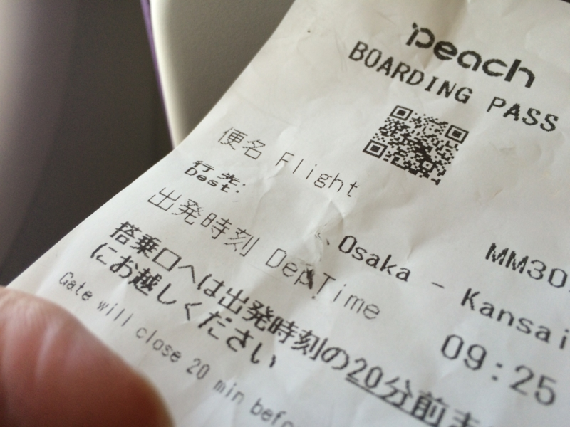
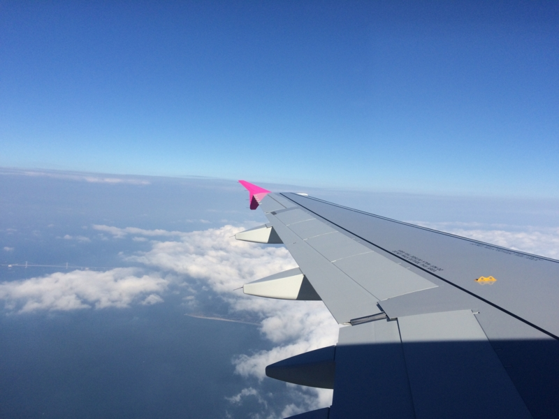
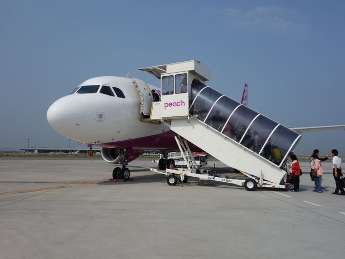
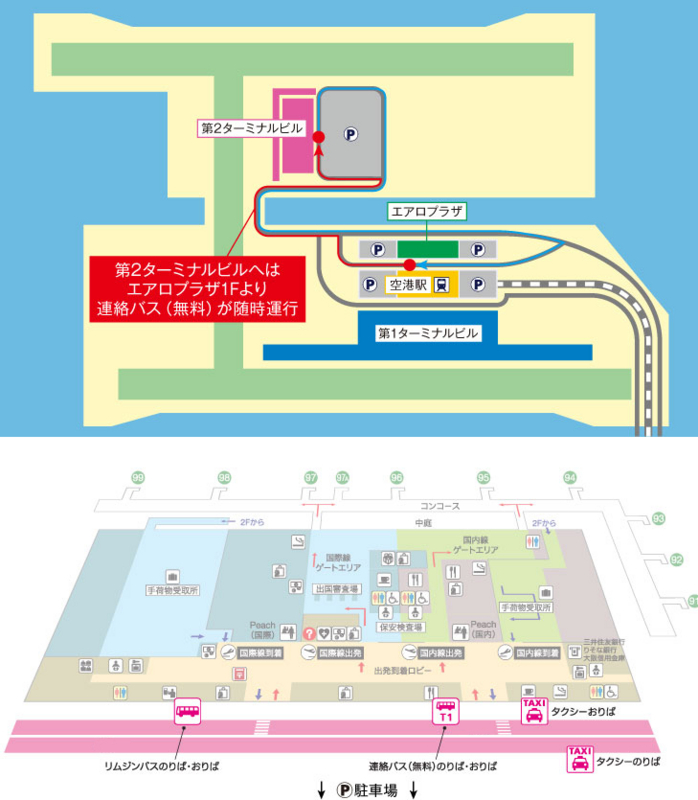

新幹線で行ってもいいのだけど、一度体験してみたかったので。

ちなみに、松山～大阪間の交通手段とお値段はこんな感じ。JR松山駅～松山空港までは、リムジンバスで310円/15分。タクシーで2,000円弱って感じかな。カウンターはジェットスターとは逆、JAL の隣にある。

<table>
<tr>
<th></th>
<th></th>
<th>料金（目安）</th>
<th>所要時間</th>
<th>備考</th>
</tr>
<tr>
<td>新幹線</td>
<td>JR松山駅～新大阪</td>
<td>1,1070円</td>
<td>4時間</td>
<td>特急しおかぜ＋新幹線</td>
</tr>
<tr>
<td>伊予鉄バス</td>
<td>JR松山駅～梅田</td>
<td>6,200円</td>
<td>昼行5時間40分</td>
<td>※夜行あり</td>
</tr>
<tr>
<td>JRバス</td>
<td>JR松山駅～梅田</td>
<td>6,900円</td>
<td>昼行6時間</td>
<td>※夜行は京都まで行ける</td>
</tr>
<tr>
<td>ピーチ</td>
<td>松山空港～関西空港</td>
<td>3,290円～14,490円</td>
<td>50分</td>
<td>梅田までリムジンバス1,500円</td>
</tr>
<tr>
<td>ANA</td>
<td>松山空港～伊丹空港</td>
<td>19,000円</td>
<td>50分</td>
<td>梅田までリムジンバス640円</td>
</tr>
<tr>
<td>フェリー</td>
<td>JR松山駅～東予港～大阪南港</td>
<td>7,490円</td>
<td>8時間　22:00出航、翌6:00着</td>
<td>※東予港までの連絡バス込み</td>
</tr>
</table>

ピーチの運賃は毎回変わるが、今回は年末ということもあり、1か月前に予約して5,800円程度だったと思う。これに空港利用料などが加算され、6,000円ちょいになる。

飛行時間は正味30分。水平飛行時間は10分あるかないかなので、下手するとシートベルトの着用のサインが点かないままの場合もありそうだ。そのため、機内販売はほとんどない（南海電車の切符販売ぐらい）。お茶が飲みたかったら、売店で買っておくといいと思う。

席は指定しなかったのだけど（お金を追加でとられる）、ちょうど翼の付け根辺りの窓際席だったので、ずっと景色と翼を見て過ごした。機材はエアバスA320で、高揚力装置（フラップ）には角度が書いてある。離着陸時に動くので、見ていてあまり飽きない。

（<a href="http://guide.travel.co.jp/howto/11/">LCC &#x30D4;&#x30FC;&#x30C1;&#x306E;&#x62E0;&#x70B9;&#x3001;&#x95A2;&#x7A7A;&#x7B2C;&#xFF12;&#x30BF;&#x30FC;&#x30DF;&#x30CA;&#x30EB;&#x306E;&#x5931;&#x6557;&#x3057;&#x306A;&#x3044;&#x5229;&#x7528;&#x8853; | &#x5927;&#x962A;&#x5E9C; | [&#x305F;&#x3073;&#x306D;&#x3059;] by Travel.jp</a>）

関空では、最近できたばかりという LCC 専用のターミナル（第二ターミナル）で降ろされる。これが果てしなく辺鄙なところにあり、JR・南海の駅がある第一ターミナルまで連絡バスで行く必要がある。到着ならともかく、出発ならばあらかじめ15分はかかると見込んでおく必要があると思った。できたら電車がここまで来てくれるとありがたいのだけど、あんまり期待できないのだろうなぁ。

 

<h3>まとめ</h3>

<ul>
<li>安くて速い。高速バスがあまり好きじゃないこともあり、個人的には高速バスを選ぶ理由ないなと感じた。</li>
<li>天候には弱いかも。ただ、瀬戸大橋も割と死ぬので大して変わらん気がする。</li>
<li>関空の LCC ターミナルは地の果てにある。ボーディングブリッジが使える行き（松山→大阪）はともかく、帰りは割と余裕を見て空港に行かないと置いてきぼりを食らいそうだ</li>
</ul>
 

<ul>
<li>時刻表を見るとすごく不便そうだけど、乗り継ぎすれば割といろんなところに安くいけそう。機会があれば試してみる（現在、松山から直通便があるのは羽田、成田、関空、伊丹、中部、福岡、鹿児島、沖縄、ソウル、上海だけなので、札幌・仙台あたりに行けると助かるなぁ）</li>
</ul>

