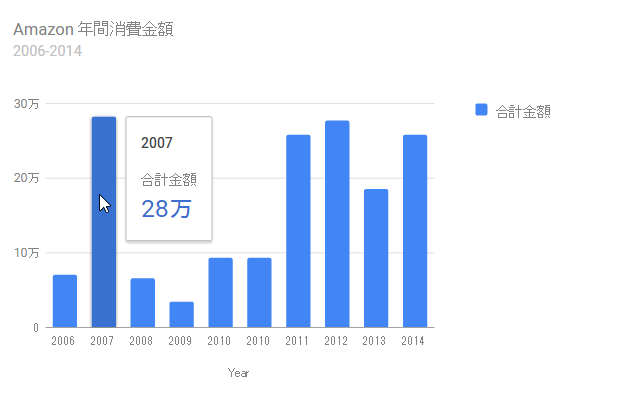

<a href="https://blog.daruyanagi.jp/entry/2015/01/04/000000">&#x53BB;&#x5E74; Amazon&#x3067;&#x4F7F;&#x3063;&#x305F;&#x91D1;&#x984D;&#x3092;&#x8A08;&#x7B97;&#x3057;&#x3066;&#x307F;&#x305F;&#x3002; - &#x3060;&#x308B;&#x308D;&#x3050;</a> でグラフを張り付けようと思ったのだけど、「Excel」で作って画像として貼り付けるよりも、Google Chart<a href="https://developers.google.com/chart/">Charts &nbsp;|&nbsp; Google Developers</a> で張り付けた方がカッコイイっぽいことに気付いた。

最近は Material Charts と呼ばれる SVG で実装されたリッチなグラフが書けるようになっている（そのため、古い Internet Explorer では表示できないので注意）。たとえば、グラフにマウスオーバーすると数値が表示されたり。かっちょいい。ただし、ベータ版であることには留意しておこう。

<h3>コード</h3>
<pre class="code lang-javascript" data-lang="javascript" data-unlink>&lt;script type=&quot;text/javascript&quot; src=&quot;https://www.google.com/jsapi&quot;&gt;&lt;/script&gt;
&lt;script type=&quot;text/javascript&quot;&gt;
google.load(&quot;visualization&quot;, &quot;1.1&quot;, {packages:[&quot;bar&quot;]});
google.setOnLoadCallback(drawChart);

function drawChart() {
var data = google.visualization.arrayToDataTable([
['Year', '合計金額'],
['2006', 71180 ],
['2007', 283066 ],
['2008', 66638 ],
['2009', 35289 ],
['2010', 93949 ],
['2010', 93949 ],
['2011', 258747 ],
['2012', 277831 ],
['2013', 186103  ],
['2014', 258747 ],
]);

var options = {
chart: {
title: 'Amazon 年間消費金額',
subtitle: '2006-2014',
}
};

var chart = new google.charts.Bar(document.getElementById('chart_div'));
chart.draw(data, options);
}
&lt;/script&gt;
&lt;div id=&quot;chart_div&quot; style=&quot;width: 540px; height: 360px;&quot;&gt;&lt;/div&gt;
</pre>
詳しい使い方は <a href="https://developers.google.com/chart/interactive/docs/gallery/columnchart">Visualization: Column Chart &nbsp;|&nbsp; Charts &nbsp;|&nbsp; Google Developers</a> で。円グラフとかも今度試してみようかな。

<h3>結果</h3>

マウスオーバーしてみるといいやで。

