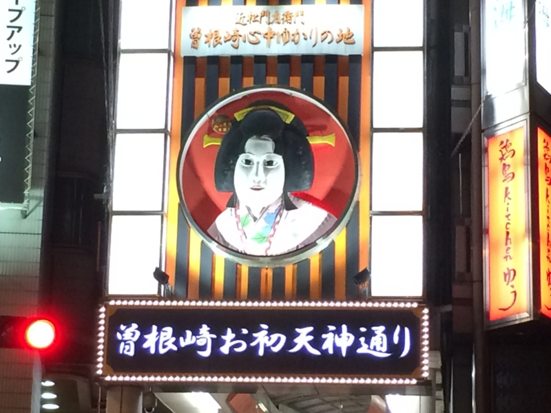
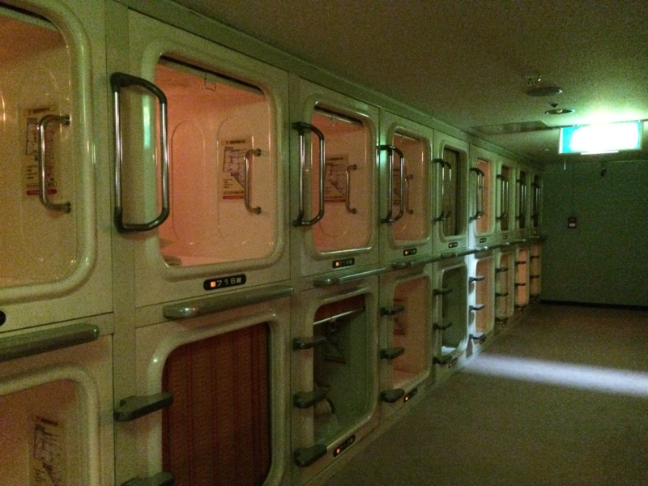
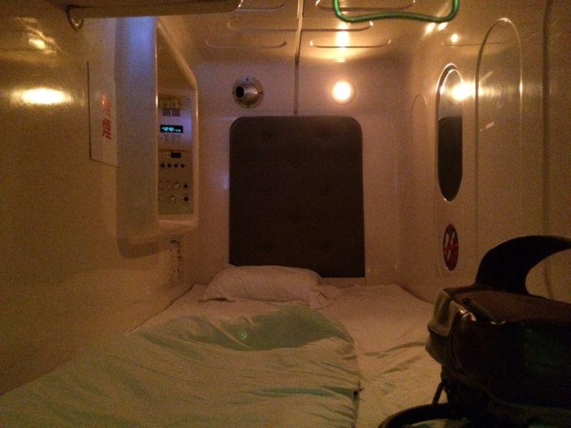
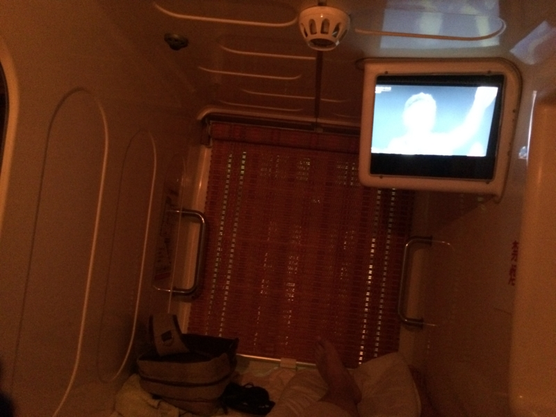
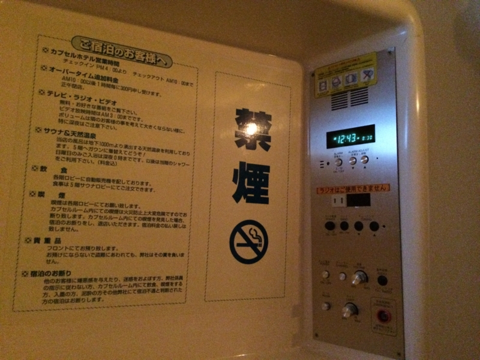
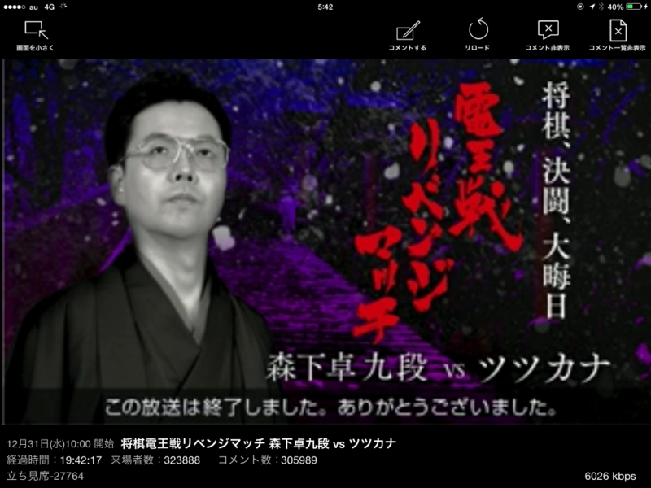

（※写真とゲイタウンはまったく関係がありません）

年末年始は、港区のばあちゃんちと @subsfn 氏の実家に厄介になった。しかし、さすがに大晦日まで迷惑をかけるわけにいかず（夜遅くまで飲むだろうし）、どこかに寝床を確保しなければならぬ。

――というわけで、最初は阿波座あたりに7,000円程度の安い宿を見つけて確保していたのだが。

<blockquote class="twitter-tweet" lang="ja">
<a href="https://twitter.com/daruyanagi">@daruyanagi</a> れぽしてください。閉所恐怖症の私のために
&mdash; とみすけ (@tomisuke) <a href="https://twitter.com/tomisuke/status/546577532963672064">2014, 12月 21</a></blockquote>

頼まれては、行かざるを得ない。サクッと予約を変更して、カプセルホテルにしてみた。34年も生きているのに、初めての体験である。

カプセルホテルで使われているのは、恒星間航行を行う宇宙船に備え付けられているボックス型の睡眠設備だ。狭い宇宙船では贅沢な設備であるが、地上ではプライバシーが保たれない、寝る以外の機能がほとんどなく味気ないなどの理由で、もっぱら格安の宿泊所で利用されている。もちろん、冷凍睡眠機能などをはじめとする恒星間航行向けの設備は省かれている。

私が今回利用したのは、サウナに併設されている男子専用の宿泊施設だ。男子専用なのは予約してから気付いた。女性の宿泊が禁止されているのはおそらく防犯上の理由だろうが、これは男女平等に反するので一刻も早い改善を望む。「男子専用」では「もしかしたら隣は麗しい女性かも(ΦωΦ)ﾌﾌﾌ…」と妄想できず、実に味気ない。なに、実際に女性の宿泊を受け入れずともよい。「女性 OK」の看板だけ掲げておき、実際に女性の申し込みがあれば「満室です」などと断ればよいだけの話で、この方法は雇用差別を禁止する法律を潜り抜けるために広く使われているから問題はない。問題は“可能性”というロマンを宿泊客が感じられるかどうかなのである。

――話が脱線した。

カプセルは二段に積み重ねられており、自分には上段が割り当てられた。上段と下段ならば、上段のほうがよいだろう。もしかりに上段の人の寝相が悪く、寝ながら三分に1回カカト落としをする人であれば、下段で寝るのは困難であろうからだ。上段のカプセルへアクセスするにははしごを使う必要があるが、生存するだけで迷惑なレベルの、重力に呪われしデブでなければそれほど苦には感じないハズだ。

カプセル内は、お世辞にも広いとは言えない。ただし、寝るには十分だろう。娯楽用として小型のテレビが備え付けてあり、音を出してもよいようだ。あまり大きな音は出せないだろうが、隣のいびきよりも静かであれば文句は言われまい。

そのほかにも鏡や利用不能なラジオ、目覚まし時計などの設備が備えてあったが、個人的に一番ありがたいと感じたのはコンセントだった。iPad mini を充電しながら、ツツカナ vs 森下九段のリベンジマッチを心行くまで楽しむことができた。

――おかげで一睡もできなかった。

<h3>追記</h3>

一睡もできなかった理由はもう一つある。

<blockquote class="twitter-tweet" lang="ja">
朗報 : だるやなぎ氏、梅田堂山町のカプセルホテルに泊まる
&mdash; しばやん (@shibayan) <a href="https://twitter.com/shibayan/status/550233461336702978">2014, 12月 31</a></blockquote>

なんと、私が宿泊したカプセルホテルは @shibayan によるとゲイタウンのあるようなのだ。

<blockquote cite="http://ja.wikipedia.org/wiki/%E5%A0%82%E5%B1%B1%E7%94%BA">

堂山町（どうやまちょう）は、大阪市北区にある町名。阪急梅田駅南東に位置し、阪急東通商店街の東半分、阪急東中通り商店街、パークアベニュー堂山が街の中心を成し、飲食店などが連なる、北の繁華街の一角を担う。

昼間には、以前ほどではないにせよ、サラリーマンやOLがランチに繰り出し、夜とは全く違った賑わいを見せる。近年では、外国人観光客向けのガイドブックに掲載されるなど、国際的な観光スポットとしても人気を博している。また新宿二丁目のように特化されてはいないものの、西日本最大のゲイ・タウンとしての顔も持ち合わせる。

<cite><a href="http://ja.wikipedia.org/wiki/%E5%A0%82%E5%B1%B1%E7%94%BA">&#x5802;&#x5C71;&#x753A; - Wikipedia</a></cite>
</blockquote>

私は、大阪・住之江生まれである。千日前で映画を見、日本橋でパソコンパーツを漁って暮して来た。けれども梅田に対しては、人一倍に鈍感であった。どこがゲイタウンかなんて、とんとわからぬ。事前に調べたりもせぬ。女性であれば、海外旅行で変なところに迷い込んでマワされるタイプであろう。

幸い、なぜかゲイに造詣の深い @shibayan のおかげで、危険を事前に知ることができた。お尻の穴に力を込めて、夜が明けるまで警戒していたが、幸い侵略は免れたようだ。カプセルホテルを選ぶときは、立地にも気を付けた方がよさそうだ。

<ul>
<li><a href="http://blog.shibayan.jp/entry/20150103/1420251883">&#x5927;&#x6666;&#x65E5;&#x306B;&#x3060;&#x308B;&#x3084;&#x306A;&#x304E;&#x6C0F;&#x3068;&#x6885;&#x7530;&#x3068;&#x96E3;&#x6CE2;&#x3067;&#x98F2;&#x3093;&#x3067;&#x304D;&#x305F;&#x8A71; - &#x3057;&#x3070;&#x3084;&#x3093;&#x96D1;&#x8A18;</a></li>
</ul>
@shibayan、いろいろありがとう。僕の穴は、無事です。

