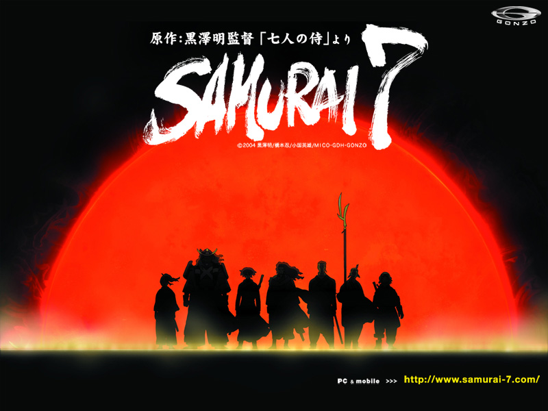
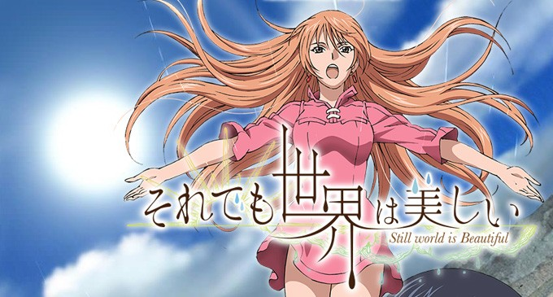
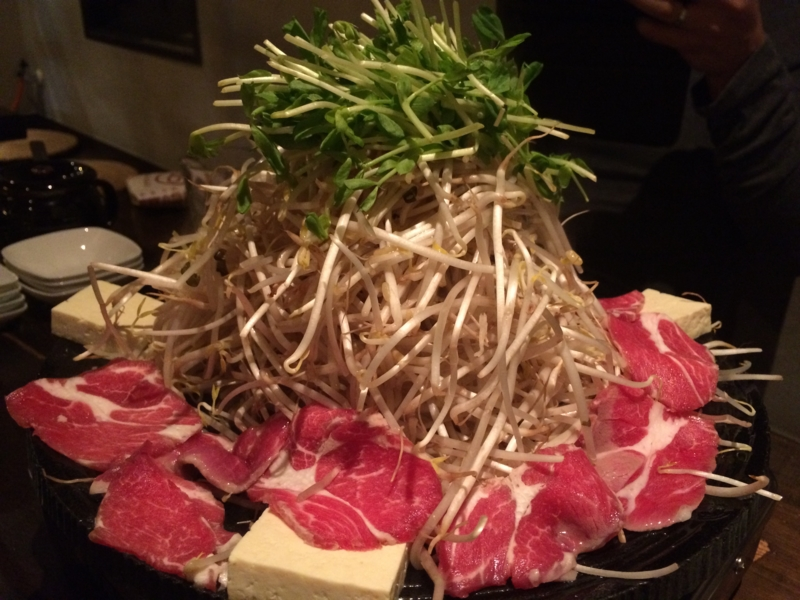

今年は禁酒することに決めた。ただし、完全に禁酒すると死ぬと思ったので、以下の例外は設けている。

<ul>
<li>禁酒は平日に限る。土日祝日は飲んでもよい</li>
<li>平日であっても、飲み会ならば飲んでもよい</li>
<li>サッカーを観戦するときは、飲んでもよい</li>
<li>そのた、やむにやまれぬ理由がある場合は飲んでもよい</li>
</ul>
今週の場合、金曜日は新年会なので飲んでもよいが、月曜から木曜は飲んではいけない。つまり、4日間禁酒しなければならなかったわけだ。

しかし、これは思いのほか辛かった。

Twitter で「四肢が痙攣する」とかつぶやいていたのはさすがに冗談だったが、なんとなく全身がだるい。そしてなにより、まったく寝付けない。明け方にようやく寝て、数時間浅く眠り、起きて仕事をするという生活が続き、発狂寸前だった。

おかげで、バンダイチャンネルでアニメを数本制覇してしまった。

ひとつめは「SAMURAI 7」。黒澤明監督の『七人の侍』を SF 風にアレンジしてアニメ化したものだそうで、なかなか面白かった。もっと凝縮して、劇場版にすればもっとウケたんじゃないかなーと思わないでもない。

<ul>
<li><a href="http://www.b-ch.com/ttl/index.php?ttl_c=1528">&#x300C;SAMURAI 7&#x300D; | &#x30D0;&#x30F3;&#x30C0;&#x30A4;&#x30C1;&#x30E3;&#x30F3;&#x30CD;&#x30EB;</a></li>
</ul>

ふたつ目は「それでも世界は美しい」。有能だが心の乾いた太陽王を、雨の国から嫁いだ姉さん女房ニケが潤していくお話。ジャンル的には「姉ショタ」なのかも。あと、王さまのセリフがたまにクソ寒いので、女の子向けだなーと思った。ニケの歌う雨を呼ぶ歌が JPOP 風なのには思わず突っ込みを入れてしまったが、全体的にはいいお話。表情豊かなキャラクターがとても魅力的だった。

<ul>
<li><a href="http://www.b-ch.com/ttl/index.php?ttl_c=4058&utm_source=wis&utm_medium=tops&utm_campaign=ttl">&#x300C;&#x305D;&#x308C;&#x3067;&#x3082;&#x4E16;&#x754C;&#x306F;&#x7F8E;&#x3057;&#x3044;&#x300D; | &#x30D0;&#x30F3;&#x30C0;&#x30A4;&#x30C1;&#x30E3;&#x30F3;&#x30CD;&#x30EB;</a></li>
</ul>
みっつ目は「魔乳秘剣帖」。故あって、画像は割愛させていただく。

時は太平の世・江戸時代。そこは乳のデカさが理とされる世界だった。なかでも胸を豊かにする豊胸術と、胸を斬り奪う「乳斬り」の技を独占する魔乳一族は、幕閣を裏から操るほどの権勢を誇っていた。その魔乳一族と、関が原で滅ぼされた胸守一族の間に生まれたチブサは、そんな世の中に疑問を感じ、乳を自在にやり取りできるという胸守一族の秘術「乳流れ」を求めて魔乳一族を出奔する――。

正直意味不明だったが、そこがシュールで面白かった。なお、バンダイチャンネルでは謎の光さんの活躍でおっぱいは見れない。残念だったな、諸君！

<ul>
<li><a href="http://www.b-ch.com/ttl/index.php?ttl_c=3047&utm_source=wis&utm_medium=tops&utm_campaign=ttl">&#x300C;&#x9B54;&#x4E73;&#x79D8;&#x5263;&#x5E16;&#x300D; | &#x30D0;&#x30F3;&#x30C0;&#x30A4;&#x30C1;&#x30E3;&#x30F3;&#x30CD;&#x30EB;</a></li>
</ul>

そんなこんなで、とても寝不足だったのだけど、新年会でヒツジとビール食べたおかげで復活。翌日は丸一日（！）寝て、すっかり元気になった。目が覚めたら外が暗かったので二度寝しようと思ったが、よくよく時計を見ると日が落ちたから暗いだけだった。

<blockquote class="twitter-tweet" lang="ja">
I&#39;m at さわ家 <a href="https://t.co/58YWP8cTGB">https://t.co/58YWP8cTGB</a>
&mdash; 俺、だるやなぎになります。 (@daruyanagi) <a href="https://twitter.com/daruyanagi/status/553502119547121664">2015, 1月 9</a></blockquote> 

<ul>
<li><a href="http://nakaji.hatenablog.com/entry/2015/01/10/073400">&#x3060;&#x308B;&#x3084;&#x306A;&#x304E;&#x3092;&#x56F2;&#x3093;&#x3067;&#xFF08;&#xFF1F;&#xFF09;&#x65B0;&#x5E74;&#x4F1A;&#x3092;&#x3057;&#x3066;&#x304D;&#x305F; - &#x306A;&#x304B;&#x65E5;&#x8A18;</a></li>
</ul>