
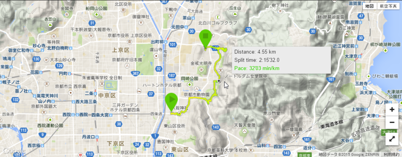

12月30日は、@subsfn と京都へ行った。結果的にえらい歩かされた。

<h3><a href="http://www.sobamatsuba.co.jp/">&#x4EAC;&#x90FD; &#x7DCF;&#x672C;&#x5BB6;&#x306B;&#x3057;&#x3093;&#x305D;&#x3070;&#x30FB;&#x677E;&#x8449;</a></h3>

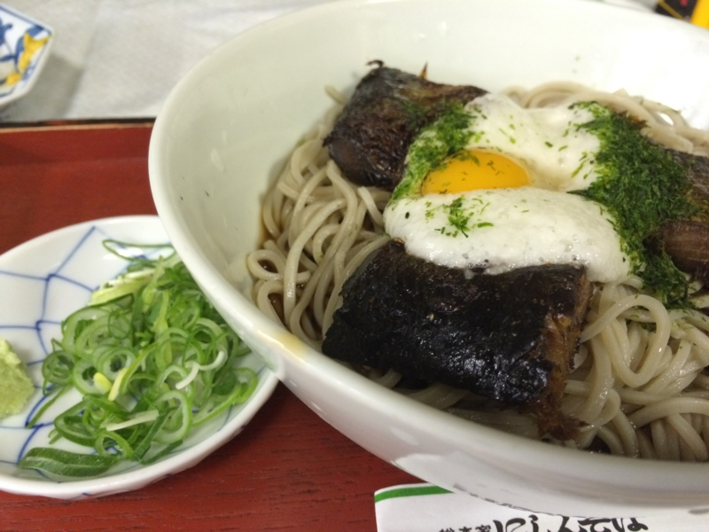

まずは四条で にしんそば を食べて英気を養う（いつの間にか京阪の駅、「祇園四条」っていう名前になったんだね）。今回はあったかいのではなくつめたいの。あったかいほうがおいしいかもしれない？

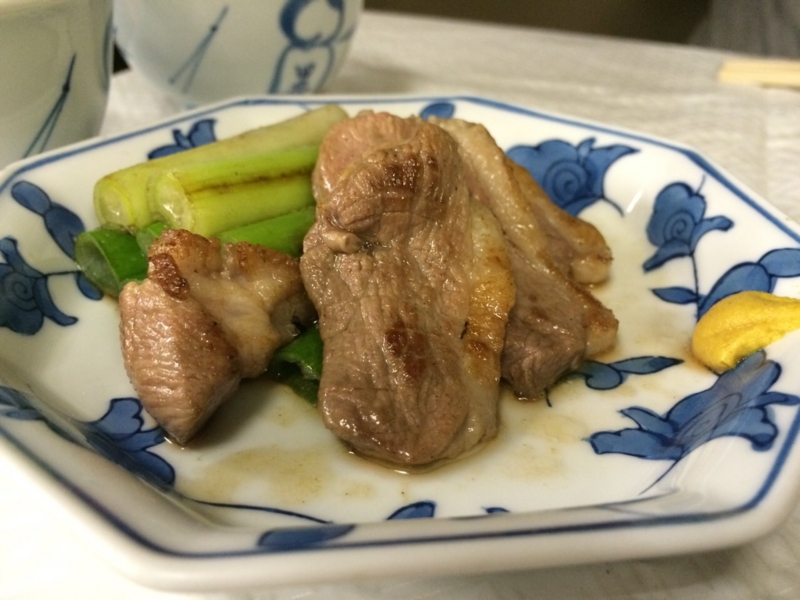

ビールも頼んだのでアテがほしく、鴨焼きも追加。これがなかなかおいしかった。ネギ……うま……。でも、お昼時だと出てくるまでにちょっと時間かかるっぽい。というか、ぶっちゃけソバ以外を頼むのは迷惑みたいな雰囲気だったｗ

<h3>八坂神社</h3>

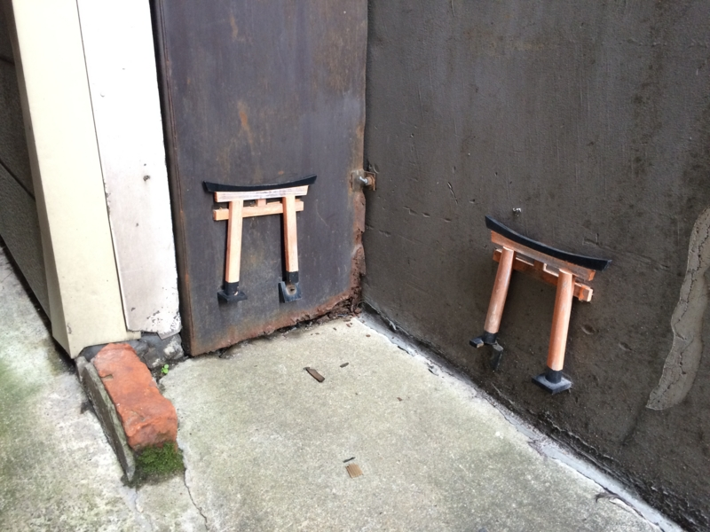

（写真と八坂神社は関係ありません）

途中、「<a href="http://www.hararyoukaku.co.jp/">&#x7947;&#x5712; &#x539F;&#x4E86;&#x90ED;</a>」によってお土産の黒山椒を買った。いつの間にかカレー屋さんになっててちょっとびっくりした。今度来るときはカレー食べたい鴨。

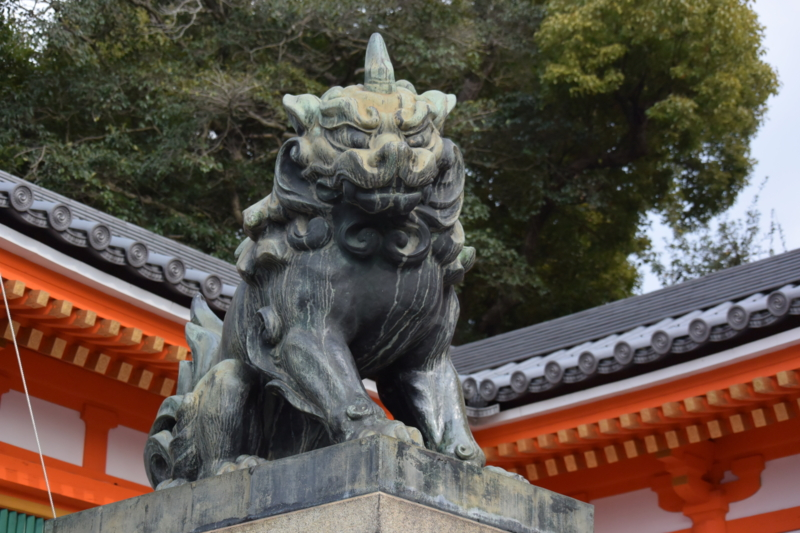

そのあとは八坂神社を抜けて、蹴上まで。八坂神社には自撮り棒をもった観光客がたくさんいた。最近流行ってるのかな、自撮り棒。使い方によっては割と危ないと思ったので、自分が使うときは気を付けようと思った。

<h3><a href="http://kyoto-design.jp/spot/2724">&#x8E74;&#x4E0A;&#x30A4;&#x30F3;&#x30AF;&#x30E9;&#x30A4;&#x30F3; | &#x4EAC;&#x90FD;&#x306E;&#x89B3;&#x5149;&#x30B9;&#x30DD;&#x30C3;&#x30C8; | &#x4EAC;&#x90FD;&#x89B3;&#x5149;&#x60C5;&#x5831; KYOTOdesign</a></h3>

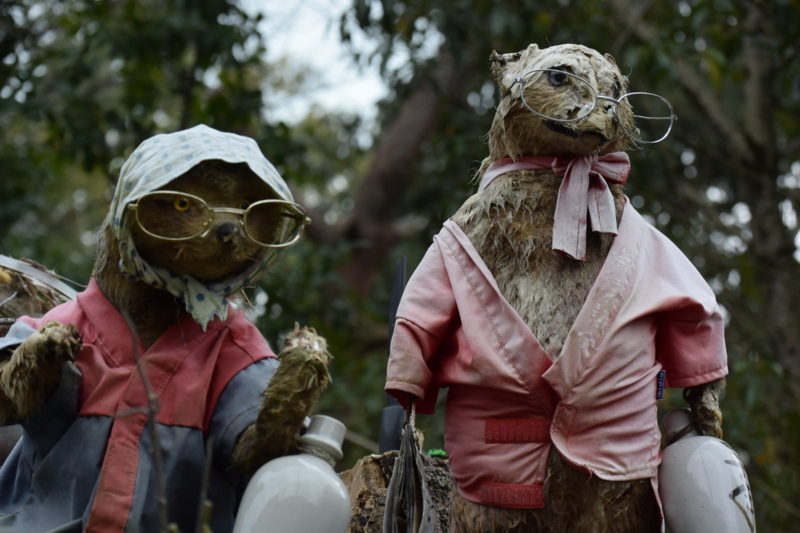

三条を蹴上へ。空がだいぶ曇ってきて、雨がぱらぱらと落ちてきた。自分も @subsfn も晴れ男で、あまり観光で雨に降られることはないのだけど、今回ばかりはダメか……と観念したが、結局それ以上は降らなかった。やっぱり、運がいいらしい。

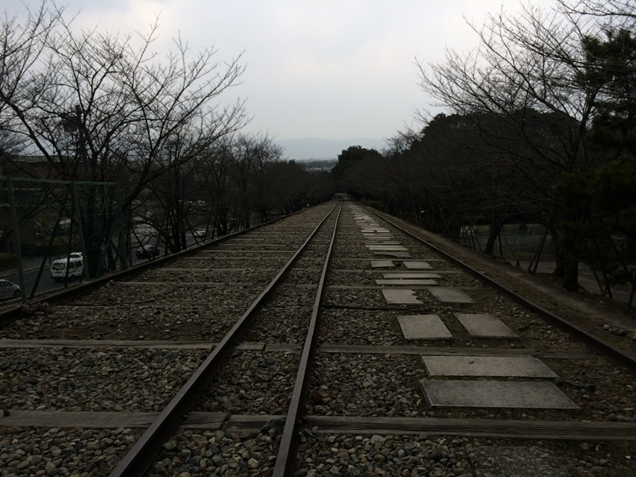 

<blockquote>

蹴上インクラインは、南禅寺の近くにあり、全長582mの世界最長の傾斜鉄道跡で、高低差約36メートルの琵琶湖疏水の急斜面で、船を運航するために敷設された傾斜鉄道の跡地です。

</blockquote>

疎水といい、水力発電所といい、先人の努力には頭が下がるばかりだ。

<h3><a href="http://www.nanzen.net/">&#x81E8;&#x6E08;&#x5B97;&#x5927;&#x672C;&#x5C71; &#x5357;&#x7985;&#x5BFA;</a></h3>

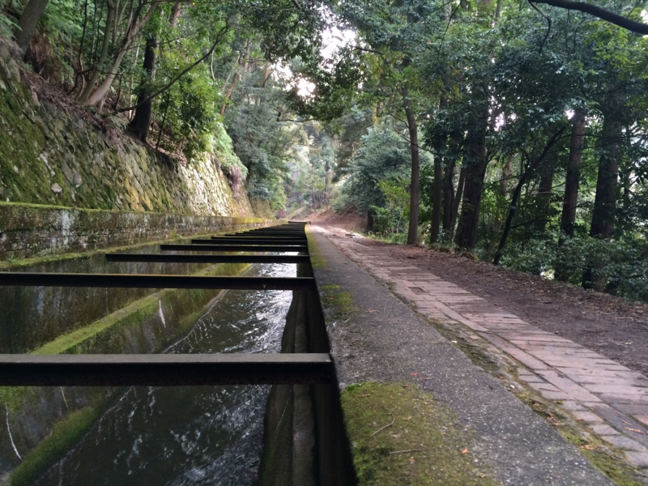

水の流れをたどって、北へ。

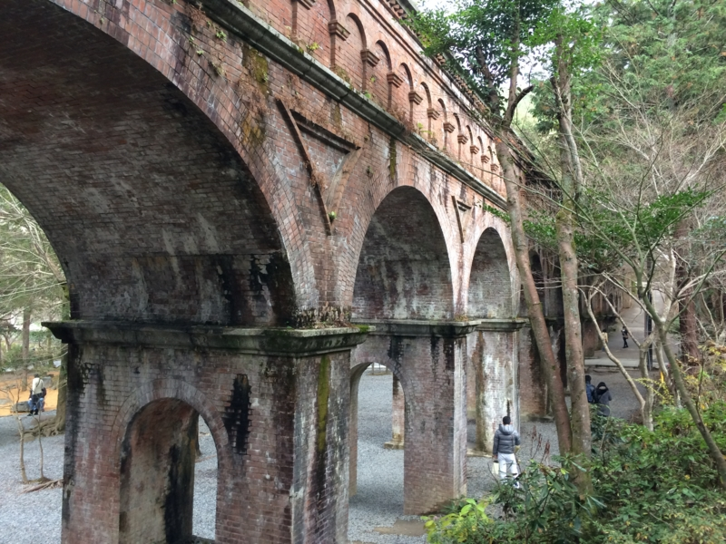

水路閣に出た。

自分はここでダウン。しばし座ってお茶などを飲む。その間、@subsfn は精力的に写真を撮っていた。あんなに体が大きいのに、重力が苦しくないのだろうか。将棋史に名高い“南禅寺の決戦”を解説する掲示などを読みながら、しばしぐてっとしていた。

そのうち気力を回復し、歩き出す。

<h3><a href="http://kanko.city.kyoto.lg.jp/detail.php?InforKindCode=1&ManageCode=3000069">&#x4EAC;&#x90FD;&#x89B3;&#x5149;Navi&#xFF1A;&#x54F2;&#x5B66;&#x306E;&#x9053;</a></h3>

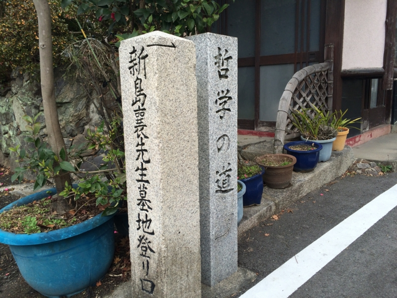

哲学の道に至る。ここからは割と知った道だ。

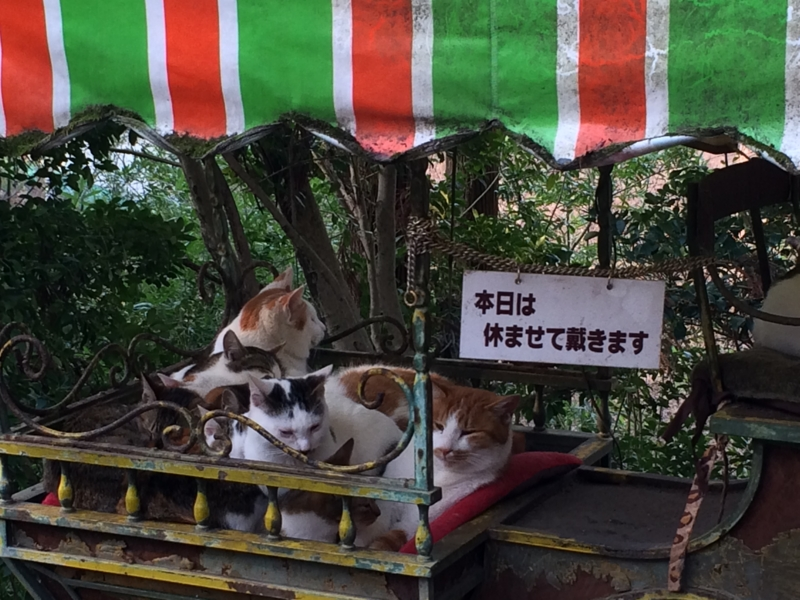

ネコは哲学によく似合う動物だ。自分がイヌよりネコを好むのも、そういうところがあるからかもしれない。サルも賢いが、あれはちょっとプラグマティズムな感じだろう。それも立派な哲学だけど、深みが足りないようにも思う。

<h3><a href="http://www.shokoku-ji.jp/g_about.html">&#x81E8;&#x6E08;&#x5B97;&#x76F8;&#x56FD;&#x5BFA;&#x6D3E;</a></h3>

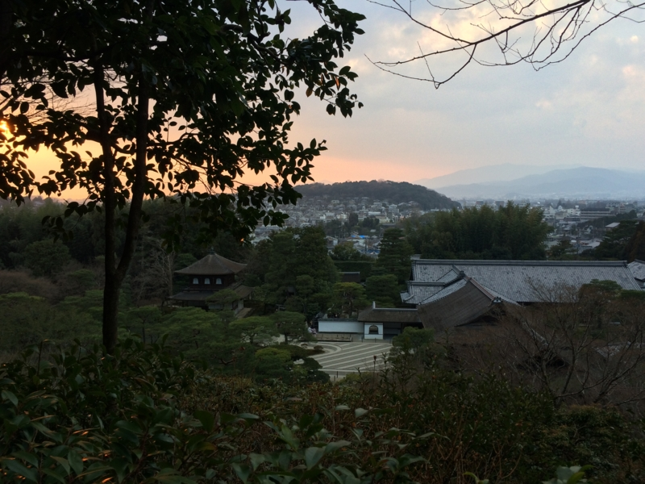

銀閣寺はもう何回も来たので、個人的にはなんの面白みも感じなかった。むしろ、「Oh……」とかいってるガイジンさんとか、盛んにピースして写真を撮ってもらってる女の子連中とかを見てる方が面白い。

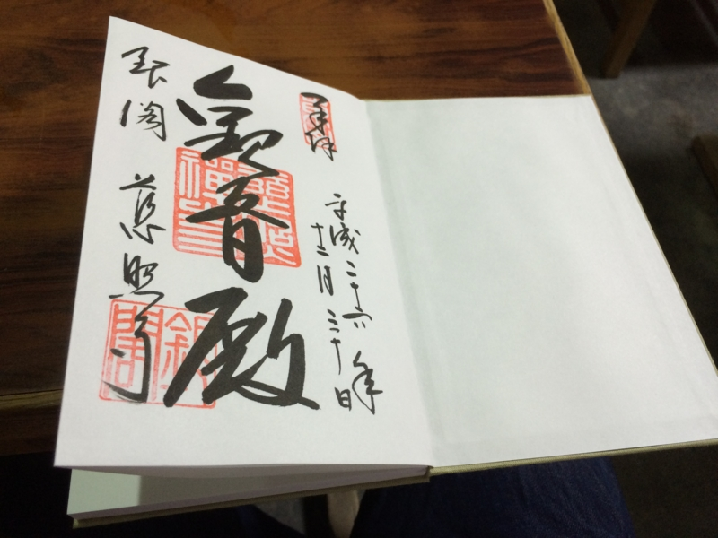

ついでに、御朱印帳を買って、御朱印を書いてもらった。御朱印集めは昔からやってみたかったのだけど、なんとなく機会を逃していた。これで一つ趣味が増えたかも。

<h3><a href="https://plus.google.com/109037227728249619135/about?gl=jp&hl=ja">&#x6728;&#x539F; - &#x57FA;&#x672C;&#x60C5;&#x5831; - Google+</a></h3>

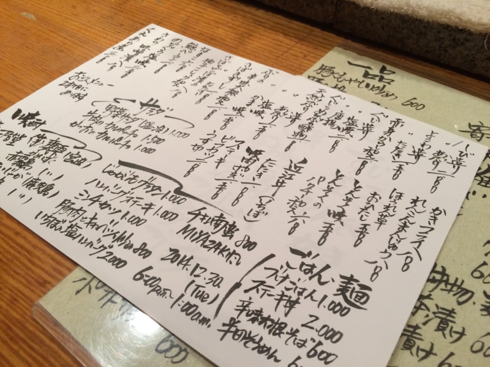

そのあとは、木原さんのところへ。学生時代、バイトとしてお世話になっていたお店だ。訪れるのは2年ぶりぐらい？　だいぶ不義理をかました。

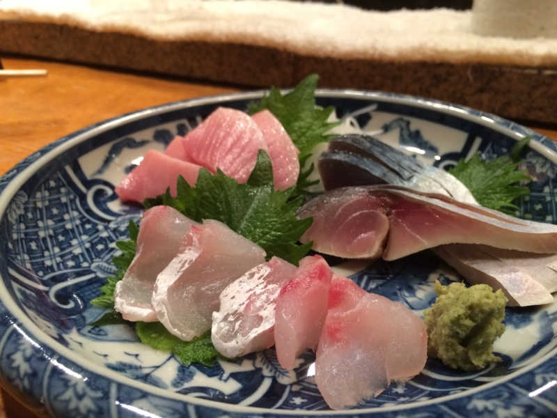

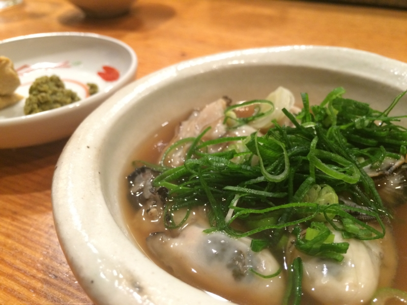

相変わらず、超おいしかった。どの季節に行ってもおいしいのだけど、この季節だと牡蠣のおでんがおいしい。あとは……まぁ、なんでもおいしい。胃袋と財布が無限であれば、ずっと食い続けるのに。

